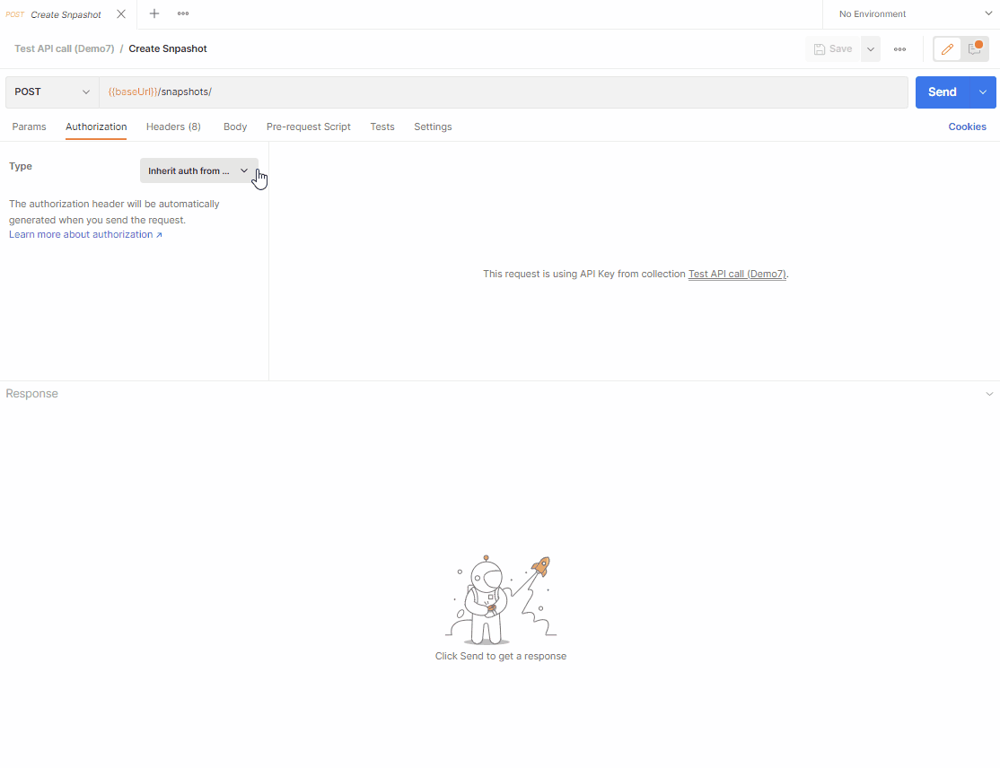
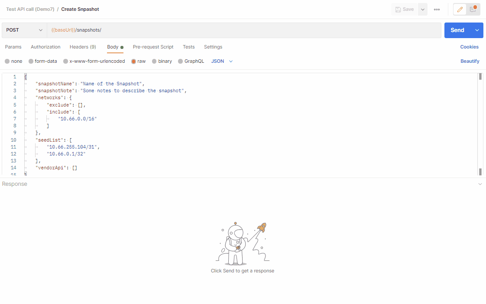

# Create New Snapshots Via API

This post is intended to explain how to create a new snapshot using the API. You may want to create the new snapshot with the existing settings, or with a different set of settings, if you wanted to have a reduced scope for example.

## API Endpoints

- `/api/{api_version}/snapshots` - method `POST` to create a new snapshot

- `/api/{api_version}/settings` - method `GET` to collect all IP Fabric settings

## Create a New Snapshot With The Existing Settings

If you want to start a discovery, using the existing settings, it is a simple `POST` request to `/api/{api_version}/settings`, without a body.

[Information regarding the Header/Authentication](../Path_Lookup_4.x/index.md#post-request) has already been mentioned in another article. Please refer to this if needed.



## Create a New Snapshot With Different Settings Than The Default Ones

What if you wanted a snapshot for a smaller scope of your network. For this, you can use the API to start a new discovery, with some specific settings used for a specific discovery.

Here is an example of a body to use to perform a discovery with a new scope (`networks`), new seed devices (`seedList`) and not taking into account the Vendor API (Checkpoint, Meraki, AWS…) that you may have configured in your settings. All fields are optional, if not specified,

!!! info The value from your settings will be used

```js
{
    "snapshotName": "Name of the Snapshot",
    "snapshotNote": "Some notes to describe the snapshot",
    "networks":
        {
            "exclude": [],
            "include": [ "10.66.0.0/16" ]
        },
    "seedList": [ "10.66.255.104/31", "10.66.0.1/32" ],
    "vendorApi": []
}
```

Let’s see how it looks when using Postman:



## What Settings Can I Use When Creating a New Snapshot?

There is a long list of what you can use in the request body to change the settings for this new discovery. The example above is probably enough for some use cases. If you wanted to change different settings, you can collect the settings of your IP Fabric’s instance via a `GET` on the endpoint `/api/{api_version}/settings`

The response will look like this _(this is just an extract of the JSON)_:

```js
{
    "fullBgpLimit": {
        "enabled": true,
        "threshold": 500000
    },
    "networks": {
        "exclude": [],
        "include": [
            "10.66.0.0/16"
        ]
    },
    "resolveNames": {
        "discoveryDevices": true
    },
    "scanner": {
        "enabled": false
    },
    "traceroute": {
        "scope": [
            "10.0.0.0/8",
            "100.64.0.0/10",
            "169.254.0.0/16",
            "172.16.0.0/12",
            "192.168.0.0/16"
        ],
        "protocol": "icmp",
        "port": null
    },
    "limitDiscoveryTasks": {
        "alreadyDiscovered": false,
        "sourceOfTasks": [
            "arp",
            "routes",
            "trace",
            "xdp"
        ]
    },
    "allowTelnet": true,
    "timeouts": {
        "login": 20,
        "session": 20
    },
    "cliSessionsLimit": {
        "enabled": false
    },
    "cliRetryLimit": {
        "default": 3,
        "authFail": 0,
        "tacacs": {
            "retry": 0,
            "delay": 1000
        }
    },
    "seedList": [
        "10.66.255.104/31",
        "10.0.0.1/32"
    ],
    [...]
```

Most fields can be entered in the body of the request to change the settings when performing a new discovery.

This won’t affect the settings for the next scheduled discovery.
