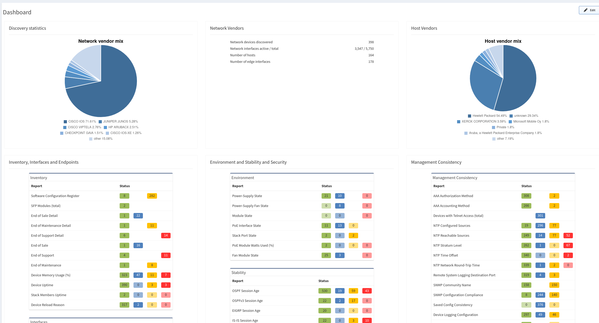

# Dashboard

## Overview

The dashboard provides an overview of the network analysis results, including an aggregated scorecard calculated from the performance, capacity, and risk metrics. Issues covered by the radar charts and compliance tables link to the detailed reports.

## Performance

Performance impact severity is calculated by accounting for packet loss at every point in the network, and then correlating loss with topological and flow rate information. The network infrastructure performance is derived from its ultimate goal to deliver a packet from source to destination as quickly and efficiently. The key performance indicators of loss and delay are universally used by all IP consumers and dependent technologies and are also key elements for the RFC2544 testing methodology. IP Fabric provides this information network-wide.

## Capacity

Capacity reports provide a subset of performance, only considering the loss created by the  insufficient capacity of the link or the platform to forward data.

