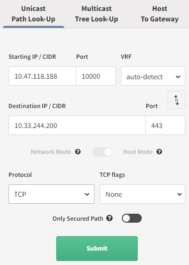
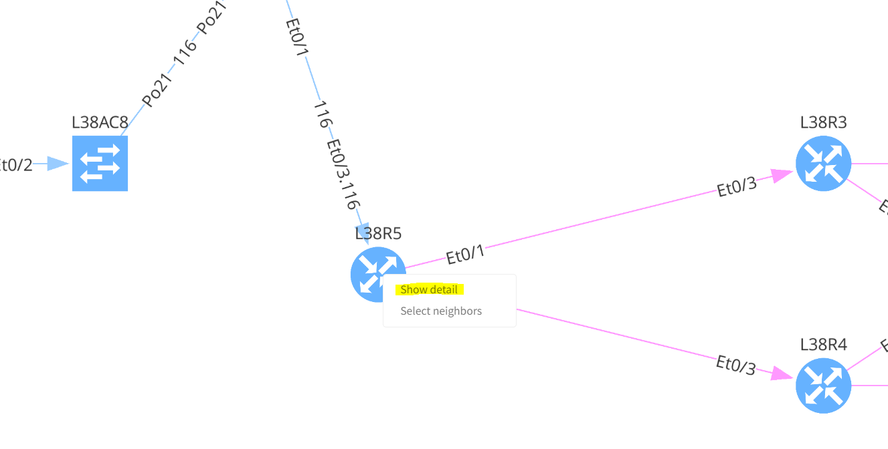

# How to use Path Look-Up

## Unicast Path-Lookup

Enter the details:

-   Source IP / CIDR (it can be a network, but the total number of IPs
    has to be less than 255 including source and destination IPs.
    Subnets are also supported.)

-   Port (Source Port)

-   VRF (Virtual Routing and Forwarding Instance)

-   Destination IP / CIDR

-   Port (Destination Port)

-   Protocol: TCP/UDP/ICMP

-   Flags: None/ACK/FIN/SYN/RST/PSH/URG

If you’ve used a network instead of a single IP, you will have the
option between:

– **Network Mode**: simulation stats and ends with whole networks,
individual hosts are not considered

– **Host Mode**: simulation starts and ends with each host. It is
limited to 255 hosts, source and destination combined.

Then click on submit:

## Path Controls

With the mouse right-click, more options are enabled:

After opening the details, we can select the destination link to proceed with packet analysis:

## Understand the path selection

To understand the decision taken by a device, right-click on the device
and “show detail”. You will then be presented with the details. If you
have more than one interface where the flow can come from, you will need
to select the interface you want to look at. Similarly, if you have
several interfaces that can be used to forward the traffic, you will
have to choose one. Then in the middle of the table, you will see the
forwarding decision:

In this example, we are looking at the device L33R4, which has 2
incoming interfaces and one forwarding for this flow:

## Multicast Tree Look-Up

You want to understand how a certain multicast flow is used, you can use
the Multicast Tree Look-Up. For that, just select the correct option and
enter the relevant details

You will then see the Multicast Tree:

And you will have access to a lot of information regarding the Multicast
forwarding decision:

## Host To Gateway

To find out more details between a host and its network gateway, you can
use this menu: Host To Gateway. You only need to provide the host, and
you will the details:

## Visualization Setup

You can set up what you want to prioritize in the view. Just simply move
the bars up or down.

## Improvements from 4.3 version

From version 4.3, IP Fabric supports more granular path lookup.

### First Hop Algorithm
First hop algorithm can be defined - when **Automatic** option is selected,
source VRF can be automatically detected, or selected manually.

Also your source network device and its interface can be selected when choosing
**User defined** First Hop Algorithm.

### Source/Destination IP Address and Port

By default, ICMP protocol and Echo request is chosen for path lookup.

When switched to Web HTTP/HTTPS, TCP destination port 80 and 443 with (web|http|https) application is selected by default.

