# Network Viewer

When you go to the page ***Diagrams → Network***, all networks are
displayed and the relationships between them. They are grouped into
sites represented by a cloud for better visibility. You can double-click
on a cloud to explore further that specific site.

Top-level view with all network:

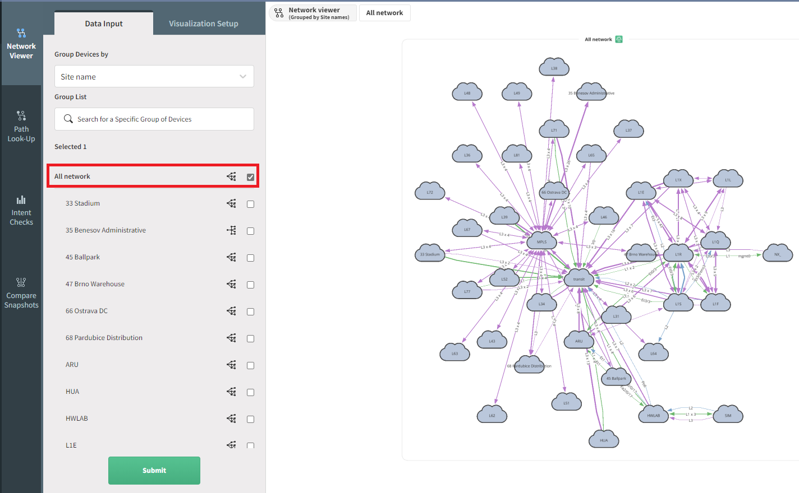

### **Adding networks to the view**

To display the required information, select on the left side the site
you want to visualize and click on ***Submit***.

One or more sites can be displayed at a time.

For example, to see a diagram of particular sites called *66 Ostrava DC*
and *47 Brno Warehouse*:

1.  Select ***Site name*** from ***Group Devices by*** drop-down menu

2.  Select the site names

3.  Click ***Submit***

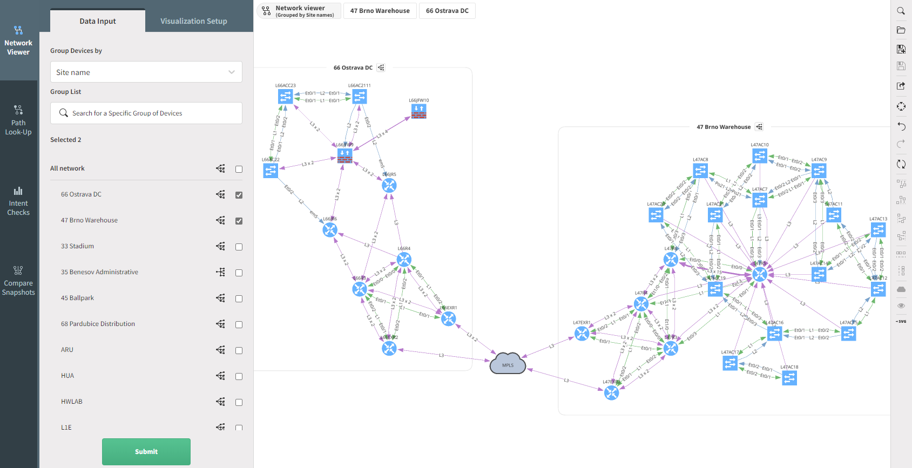

### **Removing networks**

In a very similar way as to add a site/network to a diagram, to hide it,
just unselect the network and click ***Submit***.

### **Manipulating objects and nodes**

Diagrams are generated automatically, and the following supported
operations can change their layout:

-   *Pinch to zoom: touch & desktop (if supported by the trackpad)*

-   Mouse wheel to zoom: desktop

-   Two-finger trackpad up or down to zoom: desktop

-   Tap to select: touch & desktop

-   Tap background to deselect: desktop

-   Multiple selections via modifier key (shift, command, control,
    alt) + tap: desktop

-   Box selection: touch (three-finger swipe) & desktop (modifier key +
    mouse down then drag)

-   Grab and drag nodes: touch & desktop

The ***Center View*** button can also center the screen view.

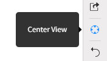

### **Hide/Collapse Items in the view**

After selecting a set of devices, or cloud, if you do a right-click, you
have the option to collapse the selected items into a new cloud, or hide
them:

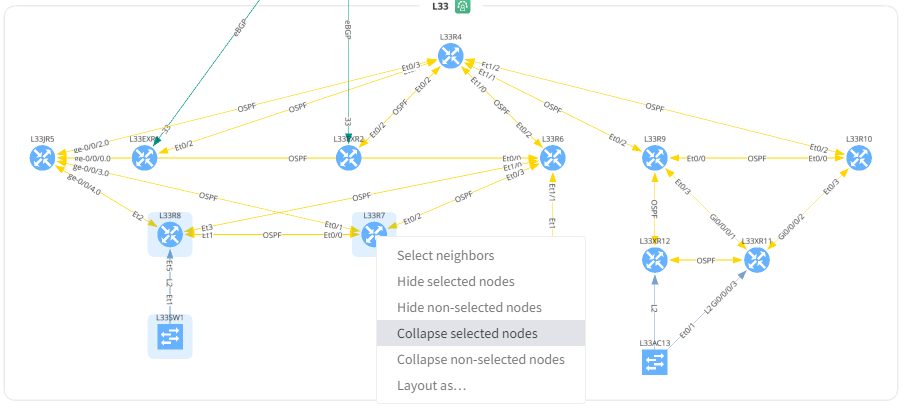

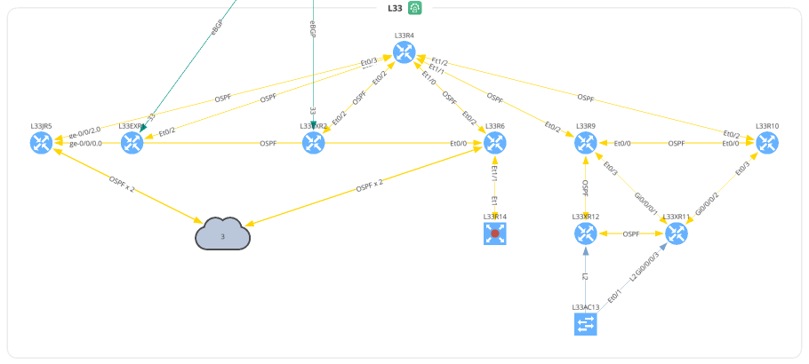

### **Save User-defined**

After editing the layout, you will see the green box, this allows you to
save the changes as the default view. Click on the green box, this will
open a menu ***Select Diagram Layout Settings*** and the last entry is
the ***User-Defined Layout**. B*y clicking on the floppy disk icon you
will update the default view (see below). Please, be aware that only
position of the visible nodes will be saved.

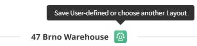

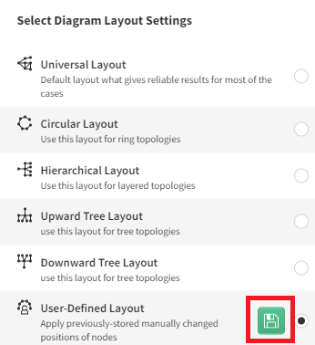

### **Use User-defined layout as the default layout**

Once you have created a user-defined layout, you probably want to use
this as the default layout. For this, click on the icon of the site you
want to update, then select the User-Defined layout and click **Save**

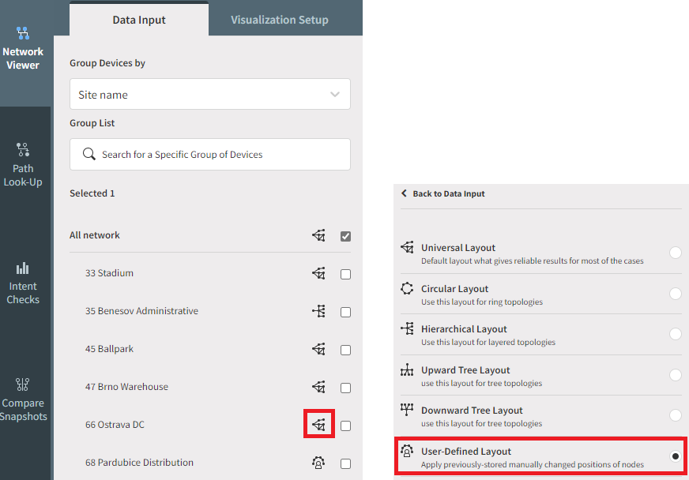

From now on, this will be the default layout for this site:

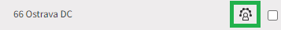

### **Choose a specific layout for a selection of devices**

You can now specify which layout you want to use for a set of devices:

### **Choose a layout to apply for the whole site**

Similarly, you can select a layout for the whole site, using the layout
selection.

-   Circular Layout can be used only for 500 nodes or less.

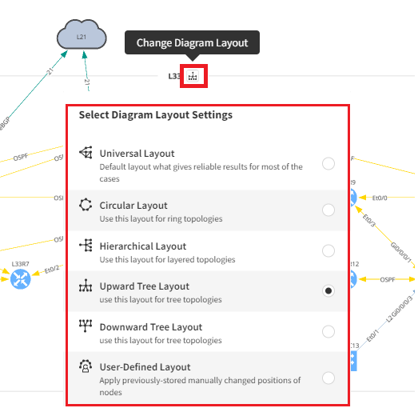

## **Save, load, and share view**

Each object can have multiple views that can be saved and loaded again
later.

#### **Save view**

Click the floppy icon on the menu on the right end side:

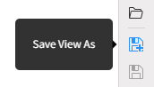

Enter a name for that view and click save.

!!! info

    The view saved in this way is not the default view for that object.

#### **Load view**

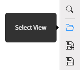

The view can be loaded by clicking the folder icon.

Select the desired view and click to load.

#### **Share view**

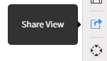

By clicking here, an URL will be displayed, which you can share with
other users, and they will be able to see this view.

### **Export current view to SVG/PNG**

The view can be exported in the form of a SVG or PNG image by clicking
on ***Export*** and selecting the format you want

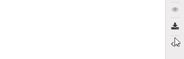

!!! info

    The SVG file can be imported into a Visio diagram, or on other drawing
    application

### **Search**

Search looks up any text currently present on the diagram. Typing query
filters the view and clicking on the search button focuses and zooms in
on the item.

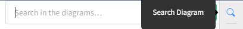

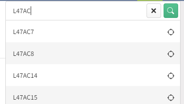

If you hover your mouse on one entry, you will see the device on the
diagram:

## **Protocols**

The user can filter connection protocols between devices of the second
and third layer of ISO OSI by using filters in the ***Network Viewer /
Visualization Setup / Protocols*** menu.

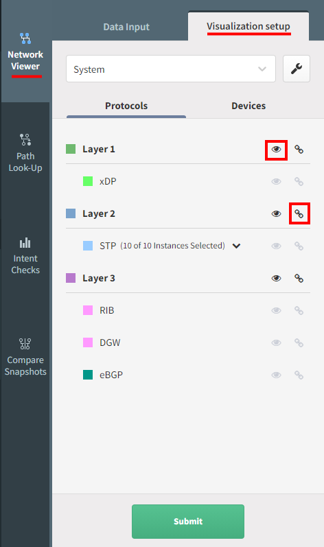

You can decide which layer/protocol you want to display/hide and
group/ungroup

#### **Default Protocols View**

By default, all discovered protocols will be grouped based on the layer
they belong to. This is the “**System**” view. You can edit this, which
means you are able to ungroup certain protocols. For this click on the
Settings icon:

Drag and drop protocols you want to put to a custom group to the “Other
Protocols”, click on Save as and give a name to the new protocol view.

With the example below, you are now able to hide only the DGW protocol,
without affecting the other Layer3 protocols:

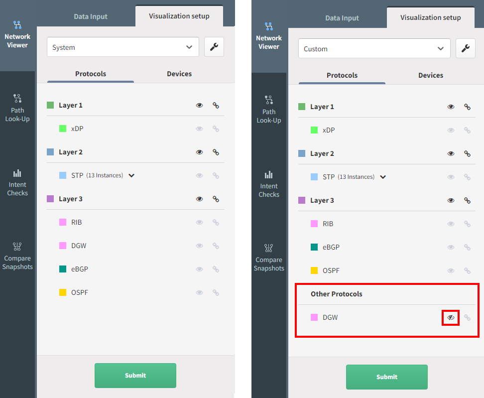

**Link grouping**

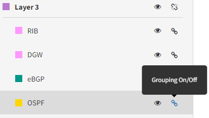

Link grouping means that protocols of the specific layer are not shown
as separate lines but together as a single line.

#### **Layer grouping**

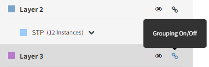

Layer Grouping collapses groups of devices according to the types of
links that connect these, either in Layer 2 or 3 groups. Devices
connected with different layer protocols can't be grouped together.

## **Devices**

You can select/un-select the type o devices you want to see on the
diagram.

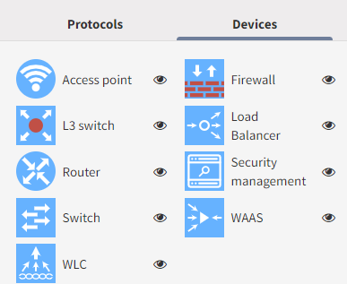

### **Device information deep dive**

After right-clicking on the device, it is possible to display additional
information about it by selecting “Show detail”:

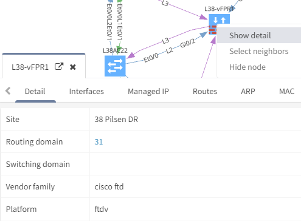
