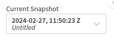
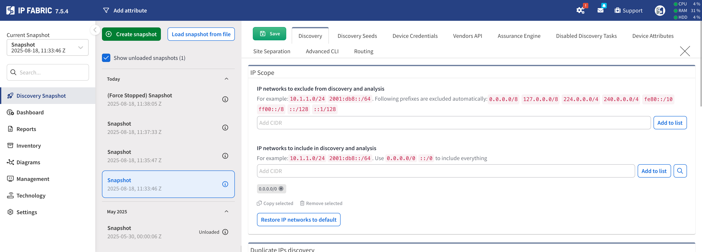
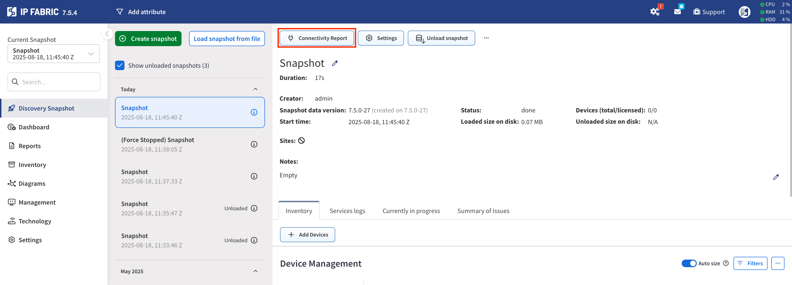
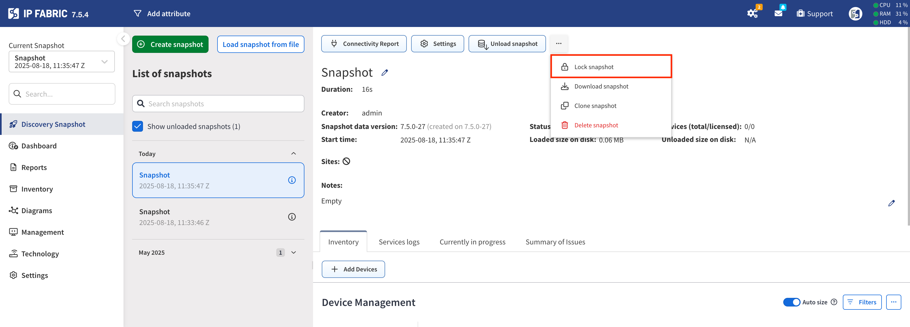
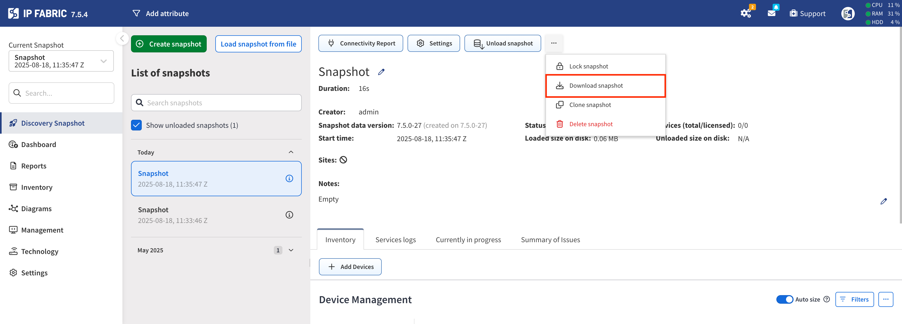

# Discovery Snapshot

## Snapshot Overview

Network snapshot records:

- The state of the network at the moment of the initialization of the snapshot.

- All service logs; logs used internally by the IP Fabric system as well as a log of commands issued on every network device.

- Connectivity issues that had occurred during the retrieval of the snapshot.

A network snapshot is a fully functional software copy of your network, including all configuration and state data. It enables to retrieve historical information, to follow network state changes, analyze connectivity issues, and more.

Information about the network displayed in IP Fabric corresponds to the network snapshot selected in the Snapshot selector drop-down menu in the top left corner of the Main User Interface.

## New Snapshot

To access the Snapshot Operations click the `Discovery Snapshot` menu entry (boxed in yellow). This will display all Loaded and Unloaded snapshots and allow the user to create new snapshots or perform operations against existing
snapshots.

A new snapshot can be taken at any time by clicking the `New Snapshot`button (boxed in red). After pressing the green `Start discovery` button, the system will then automatically start a new snapshot of the network with globally set
parameters in the `Settings` menu entry. If you need to make some changes to the discovery process (add a new network seed, change login credentials, etc.) it needs to be done before a new snapshot is taken. This can either be adjusted
globally or in the [snapshot specific settings](#snapshot-specific-settings) (boxed in blue).

Snapshots can be run manually or on a schedule; for creating automatic snapshots follow the instructions located at [Automatic Snapshots](../IP_Fabric_Settings/advanced/snapshots.md).

## Snapshot Specific Settings

Adjusting the `Settings` for either a new snapshot or previously created snapshot will override the global settings.
This is useful for example testing different SSH settings, Site Separation, Authentication methods.

## Inspection of Network Issues

Initial snapshot of the network may not include all information about your network. This could be due to a variety of
reasons including authorization or firewall issues; please take a look at
[Troubleshooting Discovery](../Getting_Started/Overview/How_Discovery_Works/troubleshooting_discovery.md).

Each successful or unsuccessful connection attempt is logged (see the following picture). Log for each device can be found in the Snapshot `Connectivity Report` (boxed in red). These logs are especially helpful when an error occurs. By
examining them you can find the reason why the device wasn't correctly or fully discovered or what led to a connection failure.

## Modifying Snapshot Devices

### Adding Devices

A new device can be added to an already existing snapshot by selecting the `Add Devices` button (boxed in red). You are then able to add a list of IP addresses or subnets to be tried in discovery and added to the current selected snapshot.
This might be desirable if you performed almost a full snapshot of the network but only a few devices were not included or had connectivity issues that were resolved (for example wrong AAA configuration, firewall rules, forgot to include a
network seed, etc).

When adding a new device to an existing snapshot, the [snapshot specific setting](#snapshot-specific-setting)
will be applied. If you need to change some settings (for example new network seed, login credentials, etc.) in order to add a new device to an existing snapshot, you need first to change settings for that particular snapshot and
then add a new device.

If `Rediscover timed out devices` check box is selected (boxed in blue) the discovery will try to rediscover any devices that previously timed out. To speed up the addition of new devices it is recommended to unselect this. If you would like
to only rediscover devices this is also possible by not entering in any new device IP addresses and selecting the green `Start Discovery`.

Finally, it is also possible to add new vendors (boxed in green) or enable previously disabled vendors (boxed in yellow) in the current selected snapshot. Please note that toggling a Vendor from `on` to `off` will not remove those devices
from the snapshot. However, toggling all the Vendors to `off` will prevent IP Fabric from rediscovering those devices thus speeding up the addition of new devices similarly to disabling `Rediscover timed out devices`.

### Refresh Devices

Using the `Refresh Devices` action will have the snapshot rediscover the selected devices and update the data models. You are able to manually select certain devices or in the example filter on a site and refresh all devices in a site.
Please note changes in those devices might have affected other devices for instance if a routing change propagated throughout the network. A good example of using refresh device is for a Firewall change and ensuring the new rules are
allowing or denying traffic in Path Lookup Simulations.

### Delete Devices

Similarly to `Refresh Devices` the `Delete Devices` allows you to manually select certain devices for deletion in the snapshot. When devices are removed and were previously being displayed in Network Diagrams or Path Lookups, IP Fabric
will then show a `transit` cloud indicating it does not have information about the next destination or connected device.

## Snapshot Actions

Because of database maintenance, only up to 5 snapshots can be loaded into the memory. The default installation is to allow only 3 loaded snapshots but this can be changed by visiting [Snapshot Settings](../IP_Fabric_Settings/advanced/snapshots.md)

### Lock Snapshot

By locking a snapshot, IP Fabric won’t unload the selected snapshot automatically to the hard disk and it will keep it in the memory. The default installation is to allow only 1 locked snapshots but this can be changed by visiting [Snapshot Settings](../IP_Fabric_Settings/advanced/snapshots.md)

### Loaded Snapshots

If the maximum number of loaded snapshot is 5 and 6th snapshot is created, the IP Fabric will automatically unload the oldest snapshot from the memory and save it to the hard drive. This can be done also manually on a selected snapshot by
the `Unload snapshot` button.

### Unloaded Snapshots

When a snapshot is unloaded, it's safely stored on your hard drive, but the data from a snapshot cannot be accessed directly through the IP Fabric user interface. To browse an unloaded snapshot, it needs to be loaded again to the memory
by `Load snapshot`.

!!! important "Snapshot Retention"

    It is important to note that there are Snapshot Retention rules in place that will delete snapshots
    after the hard drive reaches a certain threshold.  For more information please visit
    [IP Fabric Settings > Advanced > Snapshots](../IP_Fabric_Settings/advanced/snapshots.md) and 
    [Schedule System Backup](../IP_Fabric_Settings/advanced/system/system_backup.md).

### Download Snapshots

If needed, a selected snapshot can be downloaded directly from IP Fabric to your hard drive by the `Download snapshot` button.

### Clone Snapshot

Loaded as well as unloaded snapshots can be cloned by the `Clone snapshot` button. This is handy in case you want to make some changes to the snapshot (adding a device etc.) but you want to keep the original file as a backup.

### Delete Snapshot

Snapshots can be deleted by the `Delete snapshot` button.

## Load Snapshot from File

This snapshot can be loaded back to the IP Fabric platform by a `Load From File` button.

## Related Articles

If you want to learn more about how network discovery works from a technical point of view, [read this article](../Getting_Started/Overview/How_Discovery_Works/CLI_discovery.md).
