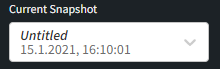

# Discovery Snapshot

## What The Snapshot Consists Of

Network snapshot records:

- The state of the network at the moment of the initialization of the
  snapshot.

- All service logs -- logs used internally by the IP Fabric system as
  well as a log of commands issued on every network device.

- Connectivity issues that had occurred during the retrieval of the
  snapshot.

A network snapshot is a fully functional software copy of your network,
including all configuration and state data. It enables to retrieve
historical information, to follow network state changes, analyze
connectivity issues, and more.

Information about the network displayed in IP Fabric corresponds to the
network snapshot selected in the Snapshot selector drop-down menu in the
top left corner of the Main User Interface.

## Available Snapshot Operations

### New Snapshot

During the initial configuration of the IP Fabric VM, automatic
snapshots can be scheduled. Initial snapshot of the network may not
include all information about your network. There might be user
privilege level issues, connectivity issues related to firewall rules,
etc. A new snapshot can be taken at any time by clicking the "New
Snapshot" button in the "Discovery Snapshot" menu entry. The system then
automatically starts a new snapshot of the network with globally set
parameters in the "Settings" menu entry. If you need to make some
changes to the discovery process -- add a new network seed, change login
credentials, etc. -- it needs to be done before a new snapshot is taken.

### Inspection of Network Issues

After the snapshot is taken, there might be some devices not showing in
the discovery table. You can then go through [the Summary of
Issues/Connectivity Report tables to see where this device in the
discovery process
failed](../Getting_Started/Overview/How_Discovery_Works/common_problems/finetune-ssh-telnet.md).

Each connection attempt -- successful or unsuccessful is logged (see the
following picture). Log for each device can be found in the Connectivity
Report. These logs are especially helpful when an error occurs. By
examining them you can find the reason why the device wasn't correctly
or fully discovered or what led to a connection failure.

### Add a New Device/Changing Snapshot Settings

A new device can be added to an already existing snapshot. This might be
desirable if you performed almost a full snapshot of the network but
only a few devices were not included or had connectivity issues that
were resolved (for example wrong AAA configuration, firewall rules,
forgot to include a network seed, etc). When adding a new device to an
existing snapshot, the discovery setting for that particular snapshot
will be applied. If you need to change some settings (for example new
network seed, login credentials, etc.) in order to add a new device to
an existing snapshot, you need first to change settings for that
particular snapshot and then add a new device.

### Lock Snapshot

Because of database maintenance, only up to 5 snapshots can be loaded
into the memory. By locking a snapshot, IP Fabric won’t unload the
selected snapshot automatically to the hard disk and it will keep it in
the memory.

### Unload/load Snapshot

Because of database maintenance, only up to 5 snapshots can be loaded
into the memory. If the maximum number of loaded snapshot is 5 and 6th
snapshot is created, the IP Fabric will automatically unload the oldest
snapshot from the memory and save it to the hard drive. This can be done
also manually on a selected snapshot by the "Unload snapshot" button.

When a snapshot is unloaded, it's safely stored on your hard drive, but
the data from a snapshot cannot be accessed directly through the IP
Fabric user interface. To browse an unloaded snapshot, it needs to be
loaded again to the memory by "Load snapshot".

button accessible on an unloaded snapshot.

### Download Snapshot

If needed, a selected snapshot can be downloaded directly from IP Fabric
to your hard drive by the "Download snapshot" button.

This snapshot can be loaded back to the IP Fabric platform by a “Load
From File” button.

### Clone Snapshot

Loaded as well as unloaded snapshots can be cloned by the "Clone
snapshot" button. This is handy in case you want to make some changes to
the snapshot (adding a device etc.) but you want to keep the original
file as a backup.

### Delete Snapshot

Snapshots can be deleted by the "Delete snapshot" button.

### Related Articles

If you want to learn more about how network discovery works from a
technical point of view, [read this article](How_CLI_Discovery_Works).
