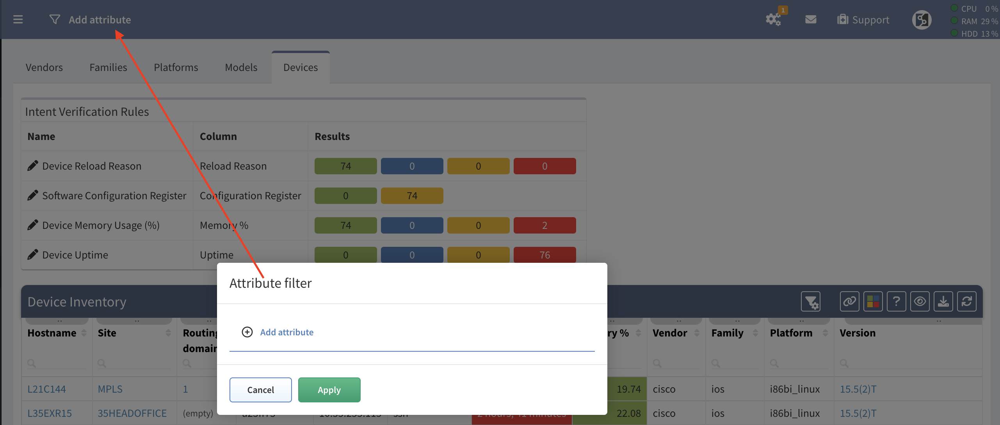
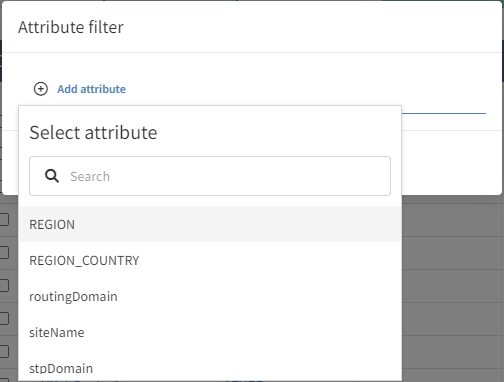
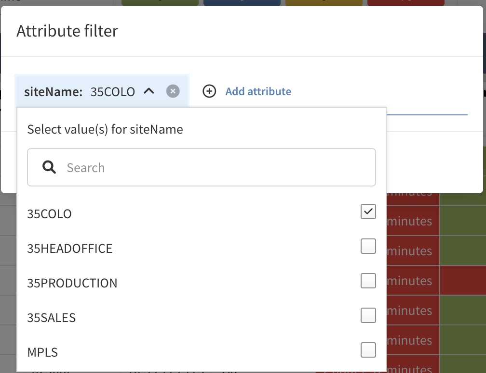
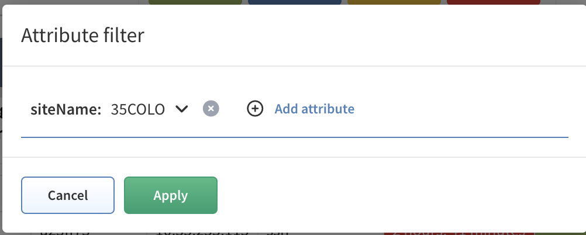
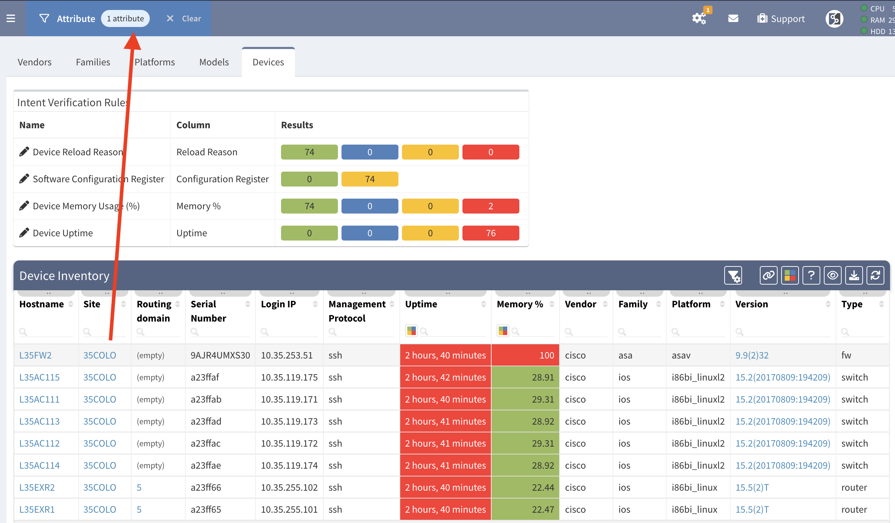

# Global Filter

Applying an **Attribute Filter** in the IP Fabric GUI will quickly limit the
scope of data that will be displayed in tables. Currently, adding a filter will
not update Intent Rules or the Dashboard (in development).

The options for filtering are:

- Site Name
- Routing Domain
- STP Domain
- Any Snapshot Local Attribute[^1]

[^1]:
    Please see [Device Attributes](../IP_Fabric_Settings/device_attributes.md)
    documentation. Note that after configuring a new Attribute Globally; a new
    snapshot must be run in order for it to be applied.

For this example we will be filtering on `siteName` then select the value(s)
you wish to apply.

View the Device inventory table filtered to show only devices from the
site `35COLO`.

