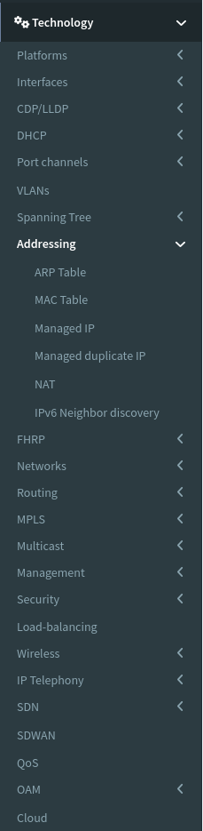
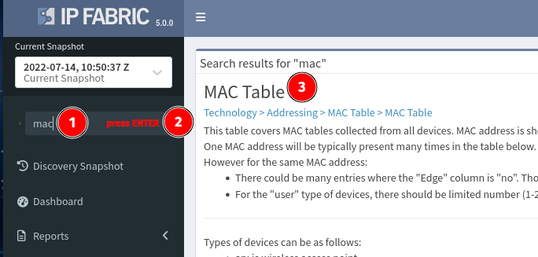
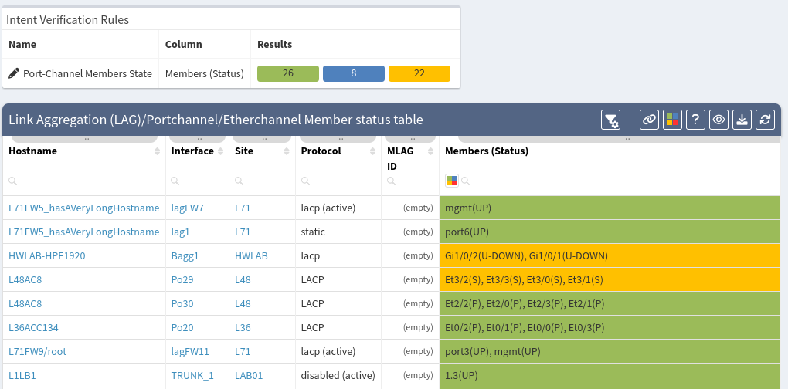
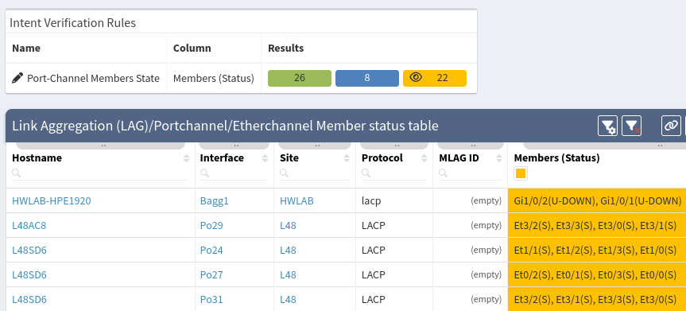
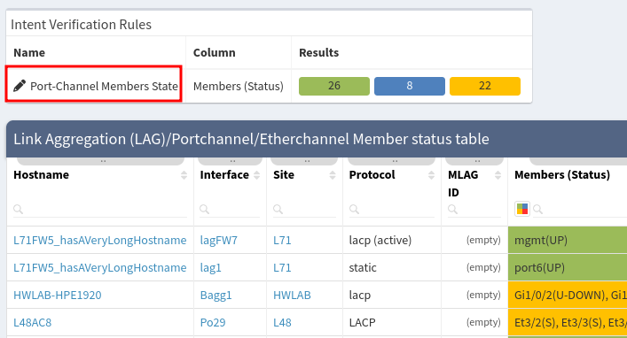
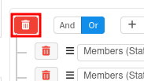
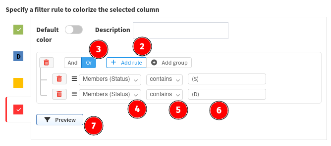
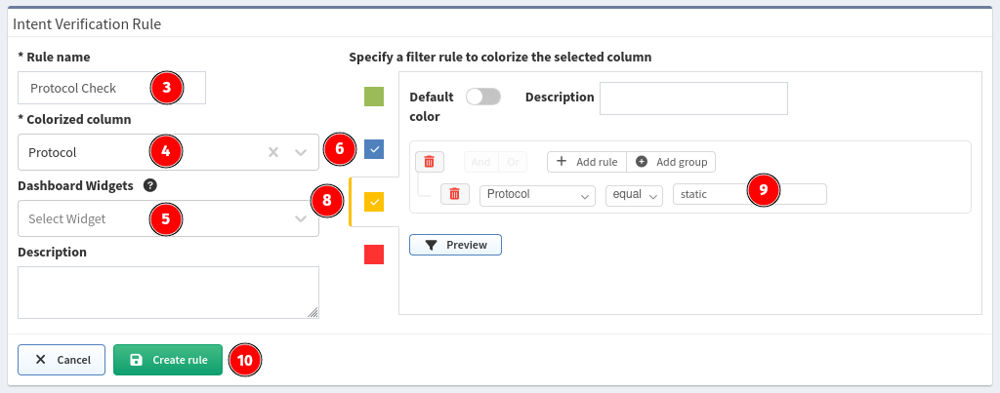

# Addressing

The Addressing section provides information about every IP address on
every managed network infrastructure device.

IP addresses should be unique throughout the network, except for highly
specialized applications like geographical service distribution via
anycast. Duplicate IPs usually signify a network fault, such as loss of
a keep alive link or misconfiguration, and actively managed duplicate IP
addresses are listed in a separate table.

## Verifying the Network

You can verify a lot of technologies and configuration parts with IP
Fabric. You can simply go through technologies in IP Fabric menu (for
example MAC table):

or quickly find particular technology you are interested in using search
(for example MAC table):

Today's goal is to check all port channels in our network.

### Step 1 -- Find the proper technology table

As described above we can simply browse IP Fabric menu and find a
particular technology table but in our case as we know exactly what we
are looking for, search menu will be a better choice.

In the upper right corner click to search field and type your request.
We are looking for port channels, ether channels or just link
aggregation. Because I'm from Cisco world I would type in "*port
channel*".

Search returns more results because there are more technology tables
with port channels. We are interested in the last one in this case
"*Link Aggregation (LAG)/Portchannel/Etherchannel Member status table*".
Just click on it and we are there.

### Step 2 -- Look for malfunctions

For your convenience IP Fabric has predefined a lot of rules and
reports. In our particular case port channels are colored green if
everything is OK and other color is used when some malfunction is in
place. You can easily sort the table by clicking the desired field in
the header. In the example below we clicked on "*Members (Status)*".

We can instantly see that some port channels have interface down (blue
color) or individual port (yellow color).

You can also filter colors by clicking them above in *Reports* box.
When clicked small eye icon is displayed and items are filtered only to
the selected color. Click again to the same color to clear filter.

#### Customize predefined rules

Predefined coloring rules can be fully customized. To do that click on
predefined rule name in *Reports* box above the technology table
which is "*Port-channel members state*" in our case.

Now you can check and change predefined colorization rules.

Let's change coloring from blue to red when port in port-channel is
down:

1. Remove rules from blue color. Click on blue color and then trash
   icon:  
     
2. Click to red color and *Add rule*.
3. Select logical *OR* because we want mark member red if any of
   defined rules apply.
4. We are interested in *Members (Status)* table row.
5. We would like to check if this row *contains* specific string.
6. Specify string we are looking for like *(D)* or *(DOWN)  
     
7. Click *Preview* to see if you rule works
8. If you are satisfied with the result click *Update rule*.

You can also add new set of coloring rules. For example, you want to check used
aggregation protocol. Please check *Colorize column* section.

### Step 3 -- Fix it

In step 2 we found few malfunctioned port channels. You can gather more
information in IP Fabric like check network diagrams or directly connect to
device with problematic port channel.

1. Click on device host name.
2. You can go to network diagram (click to switching domain number).
3. You can connect to device.  
    

### Step 4 -- An overall overview

Dashboard is the right place where you can see the overall status of
your network. There are predefined widgets for user convenience but you
can also add, remove or edit it.

For our example with port channels you can go to *Dashboard*, widget
Neighborship compliance and there is report called Port Channel members
states. By clicking selected color you are redirected to technology
table with color filter applied.

#### Adding custom Report to the Dashboard

First let's create new coloring rule which will be then added to the
Dashboard.

1. Go to *Technology → Port Channels → Member status table.*
2. Click to *Colorize columns* button in the right toolbox menu.  
     
3. Specify *Rule name*, for example *Check protocol.*
4. Select *Colorized column*, it's *Protocol* in our case.
5. Leave *Widgets* empty for now.
6. Click on *blue.*
7. Create rule *Protocol regex `(LACP\|lacp)`.*
8. Click on *yellow.*
9. Create rule *Protocol equal static.*
10. Click *Create rule.  
      

We crated new coloring rule but we would like to see status of port
channel protocol on the Dashboard. We can add it like this:

1. Go to Dashboard → Overview.
2. Click Edit in the upper right corner.
3. Click *+Add row*.
4. Choose row style what you would like to add.
5. Click on *Untitled* and enter some name for example "Port
   channels".
6. Click *+Add Widget.*
7. Select widget type in our case it's *Table Colors.*
8. Name widget for example "Port channels".
9. Look for *Table color rules* and add it to Widget. For example
   Technology → Port channels → Member status table → Protocol check.
   We created this rule it the previous steps.
10. Switch *Select Widget View* to percentage (default) or absolute
    numbers.
11. Select view type (graph or summary table)  
      
12. Click *Save *in the upper right corner.

And here we are, our new Dashboard widget.

