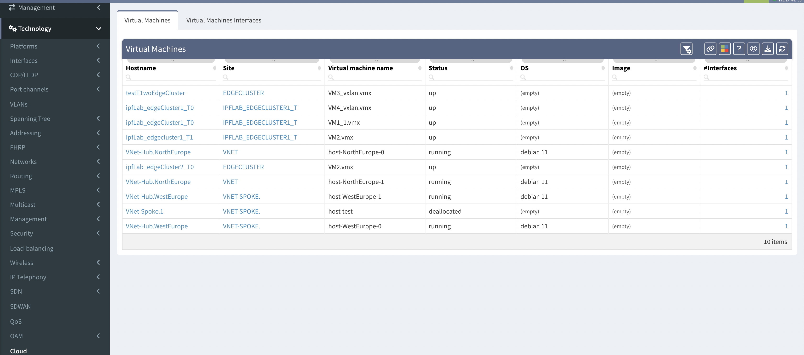

# Cloud

## Virtual Machines And Their Interfaces

Public or private clouds API provide information about virtual machines. In previous versions, IP Fabric wasn't able to collect any information about Virtual Machines. From version 4.4 IP Fabric displays information about virtual machines discovered through private or public could APIs.

Each vendor provide a different scope of information for VMs, thus IP Fabric might not be able to get all the information for end host calculations (ARP, MAC address table).

New tables in this section provide detailed information about cloud virtual machines -- their hostnames, sites, VM names, status, OS version running, number of interfaces and their details (IP address, MAC address, etc).

