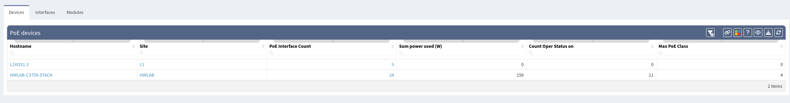
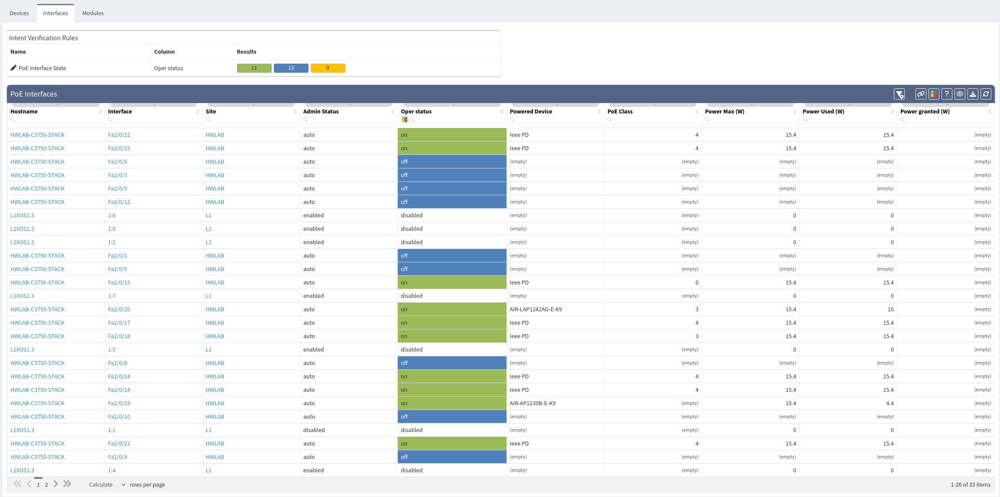
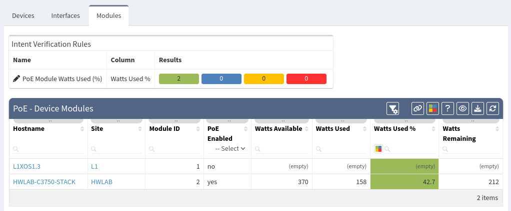
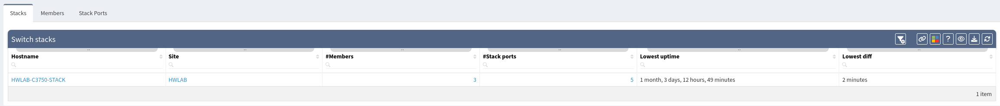

# Platforms

## PoE

Useful information about power consumption over the PoE protocol can be
found in this section.

### Devices

The first table displays all devices that support PoE protocol, number
of PoE interfaces, current power usage, number of ports that uses PoE
and highest PoE class available on the device

### Interfaces

PoE interface table lists all interfaces that support PoE protocol.
Filters can be used to check PoE interface status on a particular
device. _"Admin status"_ shows the administrative status of an
interface. It can be enabled/auto or admin-down, shutdown or disabled.
Operation status lists status of every enabled PoE port. Type/PID of
powered devices are available in the _"Powered Device"_ column if
available. The last three columns describe PoE class and power usage.

### Modules

The last tab shows the PoE module statistics. This table is especially
significant because it shows used power consumption in watts, percentage
and how many watts are left.

## Stacks

Stacks menu contains information about stacks in your network - stack
members, stack ports, their uptime, role in the stack, status and more.

## Environment

Environment menu provides information about power supplies, power
supplies fans, chassis fans and modules of network devices.

