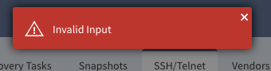
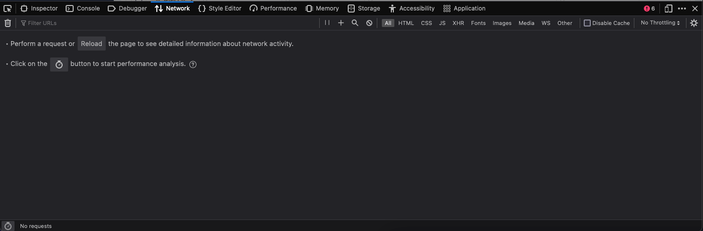
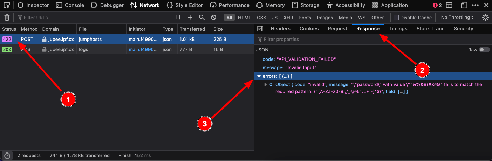
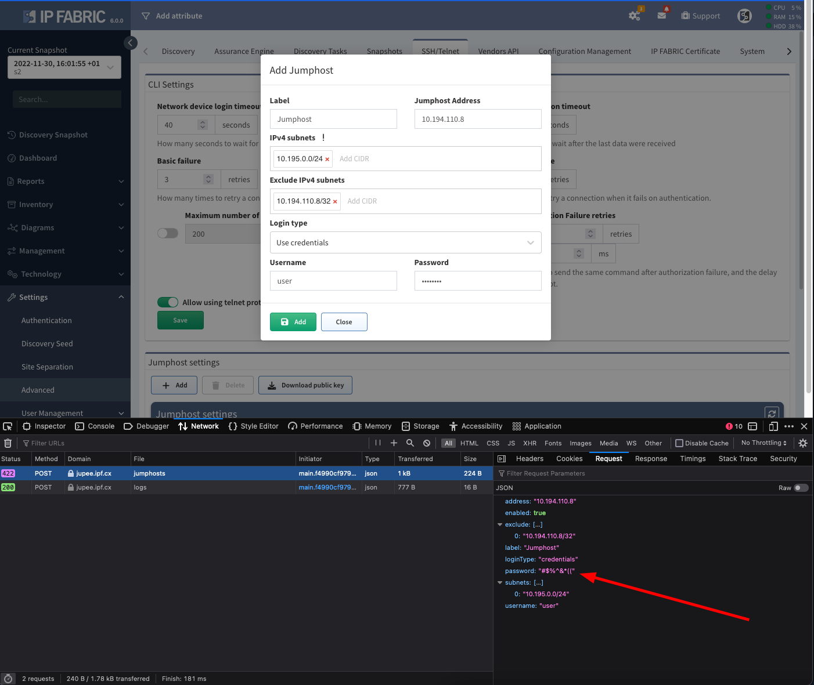

# Troubleshooting Vague Messages

IP Fabric error messages are not always eloquent and vague message like **Invalid Input** can be displayed:

If you do not know what exactly went wrong, more descriptive messages can be excerpt from API response received on the background.

These messages can be found in developer console of the browser.

Hit `F12` or click in top right corner on hamburger menu in your browser, go to **More tools --> Web Developer Tools** and something similar will appear:

!!! info

    The console may look differently in your browser but functionality and tabs should be the same. This example is from Mozilla Firefox.

Go to the `Network` tab and repeat the action which raised the error message, the API calls from your browser should be visible.

When selecting a response from the server with `error code` (usually ones in red colors) go to tab **Response** and in the **errors** section should be an explanation why the **Invalid input** message was displayed:

!!! example

    In the example above the error message was thrown because restrictred characters were present in Jumphost's `password` field:

    
