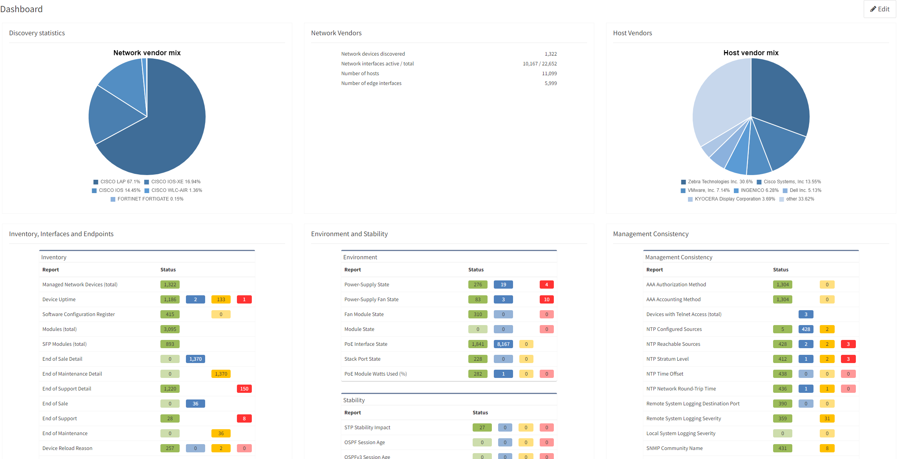

# Dashboard

## Overview

The dashboard provides an overview of the network analysis results, including an aggregated scorecard calculated from the performance, capacity, and risk metrics. Issues covered by the radar charts and compliance tables link to the detailed reports.

