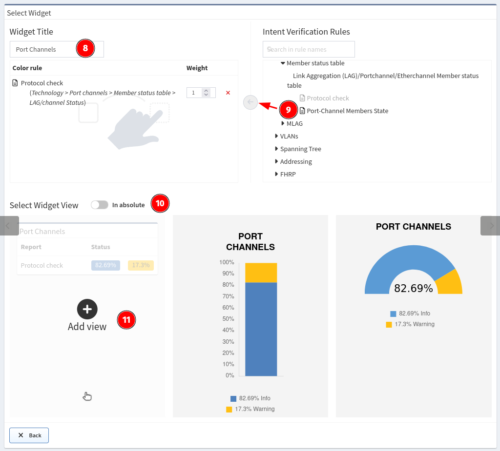
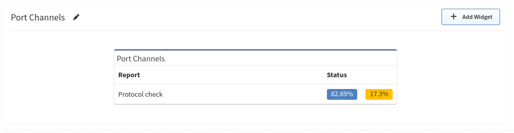

# Dashboard

## Overview

The dashboard provides an overview of the network analysis results, including an aggregated scorecard calculated from the performance, capacity, and risk metrics. Issues covered by the radar charts and compliance tables link to the detailed reports.

## Adding Information To The Dashboard

You can add any Intent Verification Rule to the Dashboard.

1. Go to **Dashboard**.
2. Click Edit in the upper right corner.
3. Click **+Add row**.
4. Choose row style what you would like to add.
5. Click on **Untitled** and enter some name for example **Port
   channels**.
6. Click **+Add Widget**.
7. Select widget type in our case it's **Intent Verifications**.
8. Name widget for example **Port channels**.
9. Look for **Table color rules** and add it to Widget. For example
   **Technology → Port channels → Member status table → Protocol check**.
   We created this rule it the previous steps.
10. Switch **Select Widget View** to percentage (default) or absolute
    numbers.
11. Select view type (graph or summary table)  
    
12. Click **Save** in the upper right corner.

And here is our new Dashboard widget:

