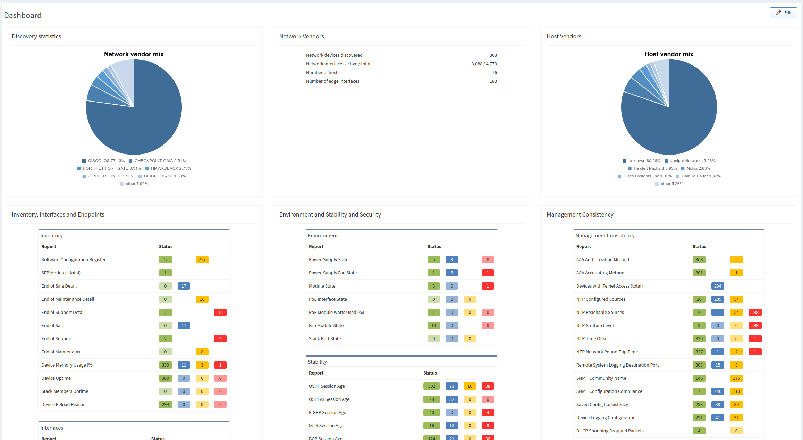

# Dashboard

## Overview

The dashboard provides an overview of the network analysis results, including an
aggregated scorecard calculated from the performance, capacity, and risk
metrics. Issues covered by the radar charts and compliance tables link to the
detailed reports.

## Adding Information to the Dashboard

You can add any Intent Verification rule to the Dashboard.

1. Go to **Dashboard**.
2. Click **Edit** in the upper-right corner.
3. Click **+ Add row**.
4. Choose a row style that you would like to add.
5. Click **Untitled** and insert a name, for example `Port Channels`.
6. Click **+ Add Widget**.
7. Select a widget type. In our case, it is **Intent Verifications**.
8. Name the widget, for example `Port Channels`.
9. Find an intent verification rule and add it to the widget. For example,
   **Technology --> Port channels --> Member status table --> Link Aggregation
   (LAG)/Portchannel/Etherchannel Member status table --> Port-Channel Members
   State**.
10. Switch **Select Widget View** to percentage (default) or absolute numbers.
11. Select view type (graph or summary table). 
    
12. Click **Save** in the upper-right corner.

And here is our new dashboard widget:

