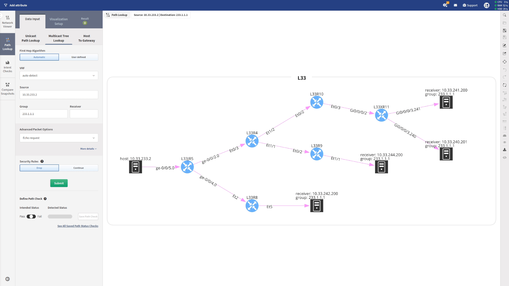

# Compare Snapshot

It can be very useful to have a quick look at the topology and observe what has
changed from one snapshot to another. To compare, you just need to click
**Compare Snapshots** and select the snapshot you want to compare your current
snapshot with, and you will see the result.

In the example above, we can see that the router `L33R8` was in the `older
snapshot`, but it has been removed in the `newer snapshot`.
