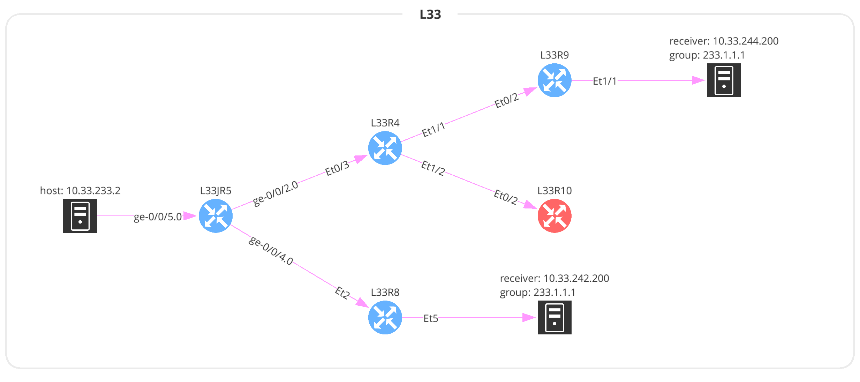
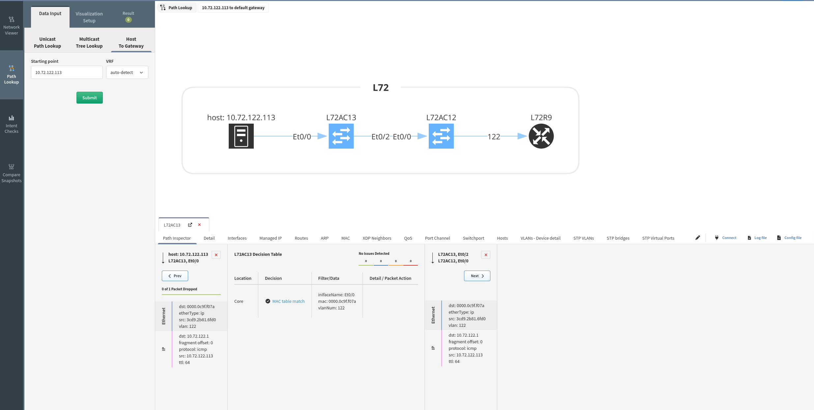

# How To Use Path Lookup

## Unicast Path Lookup

### First Hop Algorithm And VRF
First hop algorithm can be defined - when **Automatic** option is selected,
source VRF can be automatically detected, or selected manually.

Also your source network device and its interface can be selected when choosing
**User defined** First Hop Algorithm.

### Source/Destination IP Address and Port

As a source/destination IP address can be used a plain IP address or a CIDR (Classless Inter-Domain Routing) when for example simulating path lookup from a host to a network.

By default, ICMP protocol and Echo request is chosen for path lookup.

When switched to Web HTTP/HTTPS, TCP destination port 80 and 443 with (web|http|https) application is set by default.

When extending details, transport protocol and range of ports can be specified for a source and for a destination. When more destination ports are specified, IP Fabric will analyze all of them individually during the pathlookup.

Port can be changed to an arbitrary one for TCP/UDP protocols.

The following flags can be also set for TCP traffic -- None/ACK/FIN/SYN/RST/PSH/URG.

### TTL and Fragment Offset

In **More details**, **TTL** (Time to live ) and **Fragment offset** can be set - thus affecting path lookup output - default TTL is 128 and Fragment offset is set to 0

### Application

When evaluating security rules and security appliances on the path check traffic on L7, an application can be checked on the path lookup.

It’s almost impossible to standardize application names across all vendors. You can define your own application name with regular expressions.

!!! Info

	An application name input is just a string, so it needs to be defined exactly as in a security rule!

### Source/Destination IP Regions

You will then see the Multicast Tree:

And you will have access to a lot of information regarding the Multicast
forwarding decision:

## Host To Gateway

To find out more details between a host and its network gateway, you can
use this menu: Host To Gateway. You only need to provide the host, and
you will the details:

## Visualization Setup

You can set up what you want to prioritize in the view. Just simply move
the bars up or down.

## Improvements from 4.3 version

From version 4.3, IP Fabric supports more granular path lookup.

### First Hop Algorithm
First hop algorithm can be defined - when **Automatic** option is selected,
source VRF can be automatically detected, or selected manually.

Also your source network device and its interface can be selected when choosing
**User defined** First Hop Algorithm.

### Source/Destination IP Address and Port

By default, ICMP protocol and Echo request is chosen for path lookup.

When switched to Web HTTP/HTTPS, TCP destination port 80 and 443 with (web|http|https) application is selected by default.

When extending details, transport protocol and range of ports can be specified for a source and for a destination. When more destination ports are specified, IP Fabric will analyze all of them individually during the pathlookup.

### TTL and Fragment Offset

In **More details**, **TTL** (Time to live ) and **Fragment offset** can be set - thus affecting path lookup - default TTL is 128 and Fragment offset is set to 0

### Application

When evaluating security rules and security appliances on the path check traffic on L7, an application can be checked on the path lookup.

It’s almost impossible to standardize application names across all vendors. You can define your own application name with regular expressions.

An application name input is just a string, so it needs to be defined exactly as in a security rule!

### Source/Destination IP Regions

When testing access to or from the internet, source or destination IP regions can be set.

Example: Europe, China, etc.

