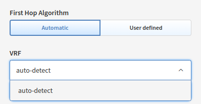
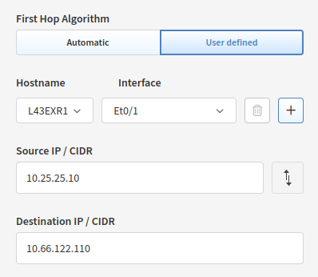
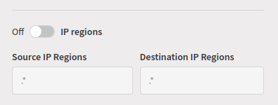
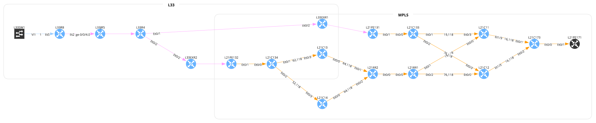
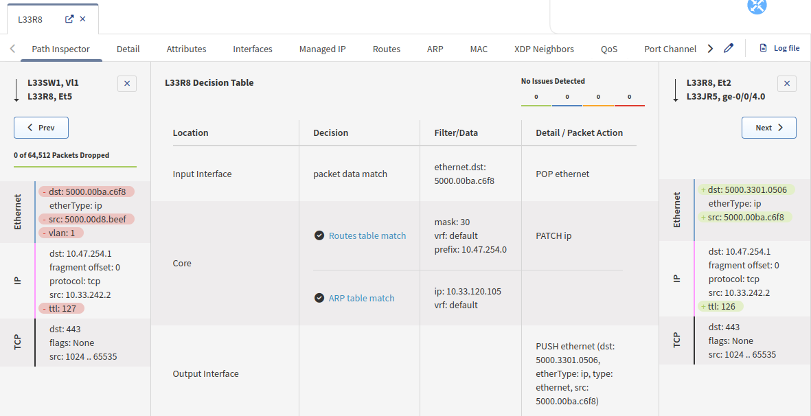
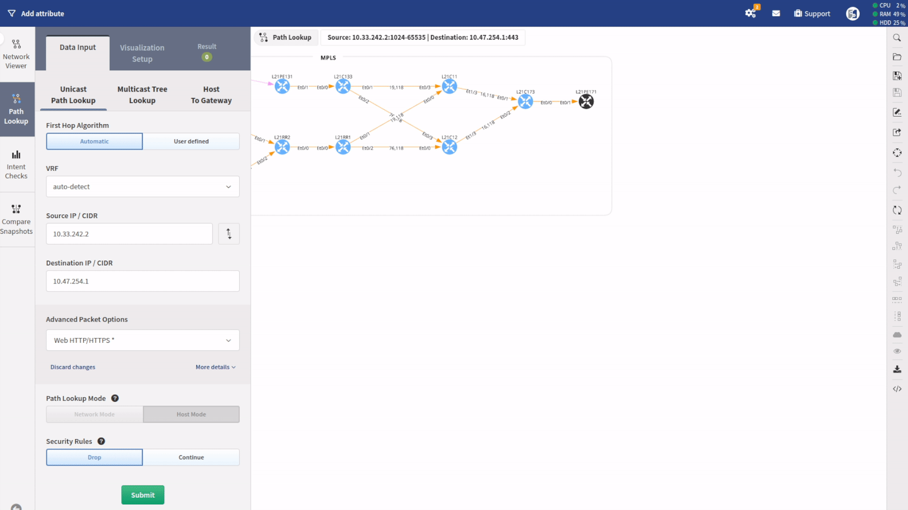

# How To Use Path Lookup

## Unicast Path Lookup

### First Hop Algorithm And VRF

First Hop Algorithm adds possibility to start path lookup simulation from a different device than the closest one.

If the **Automatic** option is selected, IP Fabric starts path lookup simulation from the closest device possible, VRF is also automatically selected by default, but can be changed manually.

**User defined** First Hop Algorithm can be useful when simulating flow where the source network is not known by IP Fabric.

To simulate such flow, it is necessary to specify the starting point by entering the name of the device and the interface which will be used to start the path lookup.

Packets will use the source IP indicated.

!!! Example "User Defined First Hop Algorithm"
    In the example below, the source network `10.25.25.0/24` is not known by IP Fabric. To show the path between a client in this network and a server in a network known by IP Fabric:
    
    {: style="height:150px"}
    
    - Select `User defined` First Hop Algorithm
    - Search for the device where to start the path: `L43EXR1`
    - Select the source interface: `Et0/1`
    - Enter the source IP, from the network outside the scope of IP Fabric: `10.25.25.10`
    - Finally enter the destination IP: `10.66.122.110`

    

    This is the result you will get:

    

### Source/Destination IP Address and Port

As a source/destination IP address can be used a plain IP address or a CIDR (Classless Inter-Domain Routing) when for example simulating path lookup from a host to a network.

By default, the `ICMP` protocol and the `Echo request` option are chosen for path lookup.

When switched to Web HTTP/HTTPS, TCP destination port 80 and 443 with (web|http|https) application is set by default.

When extending details, transport protocol and range of ports can be specified for a source and for a destination. When more destination ports are specified, IP Fabric will analyze all of them individually during the path lookup.

Port can be changed to an arbitrary one for TCP/UDP protocols.

The following flags can be also set for TCP traffic -- None/ACK/FIN/SYN/RST/PSH/URG.

### TTL and Fragment Offset

In **More details**, **TTL** (Time to live) and **Fragment offset** can be set -- thus affecting path lookup output - default TTL is 128 and Fragment offset is set to 0

### Application

When evaluating security rules and security appliances on the path check traffic on `L7`, an application can be checked on the path lookup.

It’s almost impossible to standardize application names across all vendors. You can define your own application name with regular expressions.

!!! Info

    An application name input is just a string, so it needs to be defined
    exactly as in a security rule!

### Source/Destination IP Regions

When testing access to or from the internet, source or destination IP regions can be set.

Example: Europe, China, etc.

By default, IP regions are not evaluated.

!!! Info

    IP regions are just a string, so they need to be defined exactly as they are
    in a security rule!

### Path Lookup Mode

If you’ve used a network CIDR instead of a single IP address, you will have the option between:

- **Network Mode** -- simulation starts and ends with whole networks,
individual hosts are not considered

- **Host Mode** -- simulation starts and ends with each host. It is
limited to 255 hosts, source and destination combined.

Then click submit.

This is how path lookup might look like:

### Security Rules

If **Drop** is selected, the path lookup will stop when a security rule denies
traffic.

If **Continue** is selected, the path lookup continues and does not apply the 
policy's deny; in the detail pane it is labeled as `(not applied)`.

## Multicast Tree Lookup

If you want to understand how a certain multicast flow is used, you can use
the Multicast Tree Lookup. For that, just select the correct option and
enter the relevant details

You will then see the Multicast Tree:

And you will have access to a lot of information regarding the Multicast
forwarding decision:

## Host To Gateway

To find out more details between a host and its network gateway, you can
use this menu: Host To Gateway. You only need to provide the host, and
you will the details:

## Inspecting And Adjusting Path Lookup

### Path Controls

With the mouse right-click, more options are enabled:

After opening the details with `Explore`, we can select the destination link to proceed with packet analysis:

### Understand The Path Selection

To understand the decision taken by a device, right-click the device
and click `Explore`. You will then be presented with the details. If you
have more than one interface where the flow can come from, you will need
to select the interface you want to look at. Similarly, if you have
several interfaces that can be used to forward the traffic, you will
have to choose one. Then in the middle of the table, you will see the
forwarding decision:

In this example, we are looking at the device `L21C11`, which has 2
incoming interfaces and one forwarding for this flow:

### Visualization Setup

You can set up what you want to prioritize in the view. Just simply move
the bars up or down.

