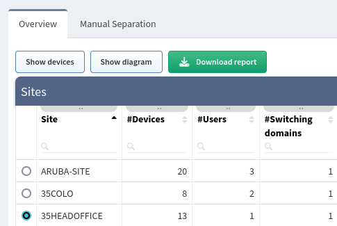
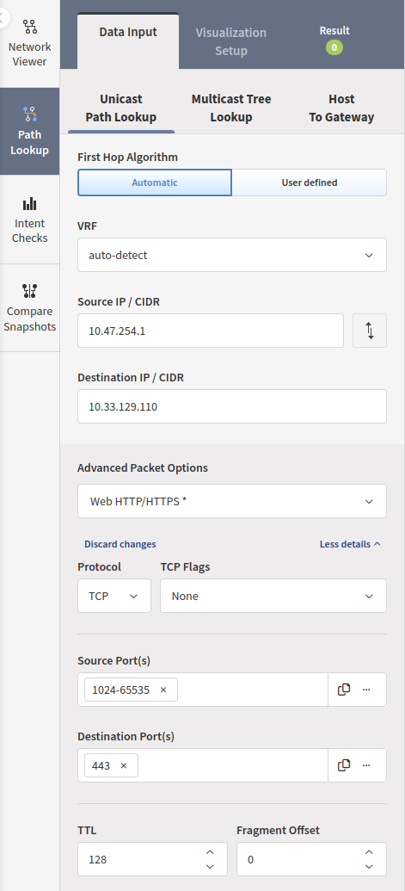
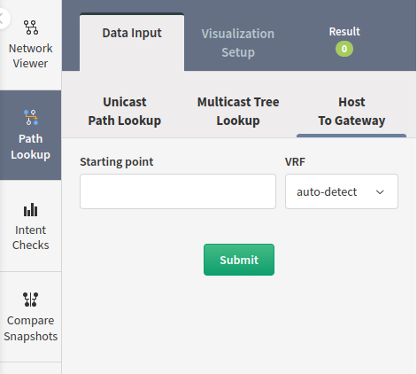

# Overview

Diagrams help to visualize the network state information.

We had to change how the diagrams work to bring more functionalities
soon. One of the key changes in the processing of the diagrams is done
in the backend, which means you will be able to collect diagram
information via the API, where it wasn't possible before.

## Diagram Types

### Network

By default, when you click on Network, all networks are displayed and
the relationships between them. They are grouped into sites represented
by a cloud for better visibility. You can double-click on a cloud to
explore further that specific site.

Check this page [Network Viewer](network_viewer.md) for more details on using the diagrams.

### Sites Diagrams

Site diagrams display all devices discovered per site. Sites are automatically calculated based on the administrative domain boundaries, such as carrier networks and unmanaged infrastructure. Site boundary calculation can be [configured in settings](../../IP_Fabric_Settings/site_separation.md).

The site name can be changed. To rename a site, go to **Inventory → Sites**, choose the site you would like to rename, click ***Rename site***, enter a new name, and click ***Rename***.

Check this page [Network Viewer](network_viewer.md) for more details on using the diagrams.

### Routing

Routing diagrams display contiguously, directly interconnected routers
to form a routing domain.

### Switching

Switching diagrams displays individual spanning-tree instances or a
composite switching domain. A unique Root ID identifies spanning-tree
instances. The switching Domain is composed of contiguously connected
spanning-tree instances, representing the maximum possible fault
propagation in a Layer 2 failure domain.

### End to End path

End to End path diagram displays a complete path between any two network
endpoints or networks. Only the actual network path is displayed, and
missing parts denote unavailable network information necessary for
completing the routing process.

The End to end path can be found in ***Diagrams → End to end path*** or
on any diagram using the "Path Look-Up" menu on the left (see picture
below)

Check this page for more details [How to use Path Look-Up](how_to_use_path-lookup.md)

### Host to Gateway path

The host to Gateway path diagram displays the Layer 2 path from every
identified endpoint in the network to its active gateway router.

The Host to Gateway path can be found in ***Diagrams → Host to gateway
path*** or any diagram using the "Path Look-Up" menu on the left and
selecting "Host To Gateway"(see picture below)

Check this page for more details [How to use Path Look-Up](how_to_use_path-lookup.md)
