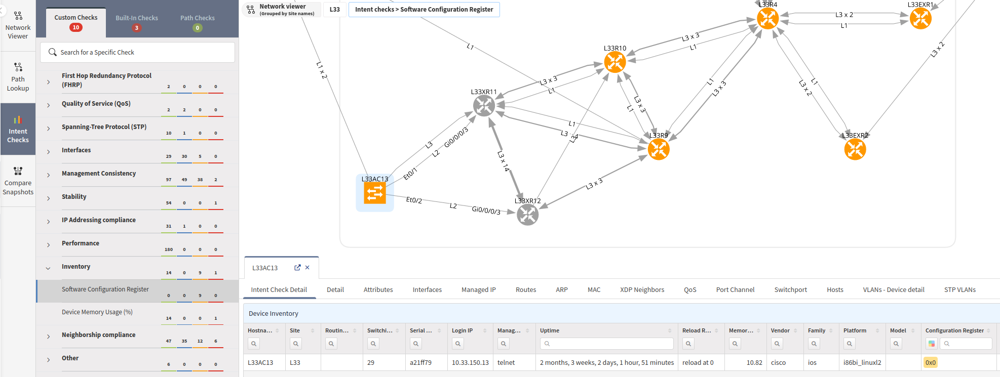

# Intent Checks

You can overlay the intent verification rules on top of any diagrams.

**Intent Checks** include:

- **Built-In Checks**
  - `Single Points of Failure`
  - `Non-Redundant Links`

- **Custom Checks**
  - All the intent verification rules in IP Fabric -- the default checks and the
    ones you have created.

## Single Points of Failure

The algorithm is designed to enhance network reliability by identifying
critical nodes. Unlike some methods, this algorithm does not consider
the protocols or the directionality of links within the network graph.
It operates by pinpointing articulation points (also called cut vertices),
which are nodes that, if removed, would divide the network into
two or more isolated components.

All nodes considered single points of failure are visualized red in
the network graph.

## Non-Redundant Links

The algorithm identifies vulnerable links within the network infrastructure,
regardless of network protocols or the directionality of links.
It identifies bridges, which are links that, if removed or failed, would
segment the network into multiple, isolated components.

These bridges act as critical pathways or bottlenecks in the network.
The algorithm visually marks these critical bridges for easy identification.

## Path Checks

**Path Checks** serve for checking of source and destination ports. Simply
add source and destination, and a diagram will be displayed.

