# Network Viewer

When you go to **Diagrams --> Network**, all networks are
displayed along with the relationships between them. They are grouped into
sites (which are represented by clouds) for better visibility. You can double-click
a cloud to explore further that specific site.

Top-level view with all networks:

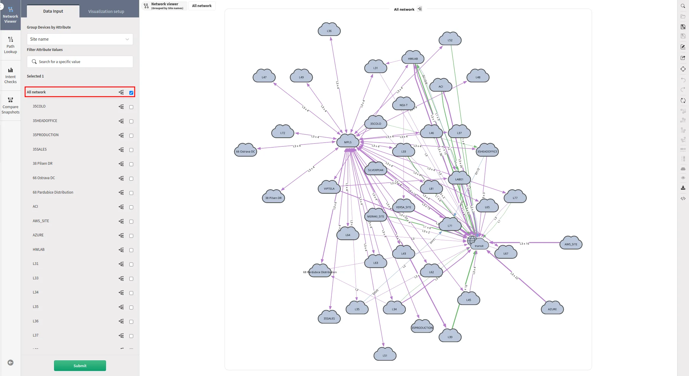

## Adding Networks to the View

To display the required information, select on the left side the site
you want to visualize and click **Submit**.

One or more sites can be displayed at the same time.

For example, to see a diagram of the particular sites `35HEADOFFICE` and
`35COLO`:

1.  Select `Site name` from the **Group Devices by Attribute** drop-down menu.

2.  Select the site names.

3.  Click **Submit**.

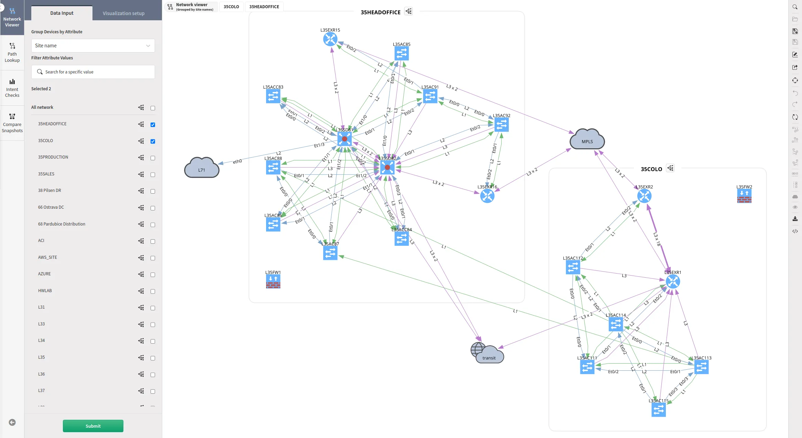

## Removing Networks

In a very similar way as to add a site/network to a diagram, to hide it,
just unselect the network and click **Submit**.

## Manipulating Objects and Nodes

Diagrams are generated automatically, and the following supported
operations can change their layout:

- _Pinch to zoom: touch & desktop (if supported by the trackpad)_

- Mouse wheel to zoom: desktop

- Two-finger trackpad up or down to zoom: desktop

- Tap to select: touch & desktop

- Tap background to deselect: desktop

- Multiple selections via modifier key (`Shift`, `Command`, or `Control`) + tap: desktop

- Box selection: touch (three-finger swipe) & desktop (modifier key +
  mouse down then drag)

- Grab and drag nodes: touch & desktop

The **Center View** button can also center the screen view.

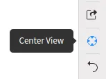

## Hide/Collapse Items in the View

If you right-click after selecting a set of devices or cloud, you will have the
option to either:

1. collapse the selected items into a new cloud:

   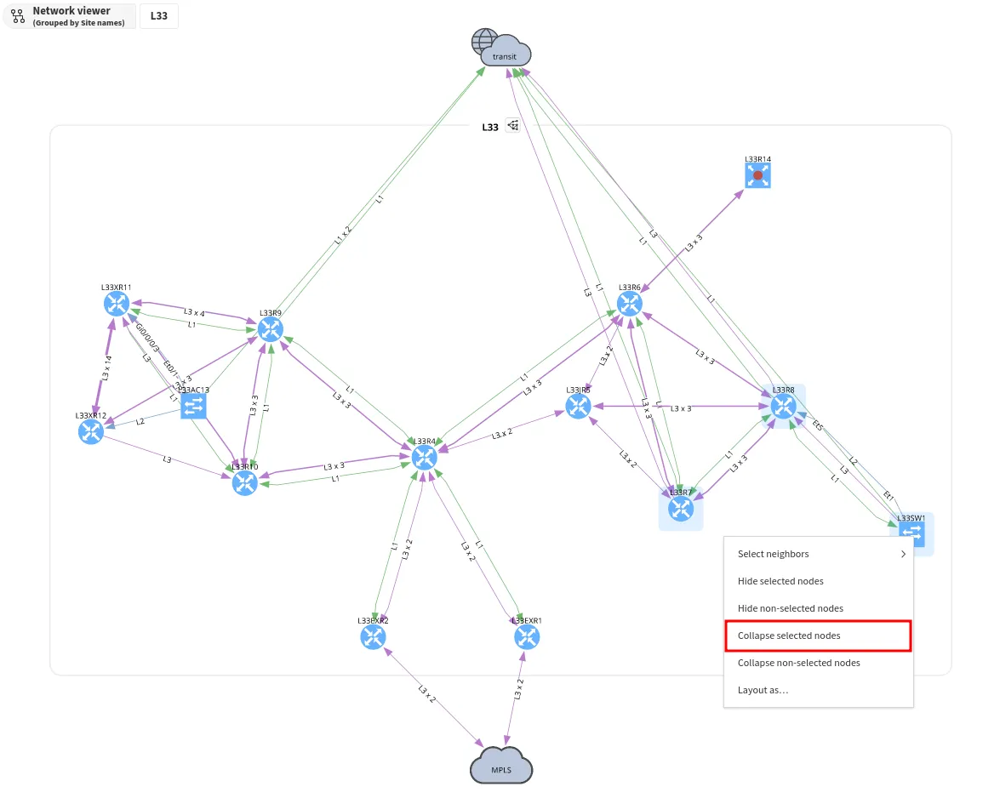

   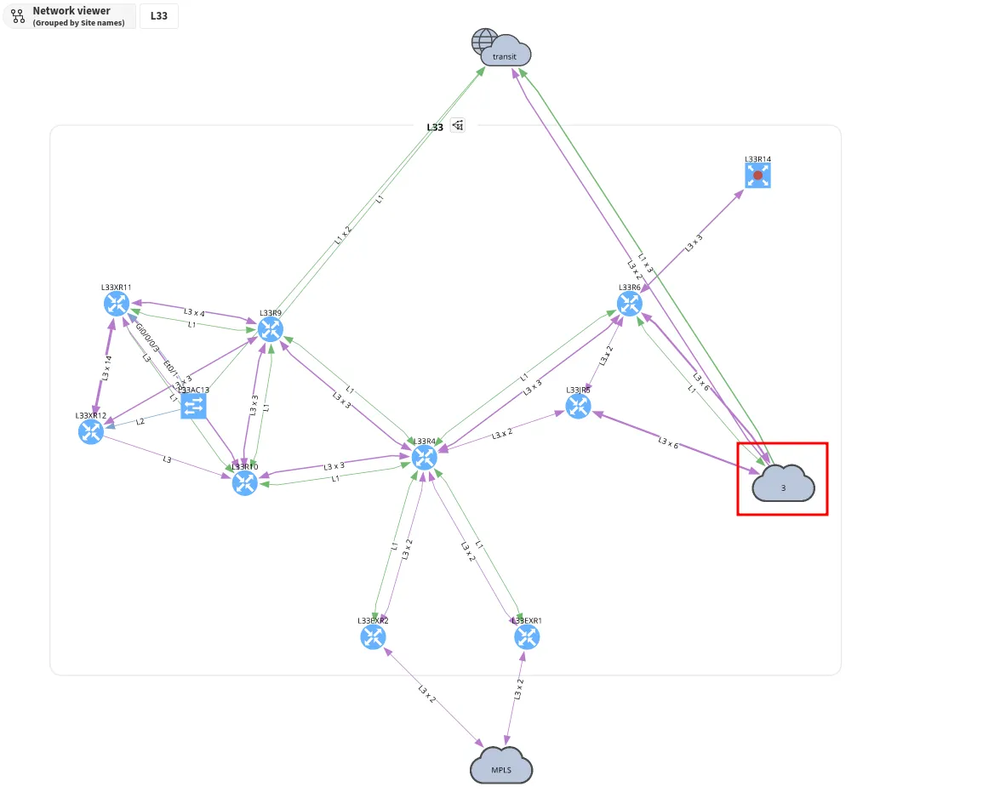

2. or hide them:

   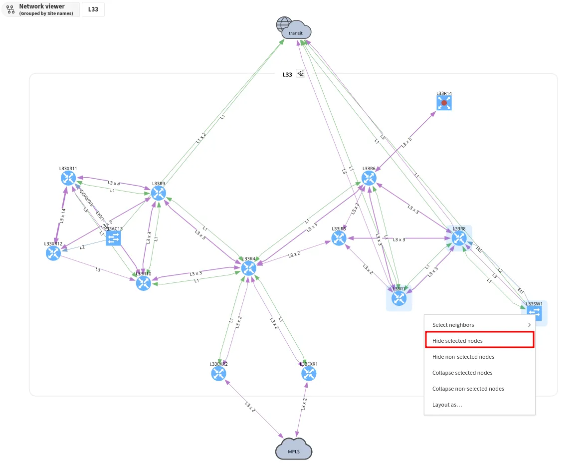

   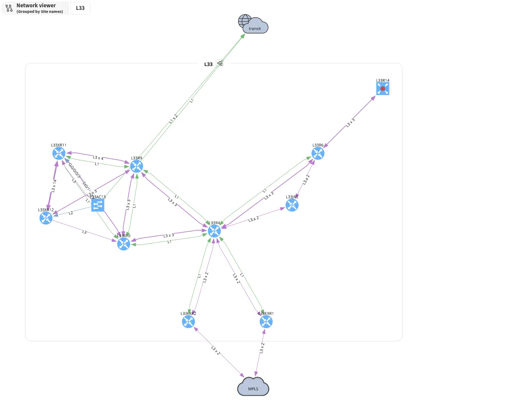

## Layouts

### Save User-Defined Layout

After editing the layout, you will see the green box. This allows you to
save the changes as the default view. Click the green box; this will
open a menu **Select Diagram Layout Settings**, and the last entry is
the **User-Defined Layout**. By clicking the **Floppy disk** icon, you
will update the default view (see below). Please be aware that only
the position of the visible nodes will be saved.

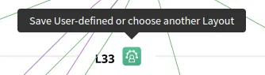

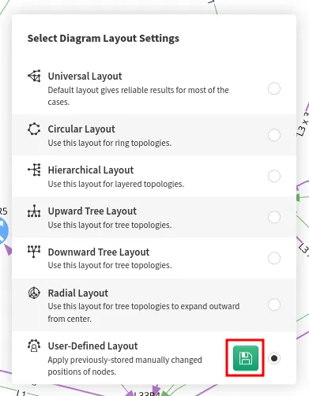

### Use User-Defined Layout as the Default Layout

Once you have created a user-defined layout, you probably want to use
this as the default layout. For this, click the icon of the site you
want to update, then select the User-Defined layout and click **Save**.

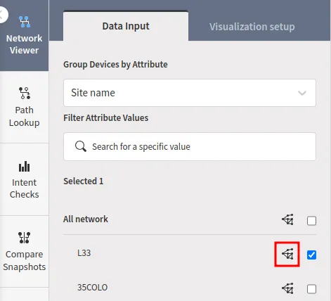

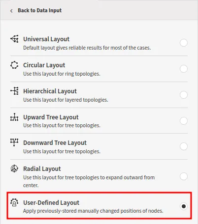

From now on, this will be the default layout for this site:

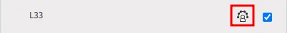

### Choose a Specific Layout for a Selection of Devices

You can now specify which layout you want to use for a set of devices:

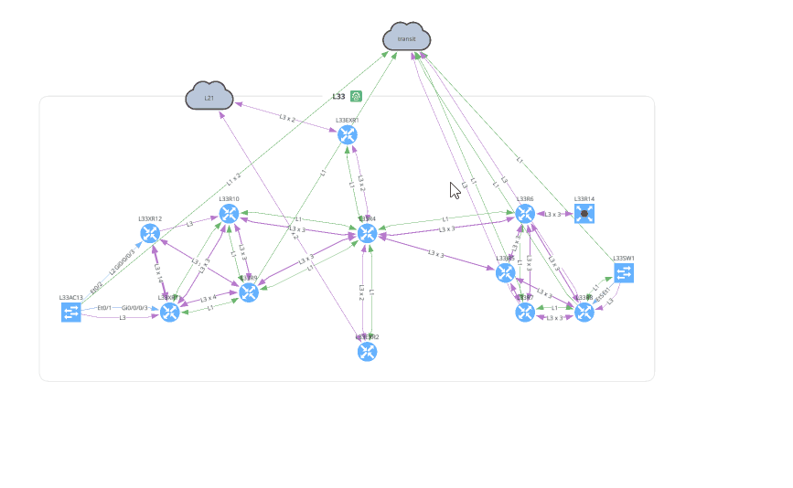

### Choose a Layout to Apply for the Whole Site

Similarly, you can select a layout for the whole site using the layout
selection.

- Circular Layout can be used only for 500 nodes or less.

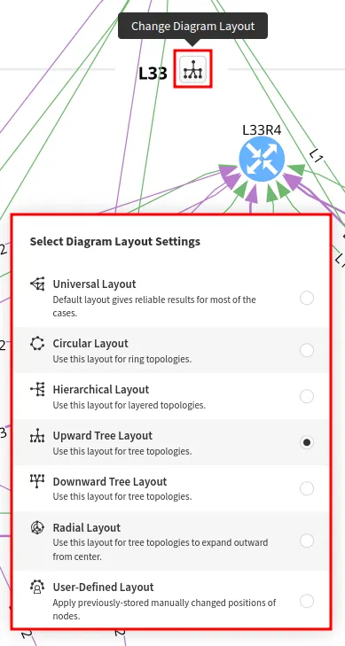

## Save, Load, and Share View

Each object can have multiple views that can be saved and loaded again
later.

### Save View

Click the **Floppy disk** icon on the menu on the right end side:

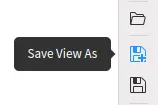

Enter a name for that view and click **Save**.

!!! info

    The view saved in this way is not the default view for that object.

### Load View

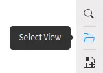

The view can be loaded by clicking the **Folder** icon.

Select the desired view and click to load.

### Share View

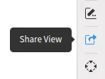

By clicking here, a URL will be displayed, which you can share with
other users, and they will be able to see this view.

### Export Current View To SVG/PNG/VSDX

The view can be exported in the form of a SVG, PNG image, or VSDX file by clicking
**Export** and selecting the format you want. The pre-defined name of the file is auto-generated based on the network name, number of shown networks, IP addresses, or name of the saved view.

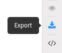

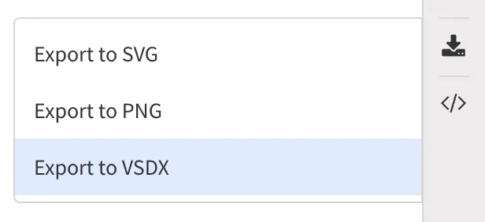{ width=300 }

!!! Note "VSDX Export Limitations"
    - Export of `Intent checks` in diagrams (colorful nodes are not supported).
    - Export of temporarily visible hidden nodes in "Show Hidden Nodes" mode is not supported.
    - Export of group boundaries is not supported.

### Search

Search looks up any text currently present on the diagram. Typing query
filters the view, and clicking the **Search** button focuses and zooms in
on the item.

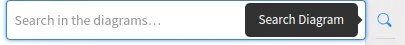

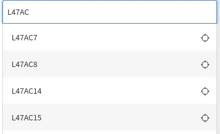

If you hover the mouse cursor on one entry, you will see the device on the
diagram:

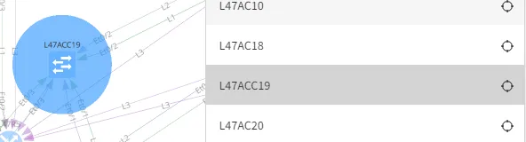

## Protocols

You can filter connection protocols between devices of the second
and third layer of ISO OSI by using filters in the **Network Viewer -->
Visualization setup --> Protocols** menu.

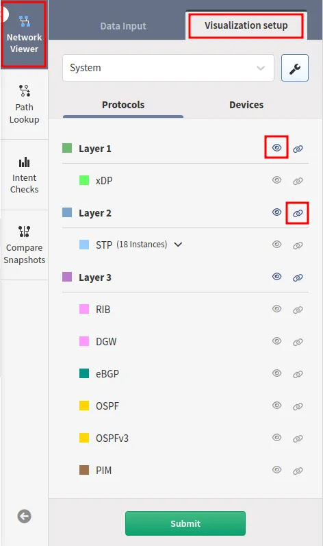

You can decide which layer/protocol you want to display/hide and
group/ungroup.

### Default Protocols View

By default, all discovered protocols will be grouped based on the layer
they belong to. This is the **System** view. You can edit this, which
means you are able to ungroup certain protocols. For this, click the
**Settings** icon:

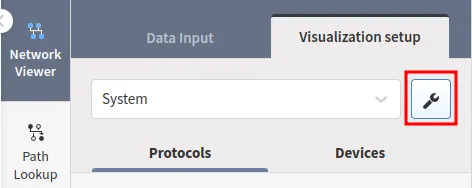

Drag and drop protocols you want to put to a custom group to the **Other
Protocols**, click **Save as** and give a name to the new protocol view.

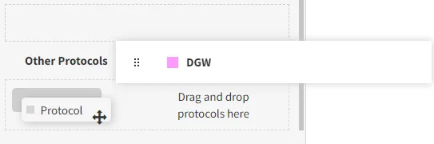

With the example below, you are now able to hide only the DGW protocol
without affecting the other Layer 3 protocols:

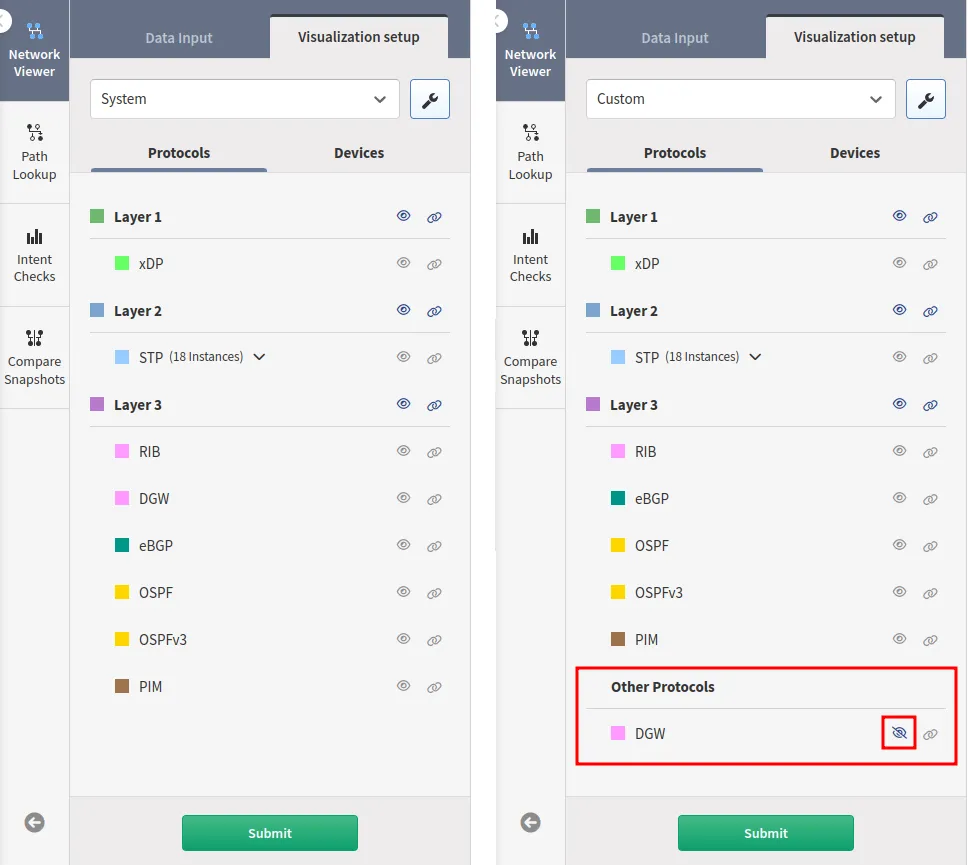

VRF labels are now shown as line-cap labels on topology graph edges for Layer 3 protocols, making it easier to identify VRF associations directly in the graph.

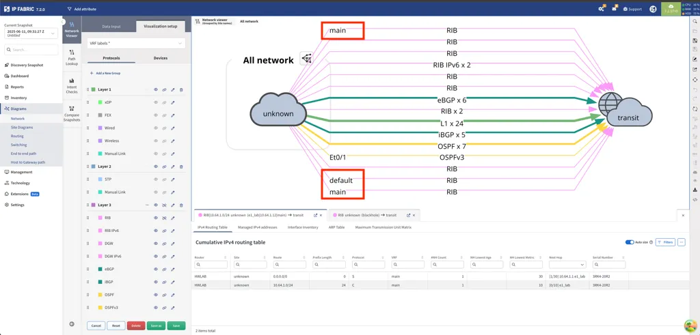

Interface descriptions can now appear as labels at the ends of topology graph edges for most protocols, making it easier to identify interfaces directly within the diagram.

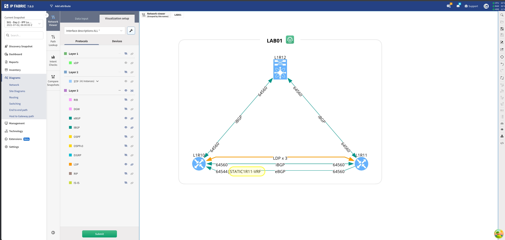

### Link Grouping

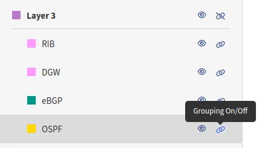

Link grouping means that protocols of the specific layer are not shown
as separate lines but together as a single line.

### Layer Grouping

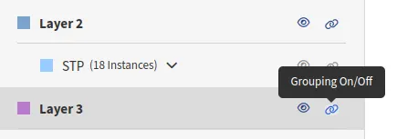

Layer grouping collapses groups of devices according to the types of
links that connect these, either in Layer 2 or 3 groups. Devices
connected with different layer protocols can't be grouped together.

## Devices

You can select/unselect the type of devices you want to see on the
diagram.

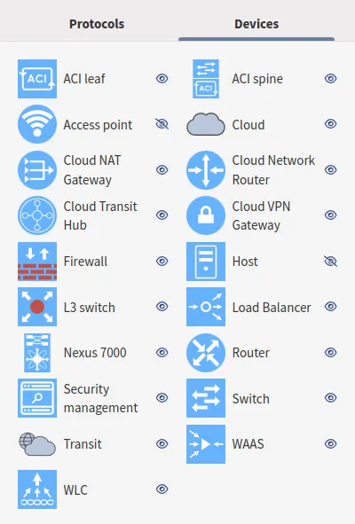

### Device Information Deep Dive

After right-clicking the device, you can display additional
information about it by selecting **Explore**:

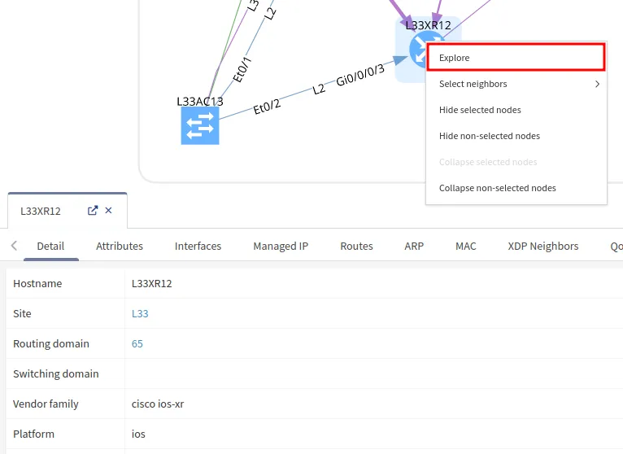
