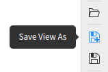
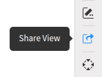
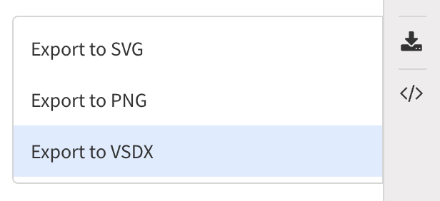
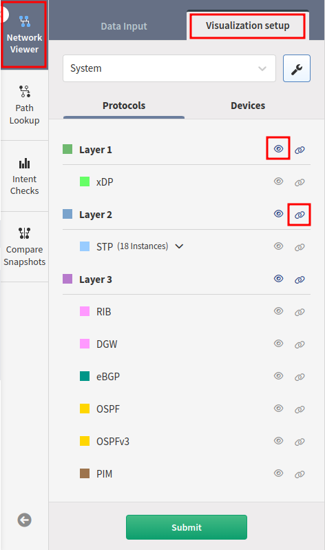
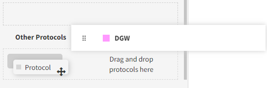
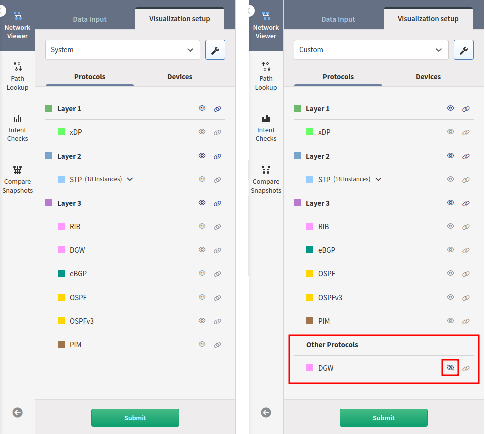

# Network Viewer

When you go to **Diagrams --> Network**, all networks are
displayed along with the relationships between them. They are grouped into
sites (which are represented by clouds) for better visibility. You can double-click
a cloud to explore further that specific site.

Top-level view with all networks:

## Adding Networks to the View

To display the required information, select on the left side the site
you want to visualize and click **Submit**.

One or more sites can be displayed at the same time.

For example, to see a diagram of the particular sites `35HEADOFFICE` and
`35COLO`:

1.  Select `Site name` from the **Group Devices by Attribute** drop-down menu.

2.  Select the site names.

3.  Click **Submit**.

## Removing Networks

In a very similar way as to add a site/network to a diagram, to hide it,
just unselect the network and click **Submit**.

## Manipulating Objects and Nodes

Diagrams are generated automatically, and the following supported
operations can change their layout:

- _Pinch to zoom: touch & desktop (if supported by the trackpad)_

- Mouse wheel to zoom: desktop

- Two-finger trackpad up or down to zoom: desktop

- Tap to select: touch & desktop

- Tap background to deselect: desktop

- Multiple selections via modifier key (`Shift`, `Command`, or `Control`) + tap: desktop

- Box selection: touch (three-finger swipe) & desktop (modifier key +
  mouse down then drag)

- Grab and drag nodes: touch & desktop

The **Center View** button can also center the screen view.

## Hide/Collapse Items in the View

If you right-click after selecting a set of devices or cloud, you will have the
option to either:

1. collapse the selected items into a new cloud:

   

   

2. or hide them:

   

   

## Layouts

### Save User-Defined Layout

After editing the layout, you will see the green box. This allows you to
save the changes as the default view. Click the green box; this will
open a menu **Select Diagram Layout Settings**, and the last entry is
the **User-Defined Layout**. By clicking the **Floppy disk** icon, you
will update the default view (see below). Please be aware that only
the position of the visible nodes will be saved.

### Use User-Defined Layout as the Default Layout

Once you have created a user-defined layout, you probably want to use
this as the default layout. For this, click the icon of the site you
want to update, then select the User-Defined layout and click **Save**.

From now on, this will be the default layout for this site:

### Choose a Specific Layout for a Selection of Devices

You can now specify which layout you want to use for a set of devices:

### Choose a Layout to Apply for the Whole Site

Similarly, you can select a layout for the whole site using the layout
selection.

- Circular Layout can be used only for 500 nodes or less.

## Save, Load, and Share View

Each object can have multiple views that can be saved and loaded again
later.

### Save View

Click the **Floppy disk** icon on the menu on the right end side:

Enter a name for that view and click **Save**.

!!! info

    The view saved in this way is not the default view for that object.

### Load View

The view can be loaded by clicking the **Folder** icon.

Select the desired view and click to load.

### Share View

By clicking here, a URL will be displayed, which you can share with
other users, and they will be able to see this view.

### Export Current View To SVG/PNG

The view can be exported in the form of a SVG or PNG image by clicking
**Export** and selecting the format you want.

!!! info

    The SVG file can be imported into a Visio diagram, or on other drawing
    application.

### Search

Search looks up any text currently present on the diagram. Typing query
filters the view, and clicking the **Search** button focuses and zooms in
on the item.

If you hover the mouse cursor on one entry, you will see the device on the
diagram:

## Protocols

You can filter connection protocols between devices of the second
and third layer of ISO OSI by using filters in the **Network Viewer -->
Visualization setup --> Protocols** menu.

You can decide which layer/protocol you want to display/hide and
group/ungroup.

### Default Protocols View

By default, all discovered protocols will be grouped based on the layer
they belong to. This is the **System** view. You can edit this, which
means you are able to ungroup certain protocols. For this, click the
**Settings** icon:

Drag and drop protocols you want to put to a custom group to the **Other
Protocols**, click **Save as** and give a name to the new protocol view.

With the example below, you are now able to hide only the DGW protocol
without affecting the other Layer 3 protocols:

### Link Grouping

Link grouping means that protocols of the specific layer are not shown
as separate lines but together as a single line.

### Layer Grouping

Layer grouping collapses groups of devices according to the types of
links that connect these, either in Layer 2 or 3 groups. Devices
connected with different layer protocols can't be grouped together.

## Devices

You can select/unselect the type of devices you want to see on the
diagram.

### Device Information Deep Dive

After right-clicking the device, you can display additional
information about it by selecting **Explore**:

