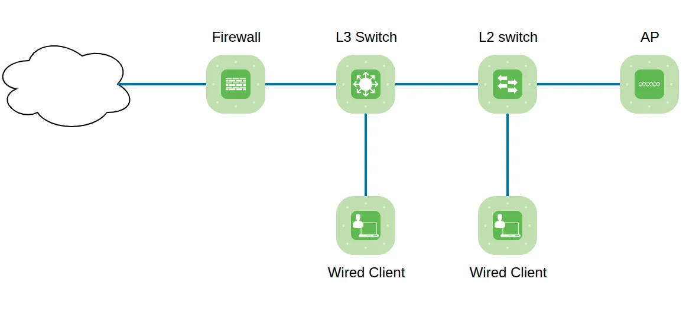

# Cisco Meraki

Device data is collected through the Meraki API. This approach presents certain
challenges, as not all information is consistently available. In some cases,
specific workarounds have been implemented to ensure data completeness. For more
details, see the [Workarounds for Not Available Data](#workarounds-for-not-available-data) section below.

## Network Diagram

As of version `7.8`, the Meraki network diagram displays:

- L1 connections using the LLDP/CDP protocol
- L2 connections based on the RSTP protocol
- L3 links derived from ARP and routing information

## Path Lookup

Currently supported path types include:

- Switches – may consist solely of Meraki devices or a mix of Meraki and
  non-Meraki switches.
- Meraki Firewalls (FWs) – VLAN Routed mode.
  - Limitation: For ARP data, only the client table is used, and no MAC table
    is available. As a result, traffic is flooded to all internal (LAN/VLAN)
    interfaces.

 ## Example

The absence of a MAC table is illustrated here. The orange firewall floods
traffic to all internal (LAN/VLAN) ports.

## Workarounds for Not Available Data

### Firewalls

- Firewalls have switch ports on the internal (LAN/VLAN) side but do not
  support STP. To generate L2 links, all firewall ports are treated as part of
  STP, with ports in a forwarding state when enabled.
- The ARP table is not available for firewalls. Instead, the client table is
  used, which provides only ARP-like data for devices on the internal
  (LAN/VLAN) side of the firewall.
