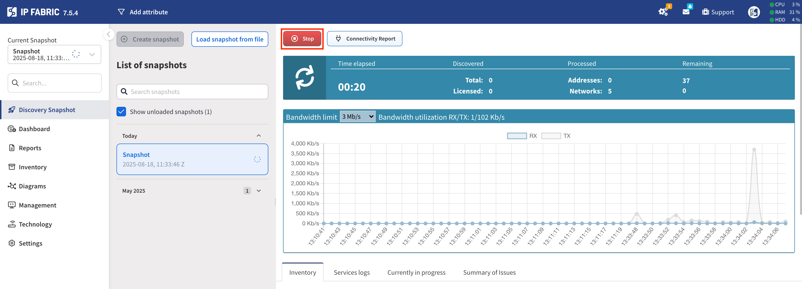
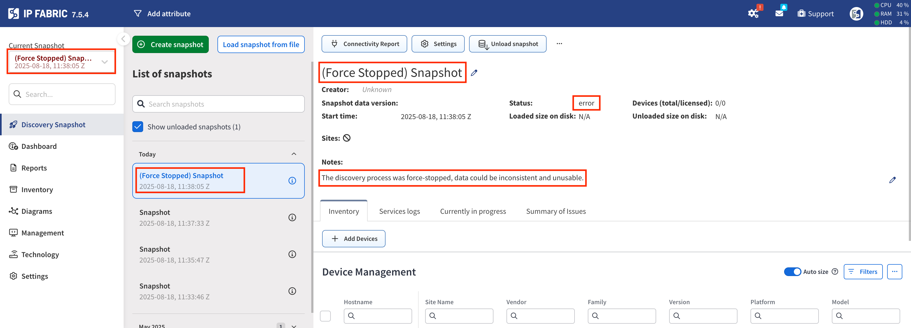
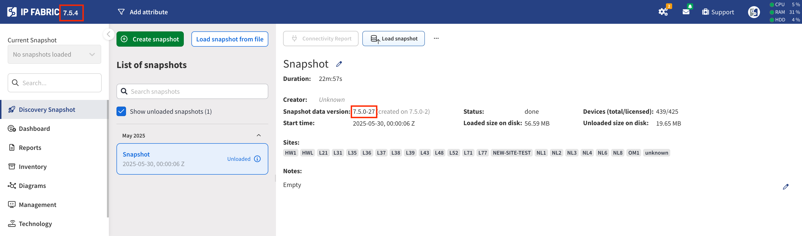
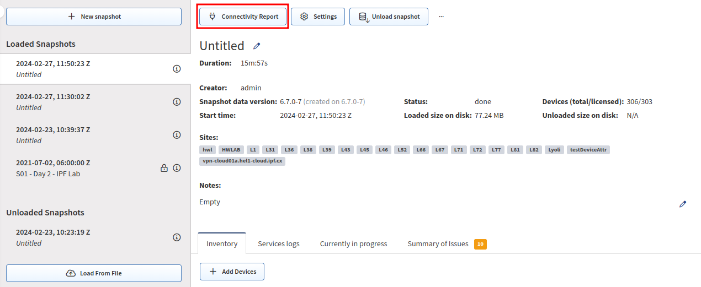
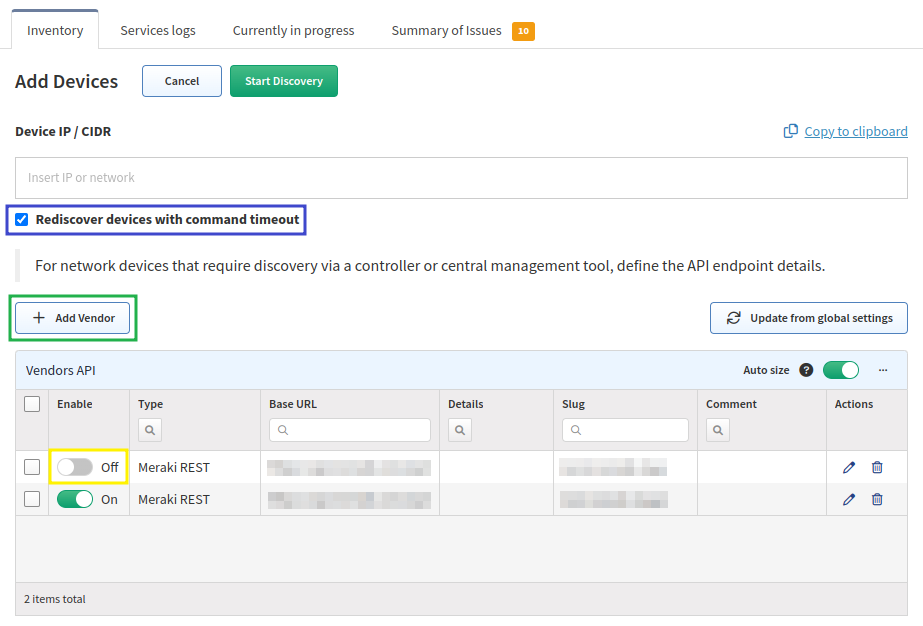
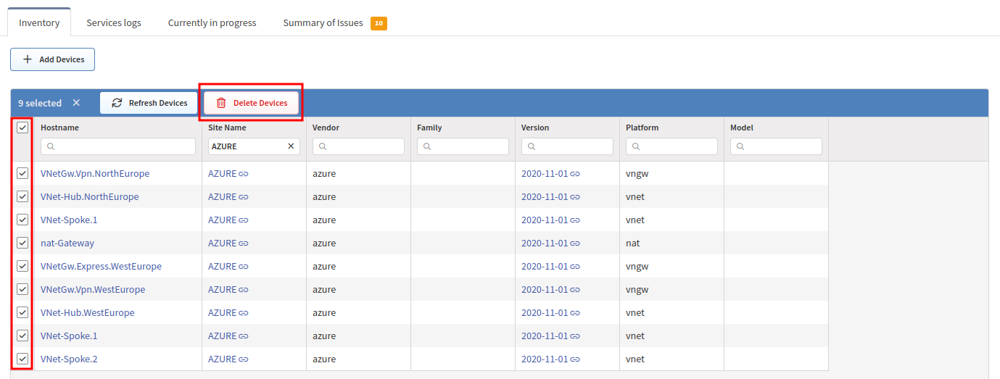
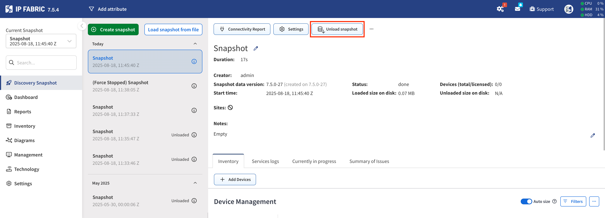
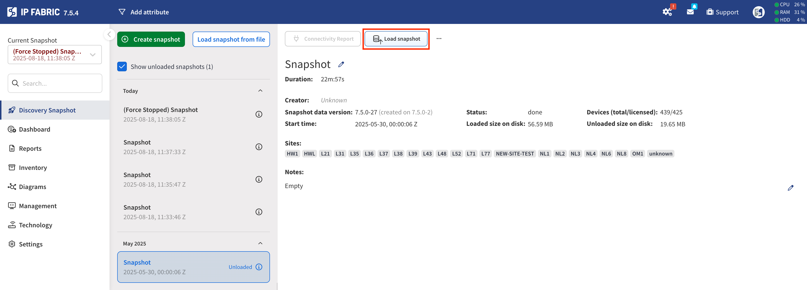
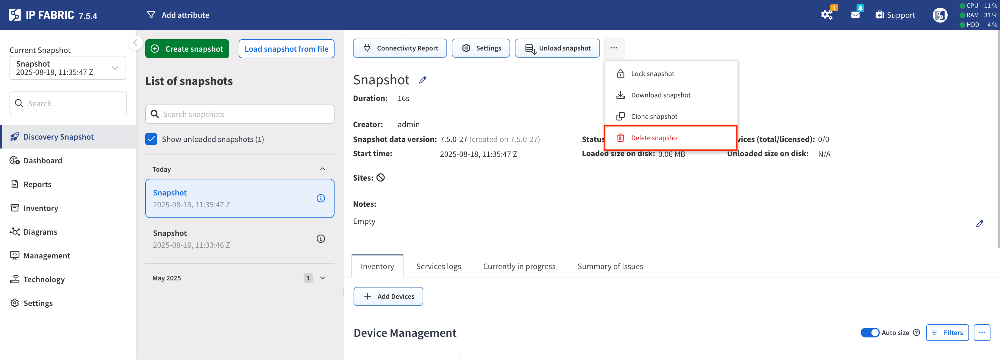

# Discovery Snapshot

## Overview

A network snapshot records:

- The state of the network at the time the snapshot was taken.

- All service logs, logs used internally by the IP Fabric system, as well as a log of commands issued to every network device.

- Connectivity issues that occurred during the retrieval of the snapshot.

A network snapshot is a fully functional software copy of your network, including all configuration and state data. It enables the retrieval of historical information, tracking network state changes, analyzing connectivity issues, and more.

The network information displayed in IP Fabric corresponds to the network snapshot selected in the **Current Snapshot** drop-down menu in the left panel.

## New Snapshot

To work with snapshots, click the **Discovery Snapshot** menu entry (highlighted
in the yellow box). This will display all loaded and unloaded snapshots and allow
you to create new snapshots or perform operations on existing snapshots.

A new snapshot can be taken at any time by clicking **+ New Snapshot**
(highlighted in the red box) and then the green **Start discovery** button. This will
start a new snapshot of the network with globally set parameters in the
**Settings** menu entry. If you need to make some changes to the discovery
process (add a new network seed, change login credentials, etc.), you may do so
in the global **Settings** or in the
[snapshot-specific settings](#snapshot-specific-settings) (highlighted in the blue
box).

For creating automatic snapshots, follow the instructions in
[Create Snapshots Periodically](../IP_Fabric_Settings/Discovery_and_Snapshots/snapshot_retention.md#create-snapshots-periodically).

### Resource Checks Before Creating a New Snapshot

Before creating a new snapshot, IP Fabric performs the following resource
checks (if any of them fails, a new snapshot won't be created):

1. The size of the largest loaded snapshot plus 5 GB is lower than the available
   disk space.

   - If this condition is not met, `Not Enough Disk Space` is thrown.

2. The average in-memory size of loaded snapshots plus 3 GB is lower than the
   available RAM.

   - If this condition is not met, `Not Enough System Memory` is thrown.

3. Even if the new snapshot would have the size of the largest loaded snapshot,
   any locked snapshots would not be automatically deleted based on the `Delete
Snapshots: If HDD utilization reaches ... percent` value (default 80) set in
   **Settings --> Discovery & Snapshots --> Snapshot Retention**.
   - If this condition is not met, `Not Enough Disk Space` is thrown.

In case of ongoing issues, it is possible to disable these resource checks in
`/opt/ipf-api/conf.d/api.json`. Please contact IP Fabric Support for such a
change.

### Stopping Discovery

While discovery is running, it can be stopped (highlighted in the red box) at its current state, preventing any further network device discoveries.

The snapshot will then begin the topology calculation and Assurance Engine process for the devices discovered up to that point.

The snapshot will enter a **Stopping** state (highlighted in the red box), and the message **Network topology building has been started** (highlighted in the green box) will be displayed.

Data from the snapshot will be partially available, and no other actions will be performed until the process is complete.

### Force Stopping Discovery

If you don't want to wait for the Assurance Engine process to finish while stopping discovery, you can use the **Force Stop** option.

To ensure UI access is maintained after a discovery **Force Stop**, any system jobs scheduled to start afterward will be cancelled.

The snapshot will enter an **error** state and be marked as **Force Stopped** with a note stating: _The discovery process was force-stopped, data may be inconsistent and unusable._

## Snapshot-Specific Settings

Adjusting the settings for either a new snapshot or a previously created snapshot will override the global **Settings**.
This is useful, for example, for testing different SSH settings, Site Separation rules, or authentication methods.

## Difference between snapshot data version and software version

The **Software version** (displayed in the top-left corner) indicates the version of the **IP Fabric product**.

The **Snapshot data version** (visible in the middle of the screenshot) represents the version of **IPF migrations**. The Snapshot Data Version (visible in the middle of the screenshot) represents the version of IPF migrations. This value is crucial for determining whether the snapshot needs to be Unloaded and Loaded again after an upgrade, or if it can be retained as-is.

## Inspection of Network Issues

The initial snapshot of the network may not include all information about your network. This could be due to a variety of
reasons, including authorization or firewall issues; please take a look at
[Troubleshooting Discovery](../overview/How_Discovery_Works/troubleshooting_discovery.md).

Each successful or unsuccessful connection attempt is logged (see the following picture). Logs for each device can be found in the snapshot's **Connectivity Report** (highlighted in the red box). These logs are especially helpful when an error occurs. By
examining them, you can find the reason why a device wasn't correctly or fully discovered or what led to a connection failure.

## Modifying Snapshot Devices

### Adding Devices

A new device can be added to an already existing snapshot by clicking the **+ Add Devices** button (highlighted in the red box). You can then add a list of IP addresses or subnets to be tried in discovery and added to the currently selected snapshot.
This might be desirable if you performed almost a full snapshot of the network, but only a few devices were not included or had connectivity issues that were later resolved (for example, wrong AAA configuration, firewall rules, forgot to include a
network seed, etc).

When adding a new device to an existing snapshot, the [snapshot-specific settings](#snapshot-specific-settings)
will be applied. To add a new device to an existing snapshot, you need to first change the settings (for example, add a new network seed, login credentials, etc.) for that snapshot and then add the device.

If the `Rediscover timed out devices` checkbox is selected (highlighted in the blue box), the discovery will try to rediscover any devices that previously timed out. To speed up the addition of new devices, it is recommended to unselect this checkbox. If you would like
to only rediscover devices, that is also possible by not entering any new device IP addresses and clicking the green **Start Discovery** button.

Finally, it is also possible to **+ Add Vendor** (for discovery via API; highlighted in the green box) or enable a previously disabled Vendor (highlighted in the yellow box) in the currently selected snapshot. Please note that toggling a Vendor from `on` to `off` will not remove that Vendor's devices
from the snapshot. However, toggling all the Vendors to `off` will prevent IP Fabric from rediscovering those devices, thus speeding up the addition of new devices (similarly to disabling `Rediscover timed out devices`).

### Refresh Devices

The **Refresh Devices** action will make the snapshot rediscover the selected devices and update the data models. You can manually select certain devices or, as shown in the example above, filter by the Site `L77` and refresh all devices in that site.

Please note that changes in those devices might affect other devices, such as when a routing change is propagated throughout the network. A good example of using **Refresh Devices** is for a firewall change, ensuring the new rules are correctly allowing or denying traffic in Path Lookup simulations.

### Delete Devices

The **Delete Devices** action allows you to manually select certain devices and remove them from the snapshot. When devices are removed and were previously being displayed in Network Diagrams or Path Lookups, IP Fabric
will then show a `transit cloud` indicating it does not have information about the next destination or connected device.

## Snapshot Actions

Due to database maintenance, only up to 5 snapshots can be loaded into memory. The default configuration allows only 3 loaded snapshots, but you can change this in **Settings --> Discovery & Snapshots --> Snapshot Retention --> Maximum number of loaded snapshots**.

### Lock Snapshot

By selecting `Lock snapshot`, IP Fabric won't automatically unload the snapshot to the hard disk and will keep it in memory. The default configuration allows only 1 locked snapshot, but you can change this in **Settings --> Discovery & Snapshots --> Snapshot Retention --> Maximum number of locked snapshots**.

### Loaded Snapshots

If the maximum number of loaded snapshots is set to 5 and there are already 5 loaded snapshots when a 6th snapshot is created or loaded, IP Fabric will automatically unload the oldest loaded snapshot from memory and save it to the hard disk. This can also be done manually for a selected snapshot by clicking **Unload snapshot**.

### Unloaded Snapshots

When a snapshot is unloaded, it is safely stored on the hard disk, but the data from that snapshot cannot be accessed directly through the IP Fabric user interface. To browse an unloaded snapshot, it needs to be loaded again to memory by clicking **Load snapshot**.

!!! important "Snapshot Retention"

    It is important to note that there are **Snapshot Retention** rules in place
    that will delete snapshots after the hard disk space utilization reaches a
    certain threshold.

    - For more information, please see:
      - [Snapshot Retention](../IP_Fabric_Settings/Discovery_and_Snapshots/snapshot_retention.md)
      - [Schedule System Backup](../IP_Fabric_Settings/system/Backup_and_Maintenance/system_backup.md)

### Download Snapshots

If needed, a selected snapshot can be downloaded from IP Fabric to your local storage by selecting `Download snapshot`.

### Clone Snapshot

Both loaded and unloaded snapshots can be cloned with `Clone snapshot`. This is handy if you want to make some changes to the snapshot (such as adding a device), but you want to keep its original version as a backup.

### Delete Snapshot

Snapshots can be deleted using `Delete snapshot`.

## Load Snapshot From File

A downloaded snapshot can be loaded back onto the IP Fabric platform with the **Load From File** button.

## Create URL Pointing to Specific Snapshot

You can add the `selectSnapshot` argument to any URL in the GUI to point to a specific snapshot.

Example:
`https://your-ipfabric-instance/inventory/devices?selectSnapshot=ad61c08c-c179-4142-8c95-3628228bc3df`

After opening the link, the specified snapshot will be selected as the current
one in IP Fabric.

## Related Articles

If you want to learn more about how network discovery works from a technical point of view, read:

- [How CLI Discovery Works](../overview/How_Discovery_Works/CLI_discovery.md)
- [How API Discovery Works](../overview/How_Discovery_Works/API_discovery.md)
