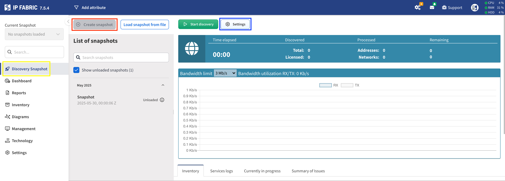
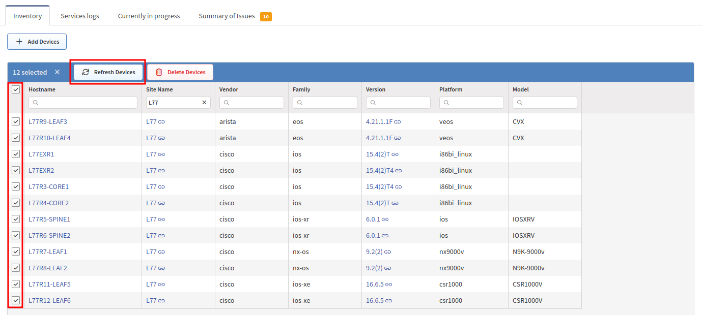
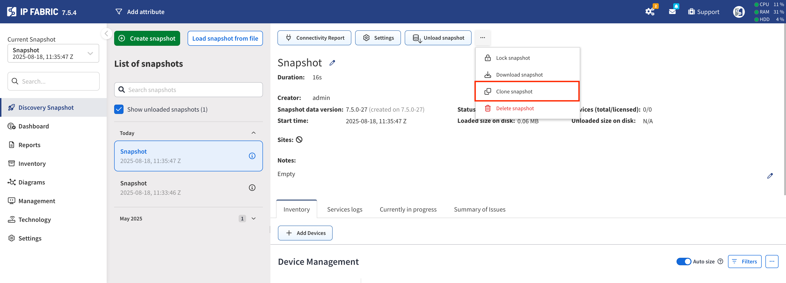
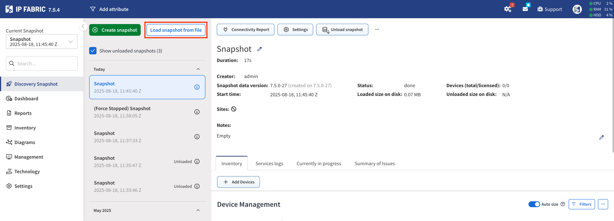

# Discovery Snapshot

## Overview

A network snapshot records:

- The state of the network at the moment of the initialization of the snapshot.

- All service logs; logs used internally by the IP Fabric system as well as a log of commands issued to every network device.

- Connectivity issues that had occurred during the retrieval of the snapshot.

A network snapshot is a fully functional software copy of your network, including all configuration and state data. It enables to retrieve historical information, to follow network state changes, analyze connectivity issues and more.

The network information displayed in IP Fabric corresponds to the network snapshot selected in the **Current Snapshot** drop-down menu in the left panel.

## New Snapshot

To work with snapshots, click the **Discovery Snapshot** menu entry (highlighted
in yellow box). This will display all loaded and unloaded snapshots and allow
you to create new snapshots or perform operations on existing snapshots.

A new snapshot can be taken at any time by clicking **+ New Snapshot**
(highlighted in red box) and then **Start discovery** (green button). This will
start a new snapshot of the network with globally-set parameters in the
**Settings** menu entry. If you need to make some changes to the discovery
process (add a new network seed, change login credentials, etc.), you may do so
in the global **Settings** or in the
[snapshot-specific settings](#snapshot-specific-settings) (highlighted in blue
box).

For creating automatic snapshots, follow the instructions at
[Create Snapshots Periodically](../IP_Fabric_Settings/Discovery_and_Snapshots/snapshot_retention.md#create-snapshots-periodically).

## Snapshot-specific Settings

Adjusting the settings for either a new snapshot or a previously-created snapshot will override the global **Settings**.
This is useful for example for testing different SSH settings, Site Separation rules or authentication methods.

## Inspection of Network Issues

Initial snapshot of the network may not include all information about your network. This could be due to a variety of
reasons including authorization or firewall issues; please take a look at
[Troubleshooting Discovery](../overview/How_Discovery_Works/troubleshooting_discovery.md).

Each successful or unsuccessful connection attempt is logged (see the following picture). Logs for each device can be found in the snapshot's **Connectivity Report** (highlighted in red box). These logs are especially helpful when an error occurs. By
examining them, you can find the reason why a device wasn't correctly or fully discovered or what led to a connection failure.

## Modifying Snapshot Devices

### Adding Devices

A new device can be added to an already-existing snapshot by clicking the `Add Devices` button (highlighted in red box). You are then able to add a list of IP addresses or subnets to be tried in discovery and added to the currently-selected snapshot.
This might be desirable if you performed almost a full snapshot of the network, but only few devices were not included or had connectivity issues that were later resolved (for example wrong AAA configuration, firewall rules, forgot to include a
network seed, etc).

When adding a new device to an existing snapshot, the [snapshot-specific settings](#snapshot-specific-settings)
will be applied. If you need to change some settings (for example add a new network seed, login credentials, etc.) in order to add a new device to an existing snapshot, you will need to first change the settings for that particular snapshot and
then add a new device.

If the `Rediscover timed out devices` checkbox is selected (highlighted in blue box), the discovery will try to rediscover any devices that previously timed out. To speed up the addition of new devices, it is recommended to unselect this checkbox. If you would like
to only rediscover devices, that is also possible by not entering any new device IP addresses and clicking the green **Start Discovery** button.

Finally, it is also possible to **+ Add Vendor** (for discovery via API; highlighted in green box) or enable a previously-disabled Vendor (highlighted in yellow box) in the currently-selected snapshot. Please note that toggling a Vendor from `on` to `off` will not remove that Vendor's devices
from the snapshot. However, toggling all the Vendors to `off` will prevent IP Fabric from rediscovering those devices, thus speeding up the addition of new devices (similarly to disabling `Rediscover timed out devices`).

### Refresh Devices

The **Refresh Devices** action will make the snapshot rediscover the selected devices and update the data models. You are able to manually select certain devices or in the example above filter by the Site `L77` and refresh all devices in that Site.

Please note that changes in those devices might affect other devices. For instance, if a routing change propagated throughout the network. A good example of using **Refresh Devices** is for a firewall change - for ensuring the new rules are allowing or denying traffic in Path Lookup Simulations.

### Delete Devices

The **Delete Devices** action allows you to manually select certain devices and remove them from the snapshot. When devices are removed and were previously being displayed in Network Diagrams or Path Lookups, IP Fabric
will then show a `transit cloud` indicating it does not have information about the next destination or connected device.

## Snapshot Actions

Because of database maintenance, only up to 5 snapshots can be loaded into the memory. The default configuration is to allow only 3 loaded snapshots, but this can be changed in **Settings --> Discovery & Snapshots --> Snapshot Retention --> Maximum number of loaded snapshots**.

### Lock Snapshot

By selecting `Lock snapshot`, IP Fabric won’t automatically unload the snapshot to the hard disk and will keep it in the memory. The default configuration is to allow only 1 locked snapshot, but this can be changed in **Settings --> Discovery & Snapshots --> Snapshot Retention --> Maximum number of locked snapshots**.

### Loaded Snapshots

If the maximum number of loaded snapshot is set to 5, there are already 5 loaded snapshots **and** 6th snapshot is created (or loaded), IP Fabric will automatically unload the oldest loaded snapshot from the memory and save it to the hard disk. This can be also done manually on a selected snapshot by clicking **Unload snapshot**.

### Unloaded Snapshots

When a snapshot is unloaded, it is safely stored on the hard disk, but the data from that snapshot cannot be accessed directly through the IP Fabric user interface. To browse an unloaded snapshot, it needs to be loaded again to the memory by clicking **Load snapshot**.

!!! important "Snapshot Retention"

    It is important to note that there are **Snapshot Retention** rules in place that will delete snapshots
    after the hard disk space utilization reaches a certain threshold. For more information, please see
    [Snapshot Retention](../IP_Fabric_Settings/Discovery_and_Snapshots/snapshot_retention.md) and
    [Schedule System Backup](../IP_Fabric_Settings/system/Backup_and_Maintenance/system_backup.md).

### Download Snapshots

If needed, a selected snapshot can be downloaded from IP Fabric to your local storage by `Download snapshot`.

### Clone Snapshot

Loaded as well as unloaded snapshots can be cloned with `Clone snapshot`. This is handy in case you want to make some changes to the snapshot (adding a device etc.), but you want to keep its original version as a backup.

### Delete Snapshot

Snapshots can be deleted with `Delete snapshot`.

## Load Snapshot from File

A downloaded snapshot can be loaded back to the IP Fabric platform with the **Load From File** button.

## Related Articles

If you want to learn more about how network discovery works from a technical point of view, read [How CLI Discovery Works](../overview/How_Discovery_Works/CLI_discovery.md) and [How API Discovery Works](../overview/How_Discovery_Works/API_discovery.md).
