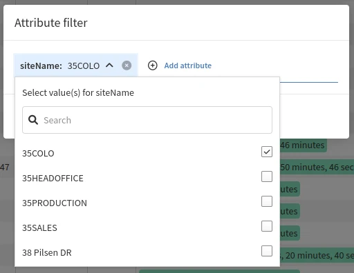
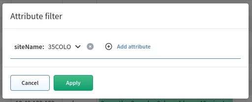
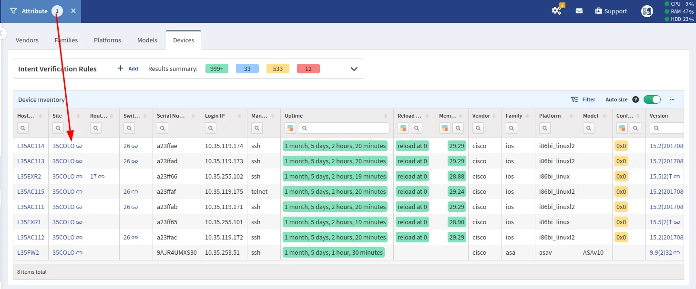

# Global Filter

Applying an **Attribute filter** in the IP Fabric GUI will quickly limit the
scope of data that will be displayed in tables. Currently, adding a filter will
not update Intent Rules or the **Dashboard** (in development).

The options for filtering are:

- Site Name
- Routing Domain
- STP Domain
- Any Snapshot Local Attribute[^1]

[^1]:
    See [Device Attributes](../IP_Fabric_Settings/Discovery_and_Snapshots/Global_Configuration/device_attributes.md).
    Please note that after configuring a new **Device Attribute** globally, a
    new snapshot must be run for applying it.

In this example, we are filtering on `siteName` with the value `35COLO`.

In **Inventory --> Devices**, we can see that the **Device Inventory** table is
filtered to show only devices from the Site `35COLO`.

