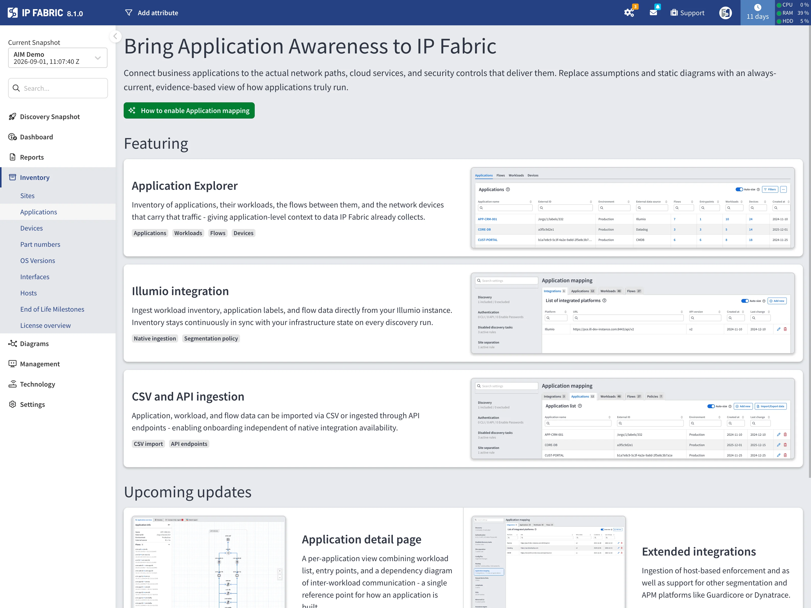
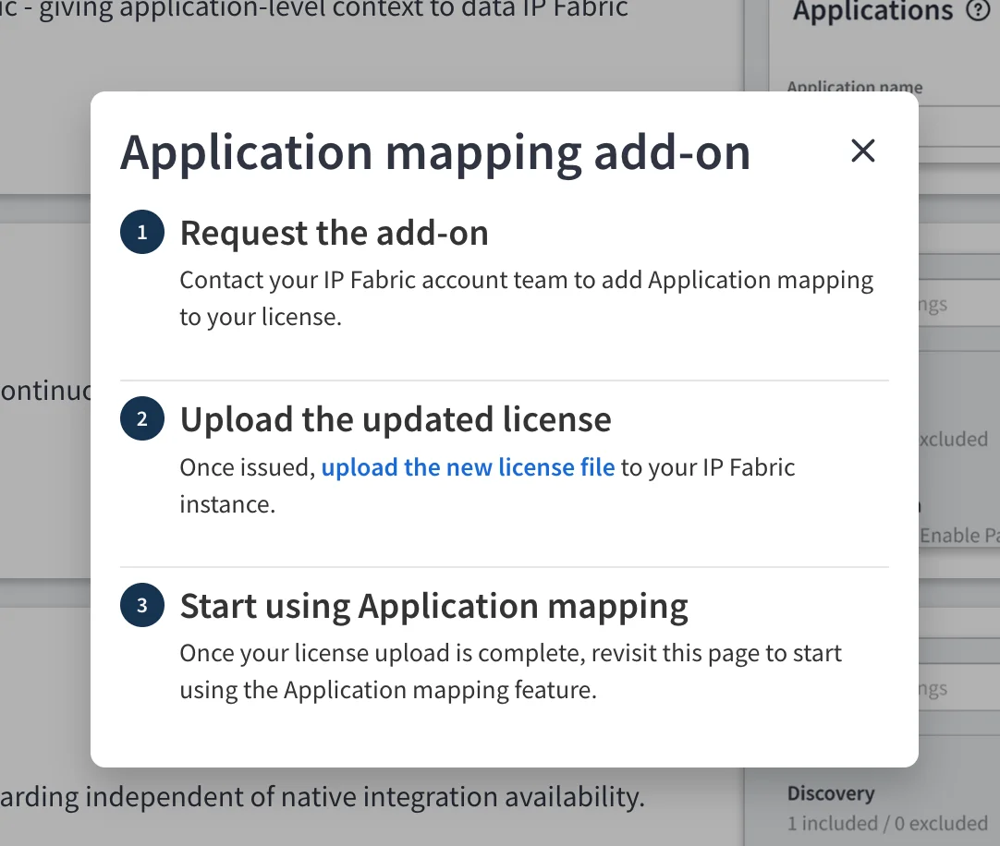
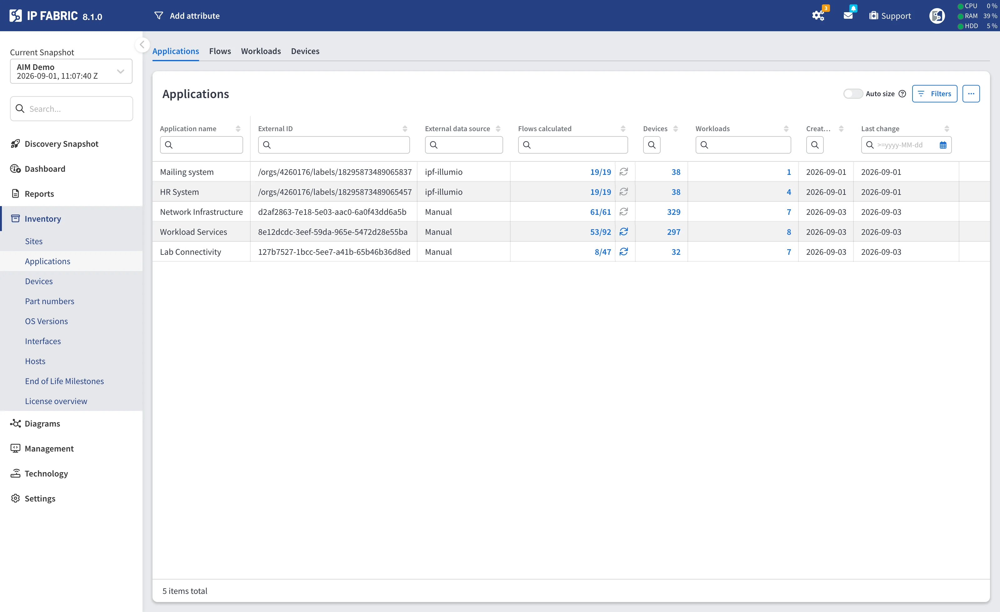
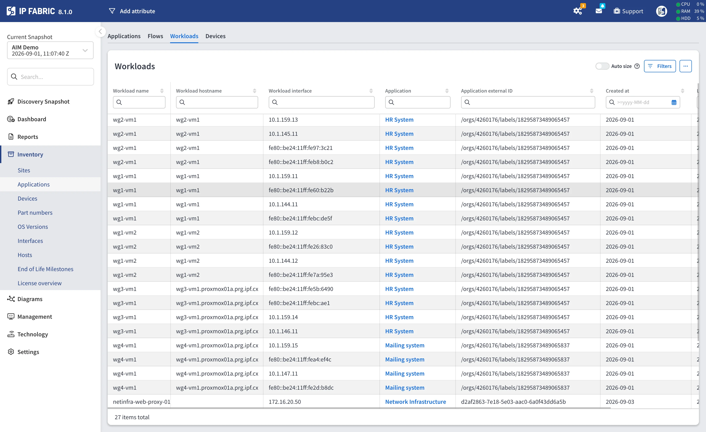
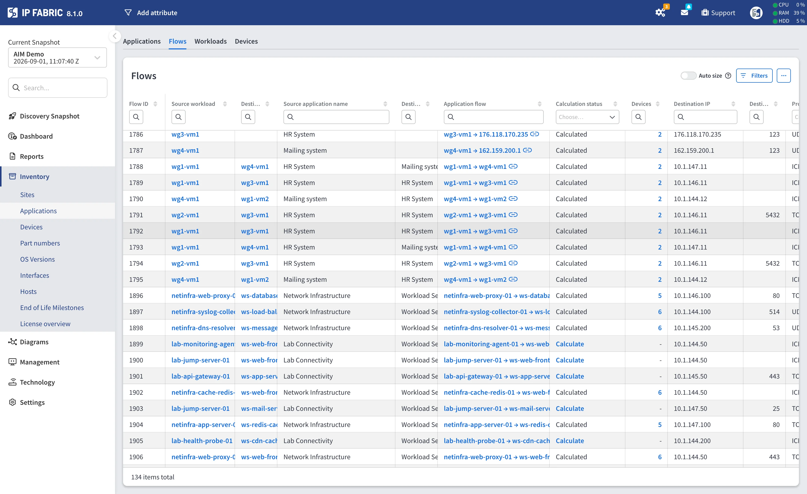
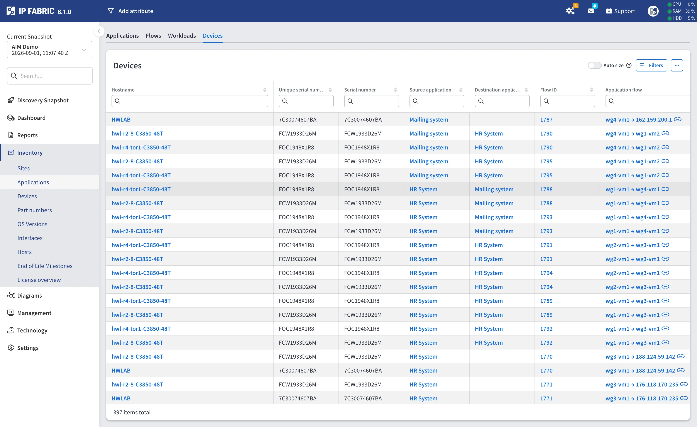
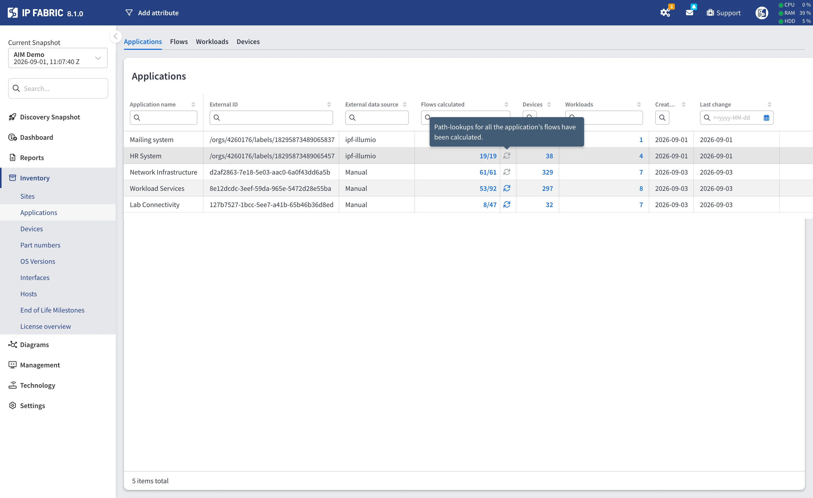
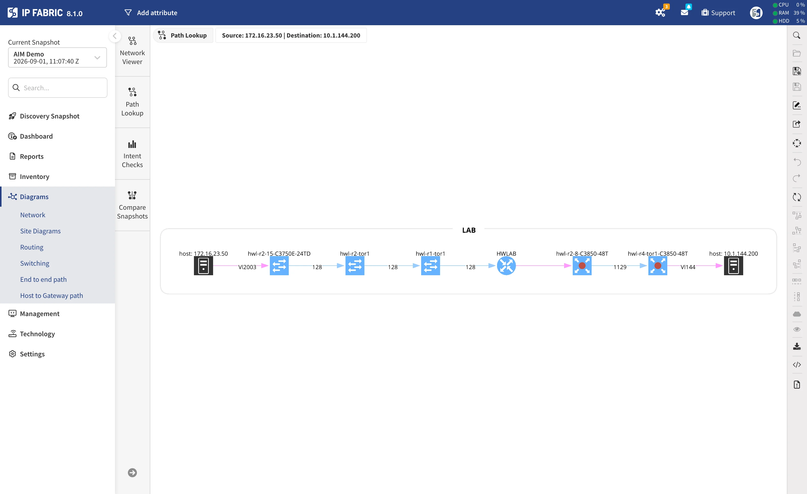

# Applications

--8<-- "snippets/aim_license_required.md"

**Inventory --> Applications** adds application-level context to the network data
IP Fabric already collects. It presents Application Infrastructure Mapping (AIM)
data as four tables:

| Tab              | Contents                                                                     |
| :--------------- | :--------------------------------------------------------------------------- |
| **Applications** | The applications known to IP Fabric, with workload, flow, and device counts.  |
| **Workloads**    | The endpoints that make up each application, with their interface addresses.   |
| **Flows**        | Observed communication between two workloads.                                 |
| **Devices**      | The network devices a flow's traffic traverses.                               |

The data comes from a third-party integration such as Illumio, from records
maintained in the Discovery Settings, or from the AIM API. Configuring those
sources is described in
[Application Mapping](../../IP_Fabric_Settings/Discovery_and_Snapshots/Discovery_Settings/application_mapping.md).

## Without an AIM License

Without the AIM feature on the license, the page shows an overview of the
capability instead of the four tables.

The overview explains what Application mapping does -- connecting business
applications to the network paths, cloud services, and security controls that
deliver them -- and is split into two groups:

- **Featuring** -- what is available today: the **Application Explorer**
  (applications, workloads, flows, and devices), the **Illumio integration** for
  native ingestion, and **CSV and API ingestion** for onboarding without a native
  integration.
- **Upcoming updates** -- what is planned: a per-application detail page with a
  workload dependency diagram, ingestion from further segmentation and
  application-monitoring platforms, connectivity and path analysis at the
  application-flow level, and intent and risk validation aggregated per
  application.

**How to enable Application mapping** opens the steps to follow: contact your
Customer Success Manager or email
[support@ipfabric.io](mailto:support@ipfabric.io) to request the add-on, upload
the reissued license file, and revisit the page. The page also links to
[go.ipfabric.io/aim](https://go.ipfabric.io/aim) for what AIM covers. See
[Getting AIM](../../overview/licensing.md#getting-aim).

## Applications Table

One row per application.

| Column               | Description                                                                                          |
| :------------------- | :--------------------------------------------------------------------------------------------------- |
| **Application name** | The application name.                                                                                |
| **External ID**      | The identifier the source system uses for the application.                                            |
| **Environment**      | Environment the application belongs to. **Hidden by default** -- enable it in the column selector. Populated for applications maintained in the Discovery Settings and for those imported from CSV; empty for applications collected through the Illumio integration. |
| **External data source** | Where the application came from -- an integration, or the manual source for data you maintain yourself. |
| **Flows calculated** | How many of the application's flows have a calculated path-lookup, out of its total flows. Also carries the calculation trigger -- see [Calculating Devices](#calculating-devices). |
| **Devices**          | Number of network devices the application's traffic traverses. Links to the Devices tab filtered to this application. |
| **Workloads**        | Number of workloads. Links to the Workloads tab filtered to this application.                        |
| **Entrypoints**      | Reserved for a future release.                                                                        |
| **Created at**       | When the record was first ingested.                                                                   |
| **Last change**      | When the record was last updated.                                                                     |

Once at least one flow has been calculated, the **Flows calculated** fraction is
itself a link to this application's flows.

!!! info "`-` in the Devices column"

    A dash means no path-lookup has been calculated yet, which is different from
    a calculated result of zero traversed devices. A genuine `0` is shown as a
    number.

## Workloads Table

One row per workload interface, so a workload with two interface addresses
appears twice, differing only in **Workload interface**.

| Column                    | Description                                                        |
| :------------------------ | :----------------------------------------------------------------- |
| **Workload name**         | The workload name.                                                 |
| **Workload hostname**     | The workload's hostname, when known.                               |
| **Workload interface**    | An IP address of the workload.                                     |
| **Application**           | The owning application. Links to the Applications tab.              |
| **Application external ID** | The owning application's external identifier.                     |
| **Created at**            | When the record was first ingested.                                 |
| **Last change**           | When the record was last updated.                                   |

## Flows Table

One row per flow -- a communication between two workloads.

| Column                          | Description                                                                                     |
| :------------------------------ | :---------------------------------------------------------------------------------------------- |
| **Source workload**             | The workload the traffic originates from. Links to the Workloads tab.                            |
| **Destination workload**        | The workload the traffic is sent to. Links to the Workloads tab.                                 |
| **Source application**          | The application owning the source workload.                                                      |
| **Destination application**     | The application owning the destination workload.                                                 |
| **Application flow**            | Source and destination endpoints of the flow, by workload name or by IP address when the workload is unnamed. Links to the path-lookup diagram -- see [Opening the Path as a Diagram](#opening-the-path-as-a-diagram). |
| **Calculation status**          | Whether this flow's path-lookup has been calculated. Also carries the calculation trigger -- see [Calculating Devices](#calculating-devices). |
| **Devices**                     | Number of network devices this flow traverses. Links to the Devices tab filtered to this flow.   |
| **Source IP** / **Destination IP** | The flow's endpoint addresses.                                                                |
| **Source port** / **Destination port** | The flow's ports, when the source provides them.                                          |
| **Protocol**                    | The flow's IP protocol.                                                                          |
| **Created at**                  | When the record was first ingested.                                                              |
| **Last detected**               | When the source last observed the flow.                                                          |

!!! note "A flow spans two applications"

    A flow's source and destination workloads can belong to different
    applications, so the same flow appears under both. Calculating it from one
    application therefore also completes it for the other.

## Devices Table

The network devices that application traffic traverses. This table is populated
only by the path-lookup calculation -- ingesting AIM data does not fill it.

| Column                            | Description                                                                        |
| :-------------------------------- | :--------------------------------------------------------------------------------- |
| **Hostname**                      | The network device's hostname.                                                     |
| **Unique serial number**          | The serial number IP Fabric assigns to the device.                                  |
| **Serial number**                 | The device's hardware serial number.                                                |
| **Source application**            | The application owning the flow's source workload. Links to the Applications tab.    |
| **Destination application**       | The application owning the flow's destination workload. Links to the Applications tab. |
| **Flow ID**                       | Internal identifier of the flow whose path traverses this device. Links to the Flows tab filtered to that flow. |
| **Application flow**              | Source and destination endpoints of the flow. Links to the path-lookup diagram.      |
| **Source IP** / **Destination IP** | The flow's endpoint addresses.                                                     |
| **Source port** / **Destination port** | The flow's ports.                                                              |
| **Protocol**                      | The flow's IP protocol.                                                             |

Rows represent flow-and-device pairs, so a device that carries several flows
appears once per flow. Filtering by application matches flows whose source **or**
destination workload belongs to that application, which is what the links from
the Applications table do.

When nothing has been calculated yet, the table explains where to start:

> No device data yet. Use the refresh button in the Flows calculated column of
> the Applications table, or the Calculate link in the Calculation status column
> of the Flows table, to collect it.

## Calculating Devices

Identifying the devices a flow traverses is an **on-demand** calculation. It runs
a path lookup for the flow and stores the devices it passes through. You can
start it at two levels:

| From                    | Column                  | Trigger                            | Scope                                         |
| :---------------------- | :---------------------- | :--------------------------------- | :-------------------------------------------- |
| **Applications** table  | **Flows calculated**    | Refresh button beside the fraction | Every flow of that application.               |
| **Flows** table         | **Calculation status**  | **Calculate** link                 | That single flow.                             |

The calculation runs in the background. When it finishes, a notification reports
the result and links to the Devices tab filtered to the application you started
it from.

As flows complete, the **Flows calculated** fraction rises, **Calculation
status** changes to **Calculated**, and the **Devices** counts fill in.

### When the Trigger Is Unavailable

On the Applications table the refresh button is disabled, with the reason shown
on hover:

- *This application has no flows to calculate.* -- the application has no flows.
- *Path-lookups for all the application's flows have been calculated.* -- nothing
  is left to do.

On the Flows table a calculated flow shows the word **Calculated** instead of the
link, tooltipped *All path-lookups for this flow have been calculated.*

!!! info "A calculated result cannot go stale"

    Within a snapshot there is no reason to recalculate: the topology a
    path-lookup runs against only changes with a new snapshot, and a new snapshot
    starts with nothing calculated. That is why the trigger disappears once a
    flow is done rather than offering a refresh.

## Opening the Path as a Diagram

The **Application flow** column in both the Flows and the Devices tables links to
the path-lookup diagram, pre-filled from the flow's own five-tuple -- source and
destination IP, protocol, and ports.

Ports the source left unspecified are submitted as the full ephemeral range
`1024-65535`. Protocols are mapped to their path-lookup equivalents: ICMP, TCP,
UDP, and ICMPv6.

A flow missing a source or destination IP, or carrying a protocol the simulation
engine does not model, cannot form a lookup -- for those rows the cell stays
plain text with no link.

## Related Documentation

- [Application Mapping](../../IP_Fabric_Settings/Discovery_and_Snapshots/Discovery_Settings/application_mapping.md)
  -- configuring the integrations and manual records that feed these tables.
- [Application Infrastructure Mapping API](../../IP_Fabric_API/Application_Infrastructure_Mapping/index.md)
  -- reading these tables and starting path-lookup calculations over the API.
