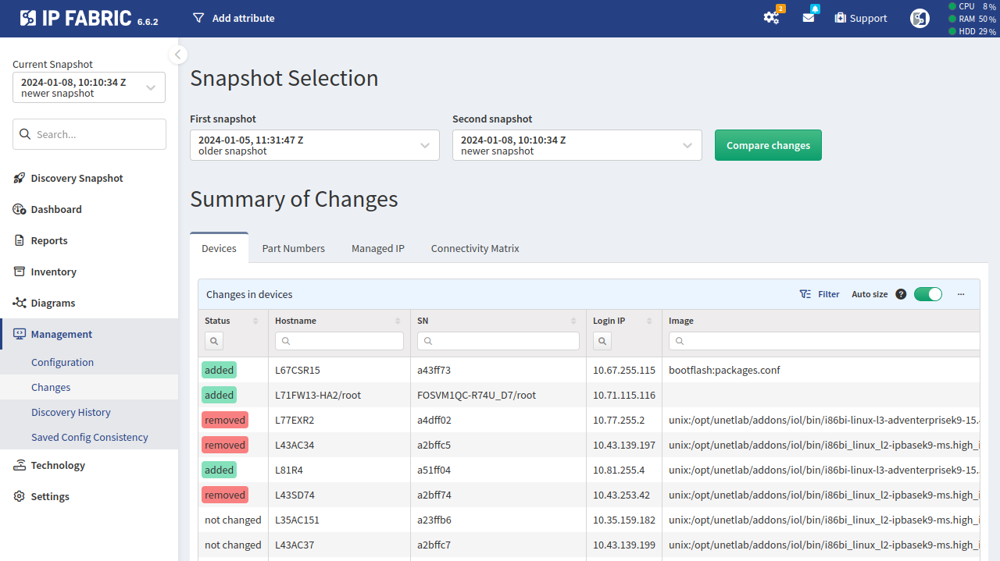

# Changes

## Overview

Snapshots at different time intervals can be compared to identify dynamic changes in the network when a snapshot of the
network (discovery run) completes successfully.

To enable periodic discovery runs, check the [Automatic Snapshots](../../IP_Fabric_Settings/Discovery_and_Snapshots/snapshot_retention.md) configuration.

## Comparing Changes

To control changes between two discovery runs, navigate to **Management --> Changes**.

First, select the more distant point in time (the older snapshot), and then select the subsequent point after the first one (the newer snapshot).

There are four tables available:

### Devices

This table shows devices that were `added`, `removed`, or `not changed` within a given time period (between two snapshots).

### Part numbers

This table checks for changes in individual device components, which is especially useful for modular devices. Status can be `added`, `removed`, or `not changed`.

### Managed IP

Changes in addressing can cause problems, particularly if they are not well communicated between teams. Any changes to the IP address can be viewed in this table. Status can be `added`, `removed`, or `not changed`.

### Connectivity Matrix

Loss of connection, redundancy, or a decrease of the connection capacity can also cause issues. Changes in the connections between devices can be examined here. Status can be `added`, `removed`, or `not changed`.
