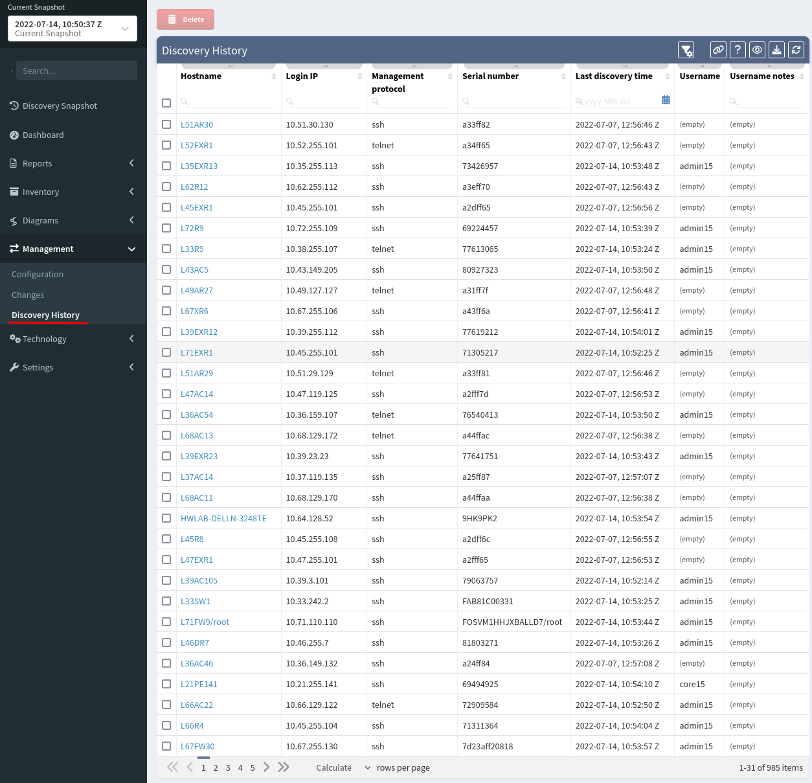

# Discovery History

This table shows every device that has ever been discovered in all
snapshots (their **_Hostname_**, **_IP address_**, **\*Management
protocol** used\* for discovery, **_Serial Number_**, **_Username_** used
for discovery and **_Last discovery time_** filed).

All of this is important for keeping track of all discovered devices.
Also, information about these devices are used in every snapshot and
devices from this list are marked in the Connectivity Report as
previouslyDiscovered devices.

!!! note
Sometimes it can be helpful for troubleshooting purposes to delete some
of the already discovered devices. All discovered devices can be found
in this table and any or all of them can be deleted by selection and
delete button on the top.
