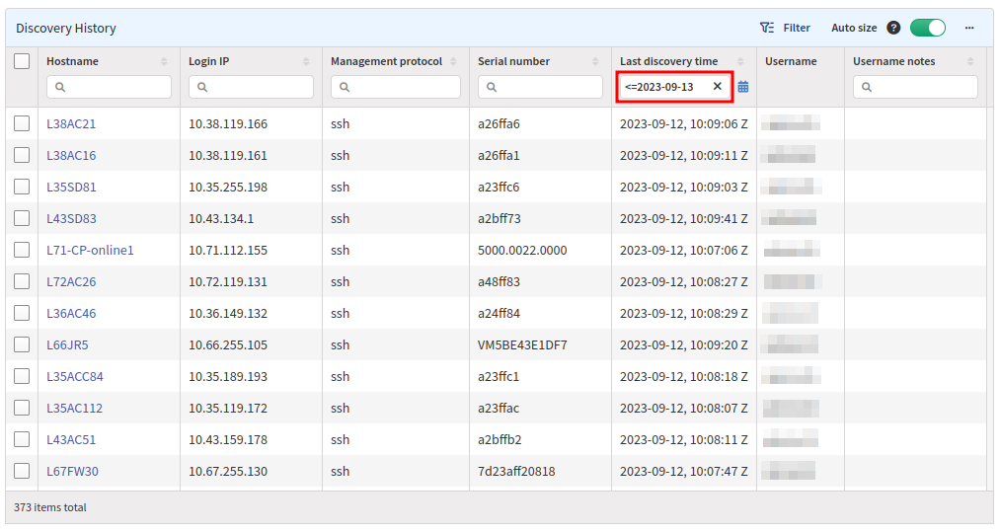

# Discovery History

## Overview

This table displays every device that has ever been discovered in all snapshots. This includes `Hostname`, `IP address`, `Management protocol`, `Serial Number` (IP Fabric Unique SN, not Hardware SN), `Username`, and `Last discovery time` used for discovery.

Information about these devices is used as a seed list for discovery and in every snapshot in the `Connectivity Report`, which reports a device as `previouslyDiscovered`.

## Deleting History

Sometimes it can be helpful for troubleshooting purposes to delete already discovered devices. All discovered devices
can be found in this table, and any or all of them can be deleted by selecting them and clicking the **Delete** button on the top.
This will not delete any information in the snapshots but only the history in the IP Fabric system.
Below are a couple examples of why it may be useful to delete history.

### Authentication Change

Deleting history is extremely useful when changing authentication on a device, as IP Fabric will first try the last successful username that is stored in this table.

### Seed List

IP addresses in this list are also used as seed addresses during discovery. **Deleting entries in this list that have not been discovered in a long time will speed up the discovery process,** as IP Fabric will not try to connect to them.

Perhaps your team wants to delete all discovery history older than 1 month to speed up the discovery process. The picture below shows using a
`Last discovery time` filter to check for entries `<=` to a certain date.

