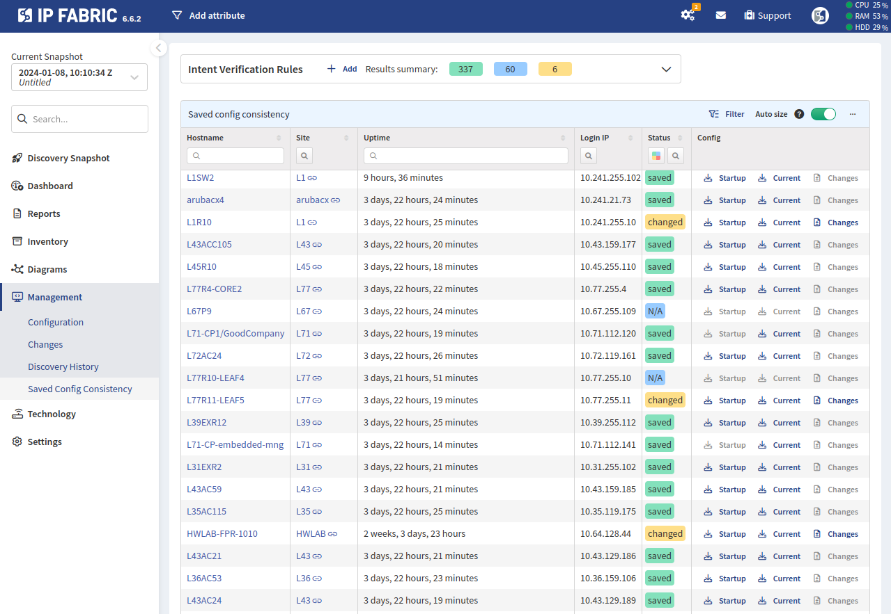

# Saved Config Consistency

**Management --> Saved Config Consistency** allows you to download the `Startup`
and `Current` configurations of network devices and to compare the differences
(if any) between these two configurations.

For this section to work, it is necessary to remove the `Configuration saved`
rule from **Settings --> Discovery & Snapshots --> Discovery Settings -->
Disabled Discovery Tasks**. Prior to version `6.3.0`, this rule was present by
default. New deployments of version `6.3.0` or newer do not have it predefined
anymore. Upgrading from version `6.2.2` or older does not automatically remove
it.
