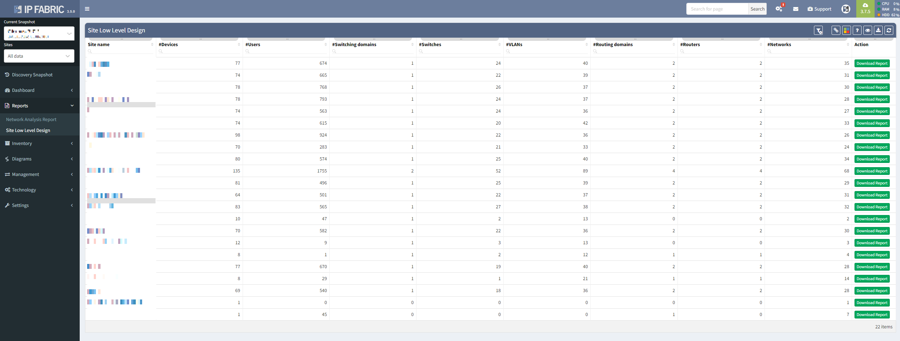

# Reports

## Overview

Report exports provide the facility to export network state information as a Microsoft Word document.

## Network Analysis Report

Network Analysis report documents provide an overview of the current network performance, capacity, and risks, and provide technical detail of the top issues in each category.

## Site Low Level Design

Site low-level design documents provide a snapshot of the network state of the site and provide sufficient information for reconstruction. All reports are downloadable.

