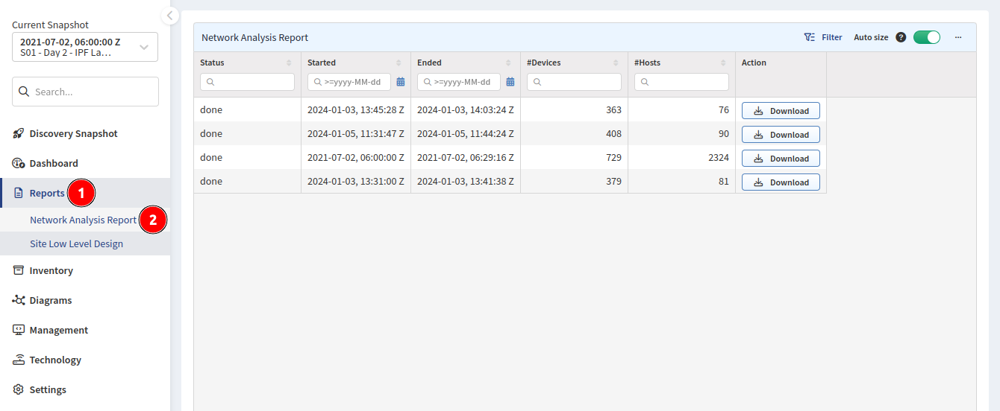
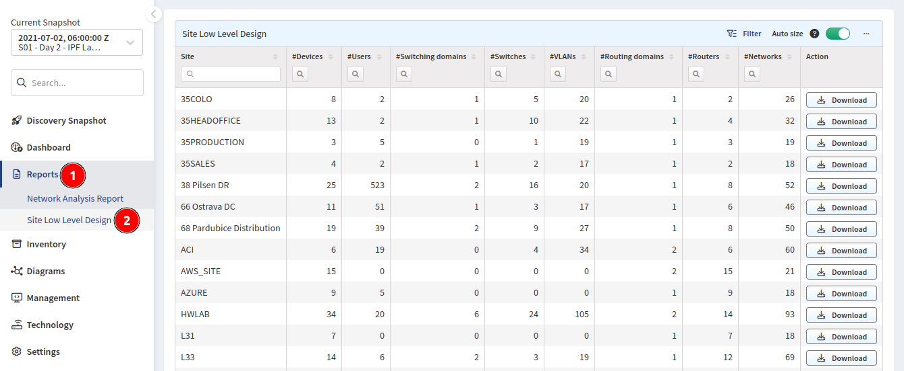

# Reports

## Overview

The **Reports** section allows you to download network state information as Word documents.

## Network Analysis Report

**Reports --> Network Analysis Report** documents provide an overview of the current network performance, capacity, and risks. They also offer technical details of the top issues in each category.

## Site Low Level Design

**Reports --> Site Low Level Design** documents provide a snapshot of the network state from the selected Site and provide sufficient information for reconstruction.

