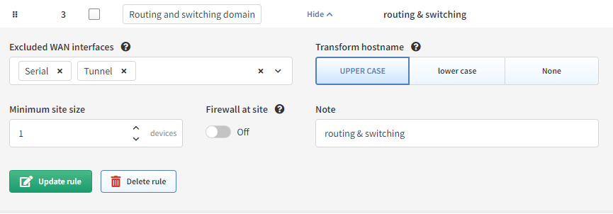

# Site Separation

The site represents a separate collection of devices. A site can be a branch, a factory, a production floor, a campus, or anything that might represent a logical group for a user.

By default, the Site distribution is generated automatically after the discovery process ends and is based on the rules described below. It can also be triggered manually without the need for the whole discovery process by going to ***Settings → Site separation*** **<u>(</u>In global or Snapshot settings<u>)</u>**. 

## Routing and switching domain (default)

!!! info
    With this setting, you can manually edit the distribution of sites later. Sites can be also renamed.

By default, the site is comprised of the topology of all contiguously interconnected protocols, and the boundary of a site is formed by the network protocol relation that is not under management using the provided authentication credentials. The default separation is useful for MPLS networks where directly connected routing infrastructure at the site’s edge is not accessible. For situations where an inaccessible routed firewall is used at the site (i.e. device under different management team), an option “***Firewall at site***” can be turned on so the infrastructure before and behind the firewall is not separated into two different sites.

For networks that have direct routing connectivity between sites, such as DMVPN or Leased Lines (usually over Serial or MFR interfaces), an option to separate the site using ***tunnel*** and/or ***serial** the *interface should be selected.

For configuration go to ***Settings → Site separation***.

Version 4.3 Example:

