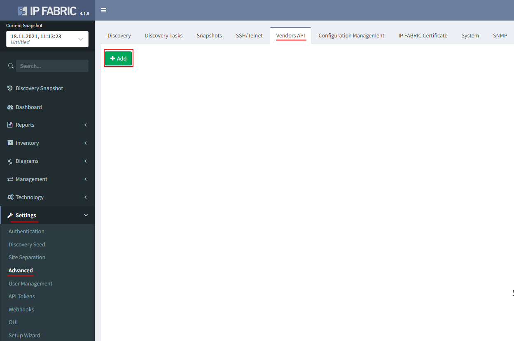

# Cisco Viptela SD-WAN

## Cisco Viptela SD-WAN

Starting version **4.1.0** IP Fabric supports Viptela API.

Viptela devices are discovered only through API.

1. To add Viptela to discovery global settings, go to **Settings → Advanced → Vendors API** and press **the+Add** button

2. Afterward, choose Viptela API from the list and fill in

-   **Username and password** used to log in to vManage

-   **Base URL** of vManage server ([https://vmanage-ip-address](https://vmanage-ip-address))