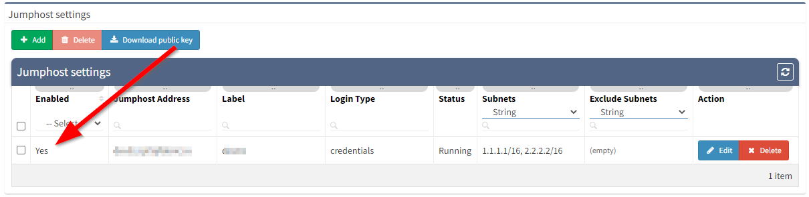
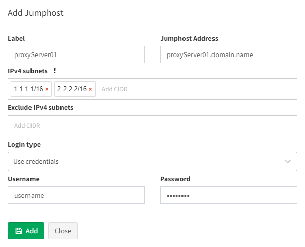
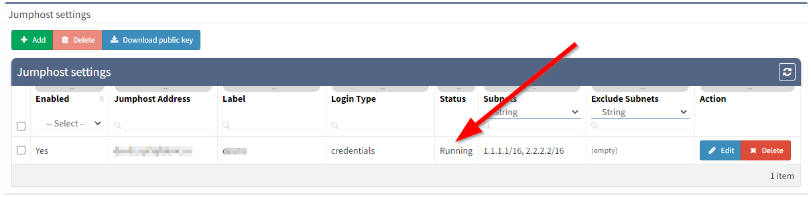
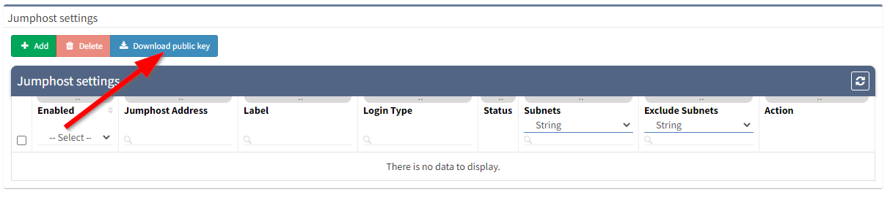
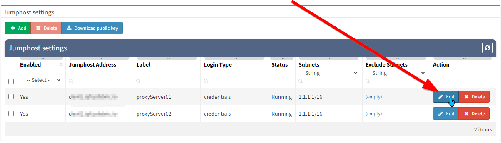
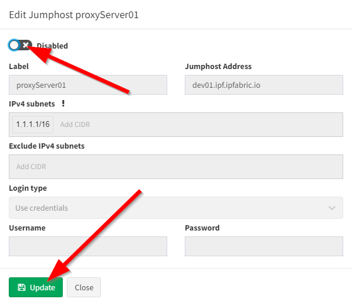
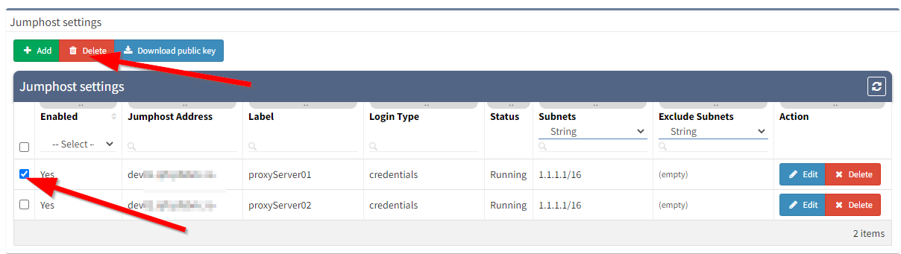

# Jumphost settings

!!! note ""

    The jumphost allows to set-up connection to the server which can be used
    as a **proxy server for discovery** purposes. IP Fabric uses an ssh
    connection to the jumphost server and python on the client and server side.
    
!!! warning "The jumphost server requirements"    

    |                    |             |
    |--------------------|-------------|
    | **Python version** |             |
    | 2.7                | supported   |
    | 3.5                | supported   |
    | 3.6                | supported   |
    | 3.7                | supported   |
    | 3.8                | unsupported |
    | 3.9                | unsupported |

!!! warning ""  

    Please bear in mind, that once the connection is established, it will be
    enabled permanently, until disabled or removed! If there are any network
    issues, IP Fabric software will try to establish a connection
    periodically.

!!! warning ""

    At least one seed IP address has to be provided as a starting point
    behind Jumphost in seed configuration.

## Setting up Jump host

1.  Open jump host settings, using item ***Settings → Advanced →
    SSH/TELNET***
2.  At the bottom of the page, please select ***Add*** button
    
3.  Fill in all necessary data
    1.  **Label** - the name for configuration (mandatory)
    2.  **Jump host Address** - IP address of FQDN name (mandatory)
    3.  **IPv4 subnets** - subnet in CIDR representation, allows adding
        more than open, separated with spaces (mandatory)
    4.  **Exclude IPv4 subnets** - subnet to exclude in CIDR
        representation, allows to add more than open, separated with
        spaces (optional)
    5.  **Login type**
        1.  **Use credentials** - require to provide username and
            password
        2.  **Use SSH keys** - if you copied ssh public key to the proxy
            server, it won’t require providing a password (please jump
            to the *SSH key configuration* section)
    6.  **Username** - Username for authentication (mandatory)
    7.  **Password** - password for authentication (mandatory if ‘Use
        credentials’ is used)  
        
        i.e., refer to the picture below  
        
4.  Click ***Add*** button
5.  If a connection is open, you will see the ***Running*** status in
    Jumphost list
    

    !!! warning ""

        If you use 0.0.0.0/0 or another subnet that includes your network from
        which you are connecting to IP Fabric, make sure you put your network to
        ***“Exclude IPv4 subnet”***. Otherwise, your IP connection will be lost
        and you will have to recover from the console.

## SSH key configuration
!!! note ""

    Adding ssh key to proxy server allows you to avoid using passwords for
    authentication

1.  Download ssh key from Jumphost settings
    
2.  Save ***jumphost-public-key.pub***
3.  Copy file content to ***authorized_keys*** file of the user that
    will authenticate with Jumphost server. Please follow official
    [ssh.com](http://ssh.com) documentation
    <https://www.ssh.com/ssh/authorized-key>
4.  Restart **sshd** service to apply settings
5.  If the key has been copied you can use the option *Use SSH keys*
    while adding a new Jumphost server, instead of *Use credentials*

## Disabling Jumphost connection

1.  Edit configuration that needs to be disabled, i.e.
    
2.  Change the setting to ***Disabled***,
3.  Click the ***Update*** button
    

## Remove Jumphost configuration

1.  On Jumphost servers list, check configuration that needs to be removed
2.  Click ***Delete*** button  
    

!!! warning "Discovery with Jumphost issues"

    Only TCP connections work through the Jump host. Traceroute with ICMP is
    not supported so the discovery process might not be able to get over the
    unreachable part of the network (for example sites separated by the
    provider’s network). In this case, you will have to add at least one IP
    from each site to the seeds settings.