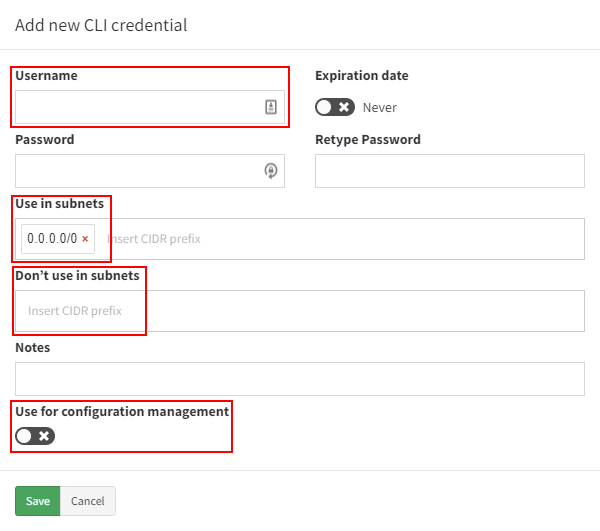
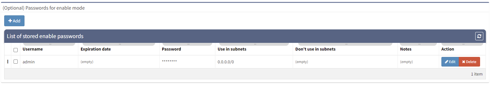
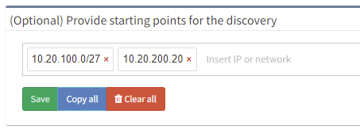
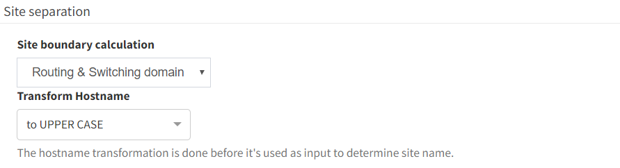
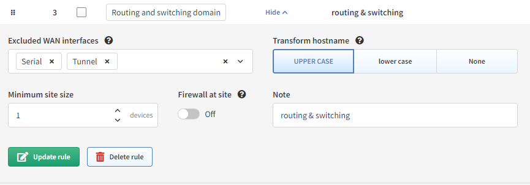

# Settings

# Authentication

Platform interacts with the network infrastructure devices by running
show commands through CLI using SSH or Telnet. Credentials added in the
Authentication section will be used by IP Fabric to access the CLI of
the network devices.

## Credential Selection Logic

If more credentials are specified, a top-down algorithm is used when
trying to login to a network device or the credentials priority can be
changed using drag and drop.

## Configure Network Infrastructure Access

Read-only (Privilege 1) credentials are sufficient for basic
functionality. Security sensitive operations and advanced functionality
might require higher privilege. See the [full list of used command in the documentation](https://ipfabric.atlassian.net/wiki/spaces/ND/pages/80019486/Used+CLI+commands+for+Discovery).

When adding new credentials, you can limit the validity of the credentials just for a part of your network using *Use in subnets* and *Don't use in subnets* fields.

Provided credentials can be used for configuration change tracking and
saved configuration consistency (i.e. they allow commands such as *show run* and *show start*).

To use this credentials for configuration change tracking,
please check [*Use for configuration management*](https://ipfabric.atlassian.net/wiki/spaces/ND/pages/79003762/Configuration) box.

## (Optional) Passwords for enable mode

Privileged credentials are generally only necessary for configuration
management. However, some platforms require privileged credentials to
access basic network state information, such as MST spanning-tree state
or 802.1X session information.

# Discovery Seed

If you know a particular starting point for discovering the network, the
information can be entered at *Settings → Discovery Seed*. This option
does not exclude any networks from discovery.

The starting points can be management IP addresses of network devices or
network subnets. Existing inventory data can also be imported.

If no seed information is entered, the discovery will begin from the
current default gateway.

!!! note

    It is recommended to provide multiple IP addresses of core routers as a starting point for discovery.

# Site Separation

The site represents a separate collection of devices. A site can be a
branch, a factory, a production floor, a campus, or anything that might
represent a logical group for a user.

By default, the Site distribution is generated automatically after the
discovery process ends and is based on the rules described below. It can
also be triggered manually without the need for the whole discovery
process by going to ***Settings → Site separation*** **(In global or Snapshot settings)**. 

## Routing and switching domain (default)

!!! info

    With this setting, you can manually edit the distribution of sites later. Sites can be also renamed.

By default, the site is comprised of the topology of all contiguously
interconnected protocols, and the boundary of a site is formed by the
network protocol relation that is not under management using the
provided authentication credentials. The default separation is useful
for MPLS networks where directly connected routing infrastructure at the
site’s edge is not accessible. For situations where an inaccessible
routed firewall is used at the site (i.e. device under different
management team), an option “***Firewall at site***” can be turned on so
the infrastructure before and behind the firewall is not separated into
two different sites.

For networks that have direct routing connectivity between sites, such
as DMVPN or Leased Lines (usually over Serial or MFR interfaces), an
option to separate the site using ***tunnel*** and/or
***serial** the *interface should be selected.

For configuration go to ***Settings → Site separation***.

Version 4.3 Example:

