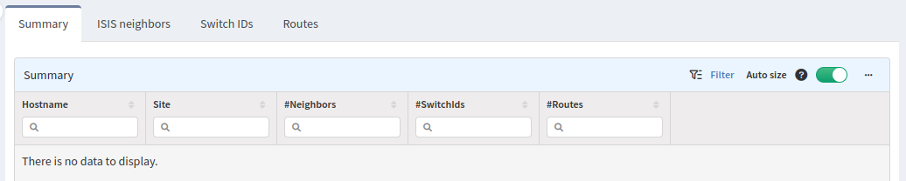
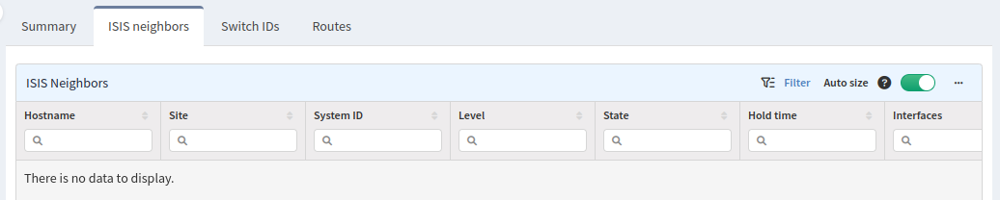
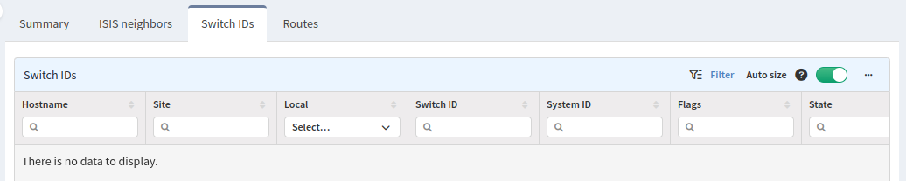
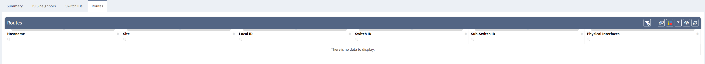

# Fabric Path

The **Fabric Path** section contains information about summaries, neighbors, switch identifications and routes.

## Summary

**Summary** tab contains information about summary of the number of neighbors, number of switch ID's and the number of routes.

## IS-IS Neighbors

**IS-IS Neighbors** tab contains information about adjacency of devices that are contributing in Fabric Path.

## Switch ID's

**Switch ID's** tab contains information about a list of Switch ID's that the current device knows about.

## Routes

**Routes** tab contains information about routes from the specific device contributing in Fabric Path.

