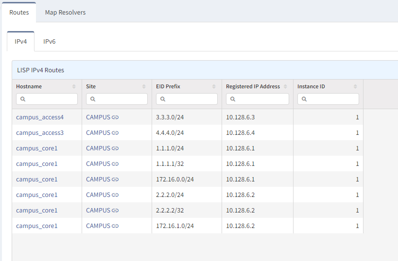
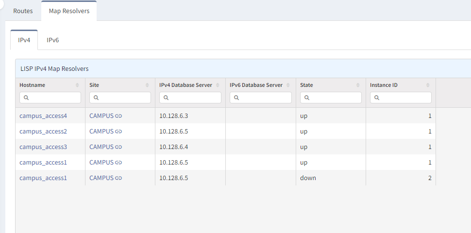

# LISP

LISP, which stands for Locator/ID Separation Protocol, is a network protocol designed to address scalability and flexibility challenges in large-scale networks. It separates the location and identification functions of IP addresses, providing numerous benefits for network architectures.

## Key Concepts -- EID and RLOC

LISP assigns each host or device an **Endpoint Identifier (EID)**, a permanent identifier that remains the same regardless of the device's network location.

In contrast, **Routing Locators (RLOCs)** represent the current network location of a device and can change as the device moves.

## Tabs in Technology --> LISP

The **Routes** tab contains a list of EID/RLOC mappings where `hostname` is the RLOC and the `EID prefix` is the EID.

The **Map Resolvers** tab contains a list of references to database servers which houses the `EID/RLOC` mappings.

## Mapping System

LISP introduces a Mapping System that maintains the association between EIDs and RLOCs. When a packet is sent to an EID, the mapping system is used to determine the current RLOC of the destination device, enabling efficient routing.

## LISP Operation

LISP operates through two key components: the Ingress Tunnel Router (ITR) and the Egress Tunnel Router (ETR).

### Ingress Tunnel Router (ITR)

The ITR encapsulates packets with a new LISP header. It uses the mapping system to obtain the RLOC for the destination EID and forwards the encapsulated packet to the appropriate ETR.

### Egress Tunnel Router (ETR)

The ETR receives the encapsulated packet, removes the LISP header, and delivers the packet to the destination device based on the EID.

## Benefits of LISP

LISP provides several benefits for large-scale networks:

- Improved scalability: LISP reduces the size of routing tables, enhancing scalability in networks with a large number of devices.
- Simplified network design: By separating the EID space from the routing infrastructure, LISP simplifies network design and enables flexibility in managing IP addresses.
- Enhanced mobility support: LISP allows devices to change locations without requiring IP address renumbering, offering better support for mobility in networks.

## Resources and Further Reading

To learn more about LISP and its implementation, refer to the following resources:

- [LISP References](https://www.cisco.com/c/en/us/td/docs/ios-xml/ios/iproute_lisp/configuration/xe-3s/irl-xe-3s-book/irl-overview.html)
- [Basic Lisp configuration of deployment](https://www.cisco.com/c/en/us/td/docs/ios-xml/ios/iproute_lisp/configuration/xe-3s/irl-xe-3s-book/irl-cfg-lisp.html)
