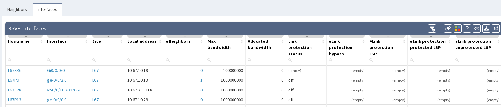

# MPLS

## RSVP

The **Resource Reservation Protocol (RSVP)** section contains information about interfaces used for communication, and neighborship information.

### Neighbors
Neighbors tab contains information about all relations including local and neighbor addresses, IDs, status of the neighborship and information about link protection.

### Interfaces
Interfaces tab contains information about each interface used for RSVP including maximal and allocated bandwidth, and link protection.

