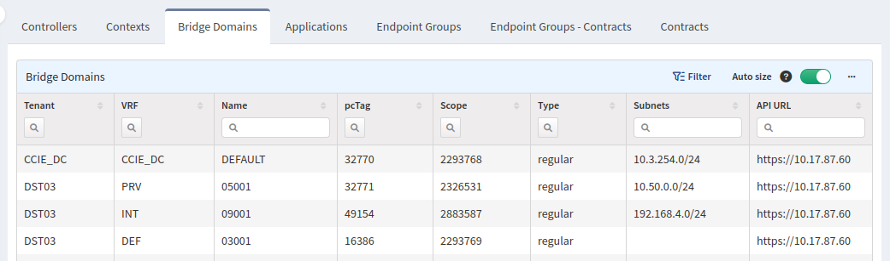
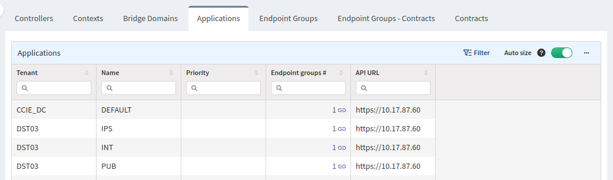
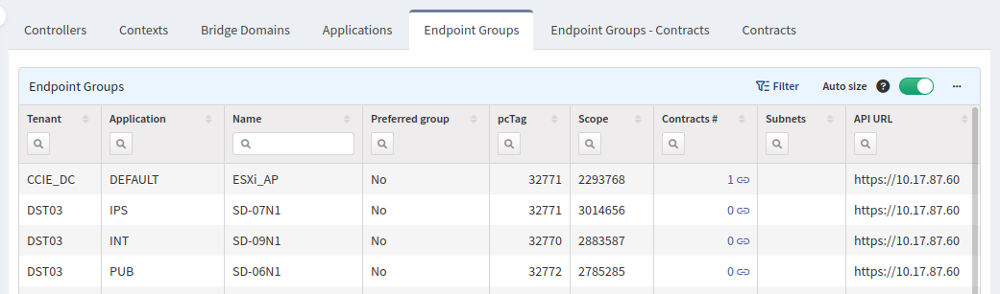

# SDN

## Cisco APIC

The **APIC** section contains information about controllers, tenants, contexts, bridge domains, applications, endpoint groups, and contracts.

Information about endpoints is not part of this section as it is present in the **ACI** table.

For instructions on how to collect APIC-related information, please check [Add Cisco APIC API](../../IP_Fabric_Settings/Discovery_and_Snapshots/Discovery_Settings/Vendors_API/Cisco_APIC.md).

### Controllers

The **Controllers** tab contains a list of all discovered controllers, their health and IP addresses.

### Contexts

The **Contexts** tab contains a list of all contexts, to which tenant they belong to, their pcTag and scope, unenforced mode, and count of bridge domains which belong to them.

By selecting a number in the `Bridge domains` column, you will be redirected to the **Bridge Domains** tab with a filter applied to show all bridge domains belonging to this context.

### Bridge Domains

The **Bridge Domains** tab contains a list of all bridge domains, to which tenant and context they belong, their pcTag scope, type, and a list of all their subnets.

### Applications

The **Applications** tab contains a list of all configured applications, to which tenant they belong, and the number of their endpoint groups.

By selecting a number in the `Endpoint groups` column, you will be redirected to the **Endpoint Groups** tab with a filter applied to show all endpoint groups belonging to this application.

### Endpoint Groups

The **Endpoint Groups** tab contains a list of all endpoint groups, tenant name, and application they belong to. If they are members of the Preferred group, how many contracts are associated with them, and a list of all their subnets.

By selecting a number in the `Contracts` column, you will be redirected to the **Endpoint Groups - Contracts** tab with a filter applied to show this endpoint group.

### Endpoint Groups - Contracts

The **Endpoint Groups - Contracts** tab contains a list of all contracts associated with the endpoint group and if the endpoint group is a consumer or provider.

### Contracts

The **Contracts** tab contains a list of all contracts, to which tenant they belong, their subject's name, match strategy, if they should reverse filters in the opposite direction, and names of their filters. There is also information about applied Service Graph.

### Service Graphs

The **Service Graphs** tab contains a list of all Service Graph templates including their type, list of nodes and devices.

