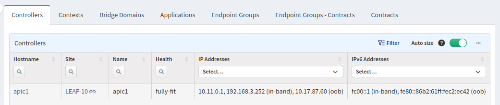
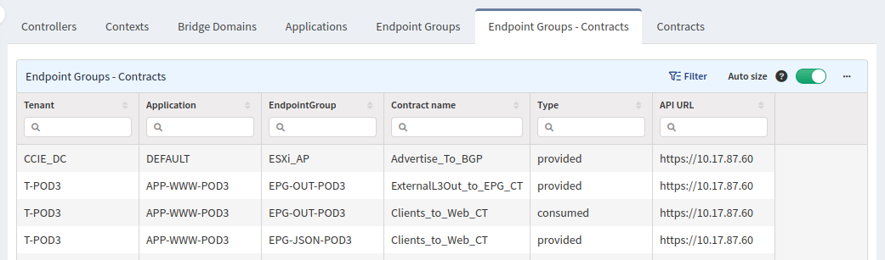

# SDN

## Cisco APIC

APIC section contains information about Controllers, Tenants, Contexts, Bridge domains, Applications, Endpoint groups and Contracts.

Information about endpoints is not part of this section as it is present in ACI table.

For instructions how collect APIC related information please check [Add Cisco APIC API](../../IP_Fabric_Settings/Discovery_and_Snapshots/Discovery_Settings/Vendors_API/Cisco_APIC.md).

### Controllers

Controllers tab contains list of all discovered controllers, their health and IP addresses.

### Contexts

Contexts tab contains list of all contexts, to which tenant they belong to, their pcTag and scope, unenforced mode and count of bridge domains which belongs to them.

By selecting a number in bridge domains column you will be redirected to **Bridge domains** tab with filter applied to show all bridge domains belonging to this context.

### Bridge domains

Bridge domains tab contains list of all bridge domains, to which tenant and context they belong to. Their pcTag scope, type and list of all their subnets.

### Applications

Applications tab contains list of all configured applications, to which tenant they belong to and number of their endpoint groups. By selecting a number you will be redirected to **Endpoint groups** tab with filter applied to show all endpoint groups belonging to this application.

### Endpoint groups

Endpoint groups tab contains list of all endpoint groups, tenant name and application they belong to. If they are members of Preferred group, how many contracts are associated with them and list of all their subnets.
By selecting a number in a column **Contracts** you will be redirected to **Endpoint groups - Contracts** tab with filter applied to this endpoint group.

### Endpoint groups - Contracts

Endpoint groups - Contracts tab contains list of all contracts associated to endpoint group and if endpoint group is consumer or provider.

### Contracts

Contracts tab contains list of all contracts, to which tenant they belong to, their subject's name, match strategy, if they should reverse filters in opposite direction and names of their filters.

