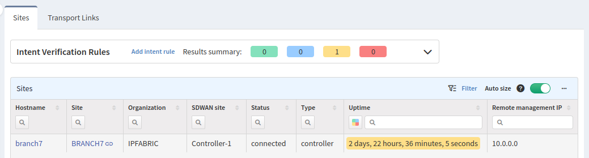
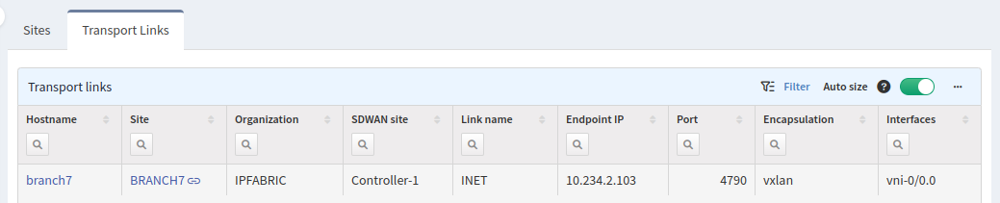

# SDWAN

## Sites

The **Sites** tab contains connectivity matrix between all sites (Controllers, Branches and Hubs).

## Transport Links

The **Transport Links** tab shows underlay connections between these sites.

