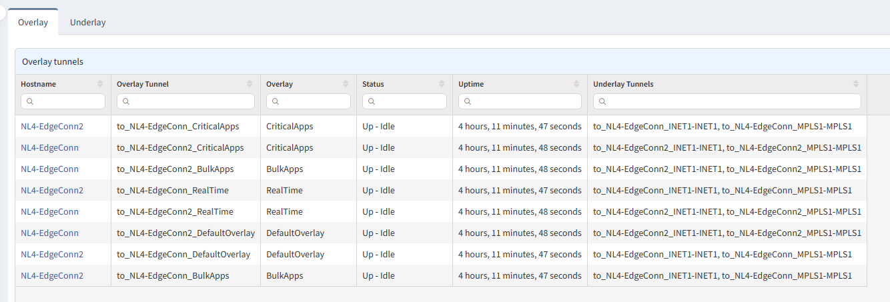
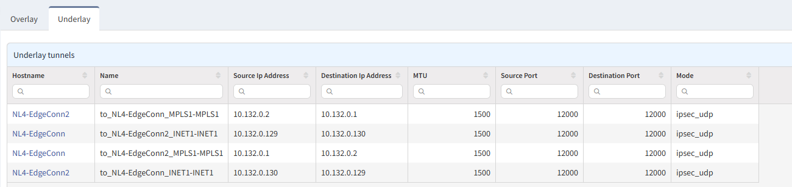

# Silverpeak

## Overlay

The **Overlay** contains SDWAN bonded tunnels. Specifically, overlay tunnels consist of bonded underlay tunnels.

## Underlay

The **Underlay** tab contains IPsec tunnels that map to discrete transports.

