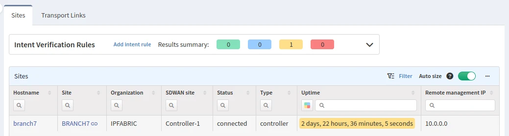
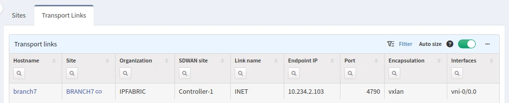

# Versa

## Versa

### Sites

The **Sites** tab contains the connectivity matrix between all sites (controllers, branches, and hubs).

### Transport Links

The **Transport Links** tab shows the underlay connections between these sites.

