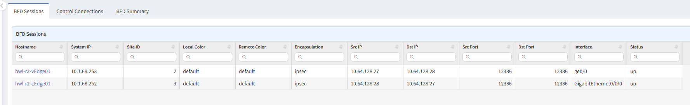
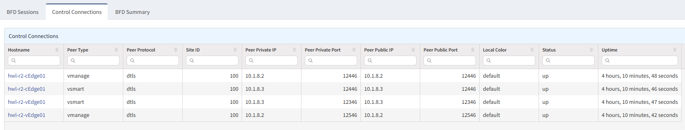

# Viptela

## BFD Sessions

The **BFD Sessions** tab contains the list of data plane connections.

## Control Connections

The **Control Connections** tab contains the list of control plane connections.

## BFD Summary

The **BFD Summary** tab contains summary of BFD sessions.

