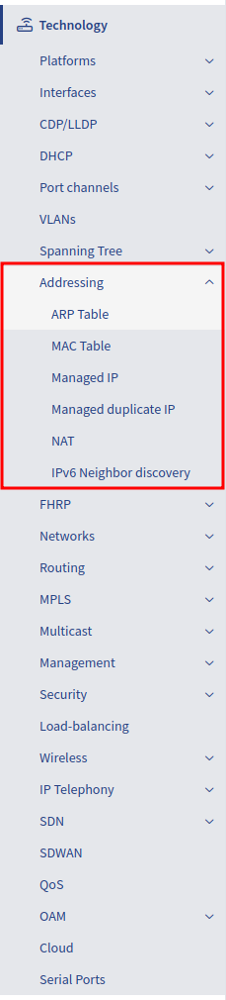

# Addressing

The Addressing section provides information about every IP address on every managed network infrastructure device.

- ARP Table: contains the ARP table from all discovered devices
- MAC Table: contains the MAC address table from all discovered devices
- Managed IP: list of all interfaces configured with an IP address from all discovered devices
- Managed duplicate IP: summary of the Managed IP table, where duplicate IP addresses are displayed
- NAT: contains NAT information from the supported devices
- IPv6 Neighbor discovery: list of the IPv6 neighbors

