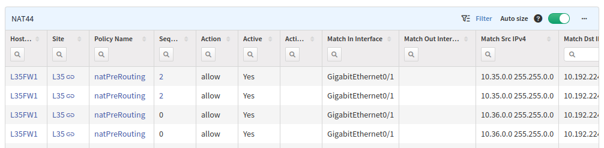

# Addressing

The **Addressing** section provides information about every IP address on every managed network infrastructure device.

- **ARP Table:** contains the ARP table from all discovered devices
- **MAC Table:** contains the MAC address table from all discovered devices
- **Managed IP:** list of all interfaces configured with an IP address from all discovered devices
- **Managed duplicate IP:** summary of the Managed IP table, where duplicate IP addresses are displayed
- **NAT:** contains NAT information from the supported devices
- **IPv6 Neighbor discovery:** list of the IPv6 neighbors

## NAT

The **NAT** sub-section contains information about NAT policies and rules configured on a device. Currently, only IPv4 NAT is supported -- the **NAT44** table.

A graphical representation (as shown below) of the policy chain can be accessed by clicking a `Policy Name` or `Sequence number`.

!!! Note

    NAT policies collection for Cisco Firepower 7000 & 8000 Series devices is not supported. To learn more about this limitation, see [Known Issues](../../support/known_issues/Vendors/cisco/FMC_Firepower_NAT.md).
