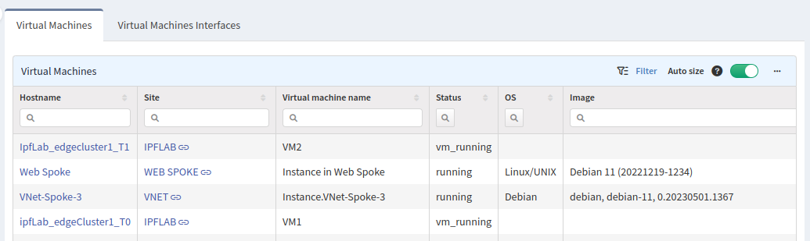

# Cloud

## Virtual Machines and Their Interfaces

Public or private cloud APIs provide information about virtual machines. In previous versions, IP Fabric couldn't collect any information about virtual machines. From version `4.4`, IP Fabric displays information about virtual machines discovered through private or public cloud APIs.

Each vendor provides a different scope of information for VMs. Thus, IP Fabric might not be able to get all the information for end-host calculations (ARP, MAC address table).

New tables in this section provide detailed information about cloud virtual machines -- their hostnames, sites, VM names, status, OS version running, number of interfaces and their details (IP address, MAC address, etc.).

