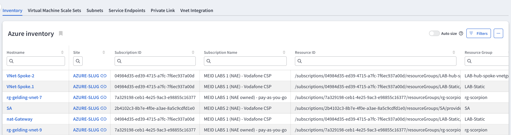
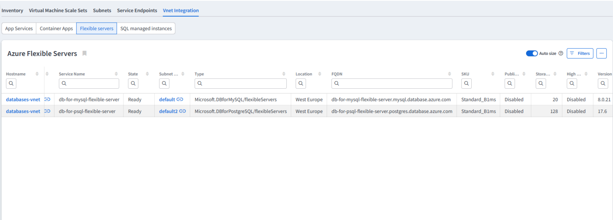
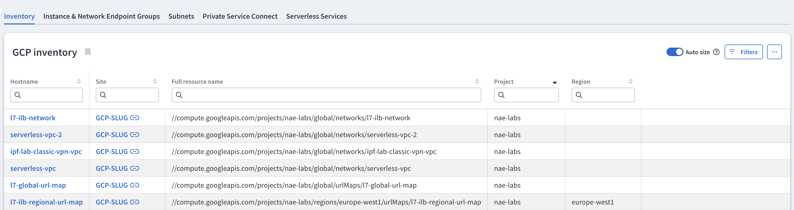
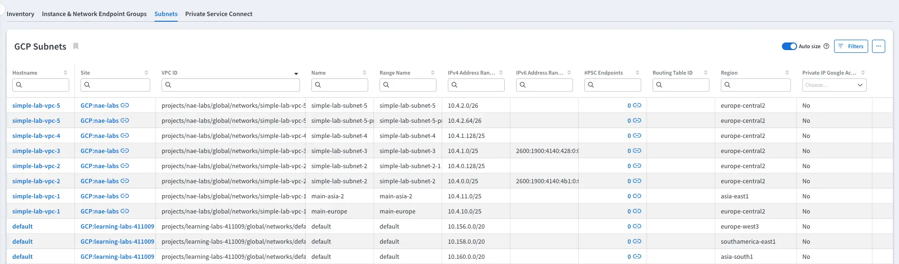
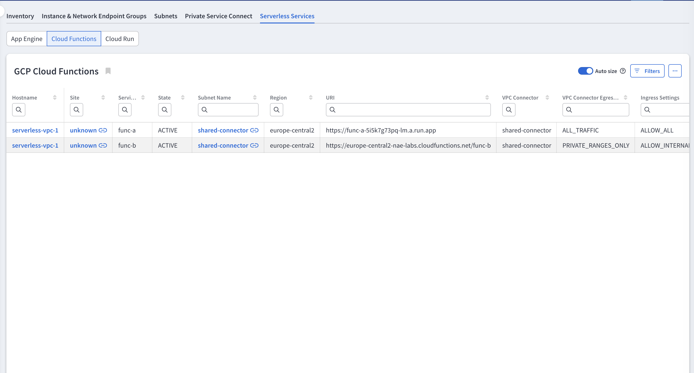

# Vendors

The **Vendors** section provides vendor-specific inventory tables for three cloud providers -- AWS, GCP, and Azure.
Each vendor's inventory table presents slightly different information to reflect the unique characteristics of their resources.

{: width="200" .center}

## AWS

AWS's inventory table offers the Amazon Resource Name (ARN), resource type, resource ID, owner ID, and region.

The Scaling Group table shows details of scaling groups including names, ARNs, number of virtual machines, instance types, target group ARNs, launch template and launch template versions.

The Subnets table shows details of subnets such as their VPC ID, name, IP ranges, route table ID, availability zone, ARN, and whether the subnet is public.

The Private Link VPC Endpoints table provides detailed information, including the Name, IPv4 and IPv6 addresses, a link to the related subnet, the state, the service type, and the service ID.

## Azure

Azure's Inventory table provides the serial number, subscription ID, subscription name, resource group, location, and SKU.

The Virtual Machine Scale Sets table provides information about scale sets including the names, IDs, number of virtual machines in the set, instance type and orchestration mode.

The Subnets table provides information about subnets, including the VNet ID, Name, IPv4 and IPv6 address ranges, a link to the list of related private
service endpoints, the routing table ID, the associated NAT gateway ID, the service to which the subnet is delegated, and whether default outbound access is enabled.

The Service Endpoints table provides information about Azure service endpoints, covering the subnet, service name, state, location, and scope (service endpoint policy).

The Private Link table provides information about private link endpoints, private link services, and their connections.
It contains three tabs: one for private endpoints, one for private link services, and one for private link service connections.

The VNet Integration table provides information about resources that are enabled for VNet integration. It contains three tabs: App Services, Container Apps, Flexible Servers and SQL Managed Instances

## GCP (Google Cloud Platform)

Google Cloud Platform's Inventory table contains the full resource name, project, and region.

The Instance & Network Endpoint Groups table contains details about managed and unmanaged instance groups and network endpoint groups,
including names, IDs, states, number of virtual machines (where available/applicable), instance types (where available/applicable), types of groups, lists of endpoints in the
groups, zones, regions, minimum and maximum numbers of endpoints in the groups, and auto-scaling information.

The Subnets table provides information about the associated VPC ID, the subnet’s name, the subnet’s range name, the IPv4 and IPv6 address ranges, the region, and whether Private Google Access
for private IPs is enabled.

The Private Service Connect tables provide detailed information about Endpoints, Published Services, and Published Service Connections in separate tabs.

The Serverless Services tables provide information about App Engine, Cloud Functions, and Cloud Run services that use VPC Access Connectors.

