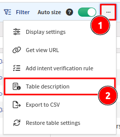

# Overview

Tables enable analysis and correlation of network state information and
parameters on the fly. Most of the tables display live snapshot data
generated by graph algorithms without a preexisting cache. The first
load of a large table usually takes longer than subsequent loads,
however all tables were built to handle large capacities and complex
queries, so the outcome is likely to be better than analyzing the output
in external applications like Excel.

## Network Or Site View

Tables display data for the whole network by default. To only display
data for a specific site, select "site" from the drop-down menu on the
top left.

## Table Filtering

Simple or advanced filters can be applied to each table. By default,
filtering is available above each column, and accepted filtering values
can be strings, numbers, IP addresses, networks, Boolean values, or
select box values.

### RegEx simple column filter examples

- `=~(cis|ari)` -- RegEx matches also `cisco` or `arista` values (not exact match)
- `=~^(cisco|arista)$` -- RegEx matches `cisco` or `arista` values only (exact match)
- `=cisco` -- matches only `cisco` values (exact match)
- `cis` -- matches `cis` or `cisco` (prefix match)
- `=~^(?!cisco)` -- RegEx negative lookahead -- matches all except value starting with `cisco` 

Some columns containing IP Addresses can be filtered by entering the IP/prefix
length in the CIDR notation. For example, `10.0.0.0/25` will find
addresses between and including `10.0.0.128` and `10.0.0.255`.

Advanced filters can be used to construct arbitrary complex expressions
by combining nested filters and filter groups with any number of logical
AND and OR operators between them. Advanced filters can be saved and
recalled for each specific table. Filters are stored per table and are
available to all users.

## Table Exports

Table outputs can be exported into CSV format for further processing and
the text can be opened by any spreadsheet processor. In some cases,
Microsoft Excel and Google Spreadsheets convert strings from the CSV
files into dates, but these can remain as exact values by renaming the
content to `string` to force the spreadsheet to retain the original
content.

!!! note

    It may take several seconds to prepare an export of large tables.

## Tooltips

Each table contains built-in help in `Table description` under the `...` menu
(in the top-right corner of the table):

.

Hover the mouse cursor over a column header for the column's description:

## Column Visibility

Tables can be especially large to facilitate easier information correlation,
however not all columns need to always be visible.

Select `Display settings` under the `...` menu and choose which columns to show
or hide:

## Column Size

Use the `Auto size` toggle to either automatically size columns to fit their
current content (when enabled), or let columns remember user-defined widths
(when disabled):

## Persistent Table View

To improve usability, each table remembers the settings and filtering for each
user.

To reset a table to its original state, select `Restore table settings` under
the `...` menu:

## Regular Expression Syntax

A regular expression may consist of literal characters and the following characters and sequences:

- `.` -- the dot matches any single character except line terminators. To include line terminators, use `[\s\S]` instead to simulate `.` with `DOTALL` flag.
- `\d` -- matches a single digit, equivalent to `[0-9]`
- `\s` -- matches a single whitespace character
- `\S` -- matches a single non-whitespace character
- `\b` -- matches a word boundary. This match is zero-length
- `\B` -- Negation of `\b`. The match is zero-length
- `[xyz]` -- set of characters. Matches any of the enclosed characters (here: `x`, `y`, or `z`)
- `[^xyz]` -- negated set of characters. Matches any other character than the enclosed ones (i.e. anything but `x`, `y`, or `z` in this case)
- `[x-z]` -- range of characters. Matches any of the characters in the specified range, e.g. `[0-9A-F]` to match any character in `0123456789ABCDEF`
- `[^x-z]` -- negated range of characters. Matches any other character than the ones specified in the range
- `(xyz)` -- defines and matches a pattern group. Also defines a capturing group.
- `(?:xyz)` -- defines and matches a pattern group without capturing the match
- `(xy|z)` -- matches either `xy` or `z`
- `^` -- matches the beginning of the string (e.g. `^xyz`)
- `$` -- matches the end of the string (e.g. `xyz$`)

To literally match one of the characters that have a special meaning in regular expressions (`.`, `*`, `?`, `[`, `]`, `(`, `)`, `{`, `}`, `^`, `$`, and `\`) you may need to escape the character with a backslash, which typically requires escaping itself. The backslash of shorthand character classes like `\d`, `\s`, and `\b` counts as literal backslash. The backslash of JSON escape sequences like `\t` (tabulation), `\r` (carriage return), and `\n` (line feed) does not, however.

!!! note "Literal backlashes require different amounts of escaping depending on the context"

    - `\` in bind variables (Table view mode) in the Web UI (automatically escaped to `\\` unless the value is wrapped in double quotes and already escaped properly)
    - `\\` in bind variables (JSON view mode) and queries in the Web UI
    - `\\` in bind variables in arangosh
    - `\\\\` in queries in arangosh
    - Double the amount compared to arangosh in shells that use backslashes for escaping (`\\\\` in bind variables and `\\\\\\\\` in queries)

Characters and sequences may optionally be repeated using the following quantifiers:

- `x?` -- matches one or zero occurrences of `x`
- `x*` -- matches zero or more occurrences of `x` (greedy)
- `x+` -- matches one or more occurrences of `x` (greedy)
- `x*?` -- matches zero or more occurrences of `x` (non-greedy)
- `x+?` -- matches one or more occurrences of `x` (non-greedy)
- `x{y}` -- matches exactly y occurrences of `x`
- `x{y,z}` -- matches between y and z occurrences of `x`
- `x{y,}` -- matches at least y occurrences of `x`

Note that `xyz+` matches `xyzzz`, but if you want to match `xyzxyz` instead, you need to define a pattern group by wrapping the sub-expression in parentheses and place the quantifier right behind it, like `(xyz)+`.

You can use 3rd party services, like [regex101](https://regex101.com/) to fine-tune and troubleshoot your regular expressions.
